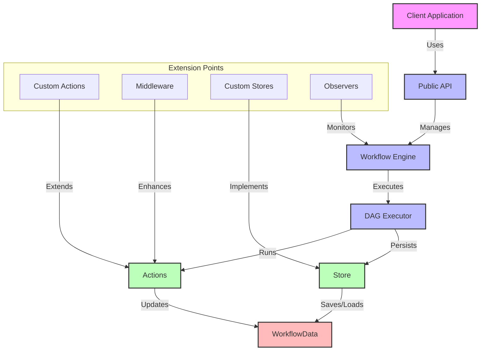

# Architecture Documentation

This section provides a comprehensive overview of Flow Orchestrator's architecture, design principles, and implementation details. These documents are useful for contributors and users who want to understand the internals of the system.

## Core Architecture Documents

- [**Architecture Overview**](./overview.md): High-level description of the system architecture, package organization, and component interactions
- [**DAG Execution Model**](./dag-execution.md): Detailed explanation of the Directed Acyclic Graph (DAG) execution model used by Flow Orchestrator
- [**Workflow Engine Component**](./component-workflow.md): Details about the workflow engine implementation, its subcomponents, and execution flow

## Architecture Decision Records (ADRs)

The [ADR directory](./adr/) contains records of significant architectural decisions made throughout the project. Each ADR describes the context, decision, consequences, and alternatives considered for important architectural choices.

## Key Design Patterns

Flow Orchestrator uses several key design patterns:

### Builder Pattern
Used for constructing workflows with a fluent interface:

```go
builder := workflow.NewWorkflowBuilder()
// Configure the workflow
workflow, err := builder.Build()
```

### Middleware Pattern
Functional composition for cross-cutting concerns:

```go
LoggingMiddleware(RetryMiddleware(3, time.Second)(myAction))
```

### Interface-Based Design
Extensive use of interfaces for extensibility and testability:

```go
type Action interface {
    Execute(ctx context.Context, data *WorkflowData) error
}

type WorkflowStore interface {
    Save(data *WorkflowData) error
    Load(workflowID string) (*WorkflowData, error)
}
```

### Memory Management Patterns
Advanced memory optimization techniques:

- Arena allocation for reduced garbage collection
- String interning for memory efficiency
- Object pooling for reusing objects

## Memory and Concurrency Design

For detailed information on memory management and concurrent data structure design:

- See [Memory and Performance Optimization](../guides/performance-optimization.md)

## System Component Interactions



The diagram above illustrates how the different components interact during workflow execution. The workflow engine coordinates the execution of the DAG, while middleware provides cross-cutting concerns and the persistence layer enables workflow state to be saved and restored. 