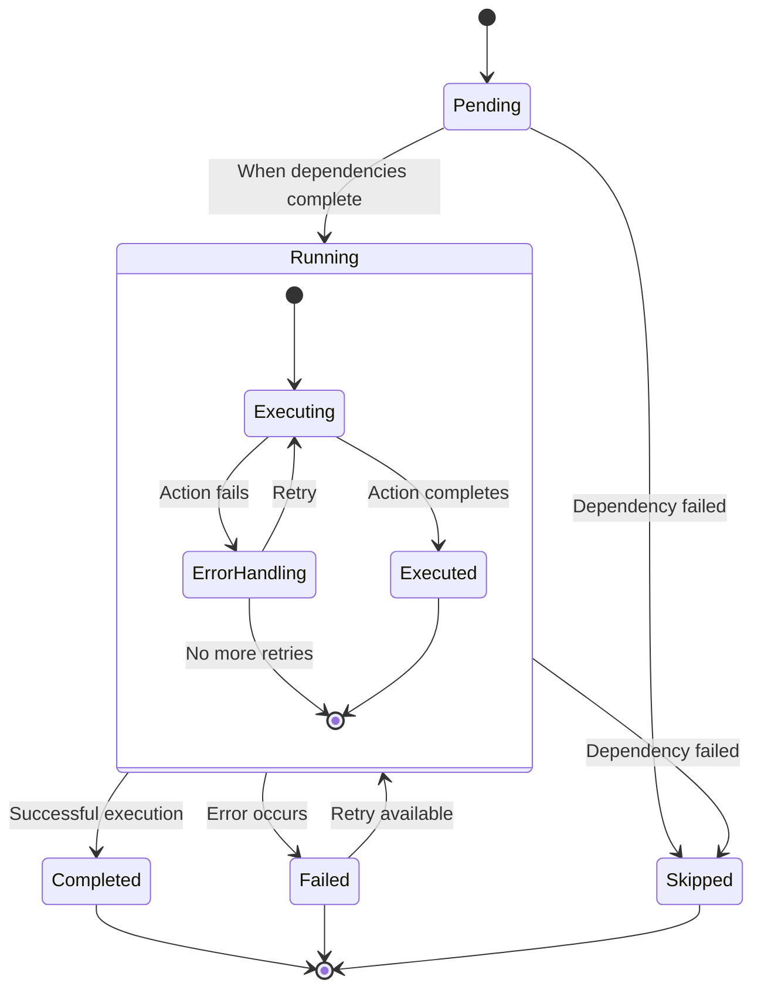
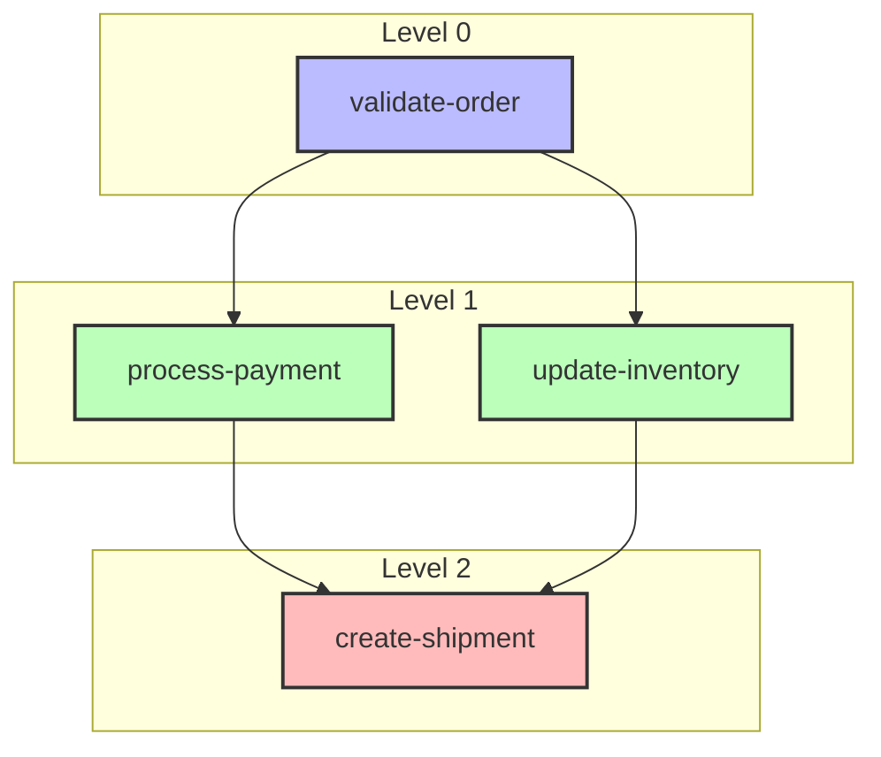

# DAG Execution Model

Flow Orchestrator uses a Directed Acyclic Graph (DAG) execution model to represent and execute workflows. This document explains how the DAG model works, how it's implemented, and the execution algorithm.

## What is a DAG?

A Directed Acyclic Graph (DAG) is a graph with directed edges and no cycles. In the context of workflow orchestration, a DAG represents:

- **Nodes**: Individual units of work (actions)
- **Edges**: Dependencies between nodes
- **Directed**: Dependencies flow in one direction
- **Acyclic**: No circular dependencies are allowed

## DAG Structure

In Flow Orchestrator, a DAG consists of:

```
+---------------------+
|         DAG         |
+---------------------+
| - Nodes             |
| - StartNodes        |
| - EndNodes          |
| - Name              |
+---------------------+
         |
         | contains
         v
+---------------------+
|         Node        |
+---------------------+
| - Name              |
| - Action            |
| - DependsOn         |
| - RetryCount        |
| - Timeout           |
+---------------------+
```

- **Nodes**: A map of node names to node instances
- **StartNodes**: Nodes with no dependencies
- **EndNodes**: Nodes with no dependents
- **Name**: Identifier for the DAG

Each Node contains:

- **Name**: Unique identifier within the DAG
- **Action**: The executable logic for the node
- **DependsOn**: List of nodes this node depends on
- **RetryCount**: Number of retry attempts on failure
- **Timeout**: Maximum execution time

## Node State Transitions

During execution, a node transitions through several states:



## Building a DAG

Flow Orchestrator provides a fluent builder API for constructing DAGs:

```go
builder := workflow.NewWorkflowBuilder().
    WithWorkflowID("order-processing")

// Add a start node (no dependencies)
builder.AddStartNode("validate-order").
    WithAction(validateOrderAction)

// Add dependent nodes
builder.AddNode("process-payment").
    WithAction(processPaymentAction).
    DependsOn("validate-order")

builder.AddNode("update-inventory").
    WithAction(updateInventoryAction).
    DependsOn("validate-order")

builder.AddNode("create-shipment").
    WithAction(createShipmentAction).
    DependsOn("process-payment", "update-inventory")

// Build the DAG
dag, err := builder.Build()
```

## Validation

Before a DAG can be executed, it undergoes validation to ensure:

1. All node names are unique
2. No cycles exist in the dependency graph
3. All dependencies refer to existing nodes
4. At least one start node exists

If validation fails, the `Build()` method returns an error with details about the validation failure.

## Topological Sorting

To determine the execution order, the DAG uses a topological sort algorithm. This sorts nodes such that for every directed edge `u -> v`, node `u` comes before node `v` in the ordering.

The sorting algorithm uses a depth-first search (DFS) approach:

1. Start with nodes that have no dependencies
2. For each node, recursively process its dependents
3. Add a node to the result list after all its dependents are processed

The topological sort produces a sequence of nodes that respects all dependencies.

## Level-Based Execution

For parallel execution, nodes are grouped into "levels" where:

- All nodes in a level can be executed concurrently
- All dependencies of a node are in previous levels

This allows for maximum parallelism while respecting dependencies:



The diagram above shows how nodes are grouped into levels for parallel execution. All nodes in Level 1 (process-payment and update-inventory) can execute concurrently once the Level 0 node (validate-order) completes.

## Execution Algorithm

The DAG execution algorithm proceeds as follows:

1. **Initialization**:
   - Validate the DAG structure
   - Perform topological sort to determine execution order
   - Group nodes into levels for parallel execution
   - Initialize node statuses (all start as "Pending")

2. **Level-by-Level Execution**:
   - For each level in the execution order:
     - Execute all nodes in the level concurrently
     - Wait for all nodes in the level to complete before proceeding to the next level

3. **Node Execution**:
   - Check if dependencies are satisfied (all dependencies "Completed")
   - If dependencies failed, mark node as "Skipped"
   - Otherwise, set node status to "Running"
   - Execute the node's action with the provided context and data
   - On success, set status to "Completed"
   - On failure, set status to "Failed" (after retries if configured)

4. **Retry Handling**:
   - If a node fails and has retry count > 0, retry the action
   - Decrement retry count after each attempt
   - Apply exponential backoff between retry attempts if configured

5. **Persistence**:
   - If a store is provided, save workflow state:
     - Before and after each node execution
     - After workflow completion
     - On errors

## Execution Context

Each node execution receives a context that can include:

- Timeout information
- Cancellation signals
- Tracing context
- Workflow-specific values

The context allows for controlled execution, including the ability to cancel the entire workflow or set timeouts.

## WorkflowData

All nodes in a workflow share a common `WorkflowData` object that:

- Contains custom key-value data
- Tracks node status
- Stores node outputs
- Is thread-safe for concurrent access

This shared data model allows nodes to pass information to downstream nodes and build on previous results.

## Concurrency Model

The DAG executor supports concurrent execution with configurable parallelism:

- Nodes within the same level execute concurrently
- The maximum number of concurrent node executions is configurable
- A worker pool manages the execution of node actions
- Lock-free data structures minimize contention

## Error Handling

The DAG execution model handles errors in several ways:

1. **Node-Level Errors**:
   - Mark the node as "Failed"
   - Try retries if configured
   - Skip dependent nodes

2. **DAG-Level Errors**:
   - Structural errors (cycles, missing nodes)
   - Execution engine errors

3. **Context Cancellation**:
   - Gracefully stops execution of running nodes
   - Marks remaining nodes as "Skipped"

## Observability

The DAG execution can be observed through:

- Node status changes
- Execution metrics (duration, success rate)
- Custom observers that hook into the execution lifecycle
- Structured logs from middleware

## Conclusion

The DAG execution model provides a powerful and flexible way to represent and execute workflows. It ensures that dependencies are respected, allows for concurrent execution where possible, and provides robust error handling and retry mechanisms.

For more information on specific components, refer to the related documentation:

- [Component: Workflow Engine](./component-workflow.md)
- [Middleware System](../guides/middleware.md)
- [Persistence Layer](../guides/persistence.md) 