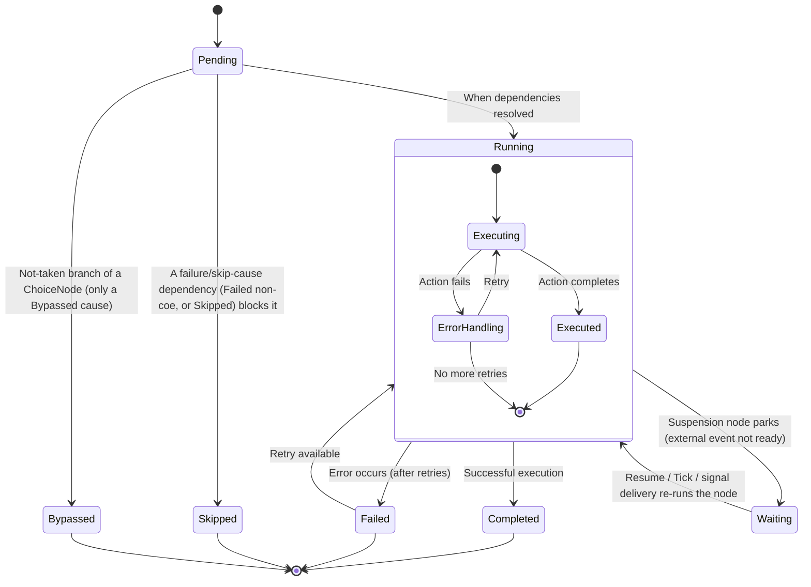
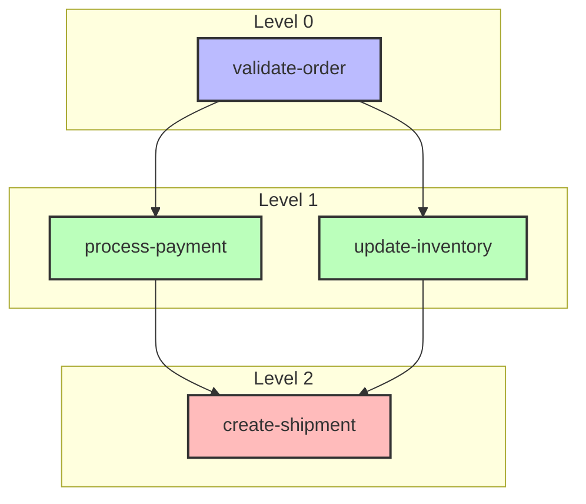

# DAG Execution Model

Flow Orchestrator uses a Directed Acyclic Graph (DAG) execution model to represent and execute workflows. This document explains how the DAG model works, how it's implemented, and the execution algorithm.

## What is a DAG?

A Directed Acyclic Graph (DAG) is a graph with directed edges and no cycles. In the context of workflow orchestration, a DAG represents:

- **Nodes**: Individual units of work (actions)
- **Edges**: Dependencies between nodes
- **Directed**: Dependencies flow in one direction
- **Acyclic**: No circular dependencies are allowed

## DAG Structure

In Flow Orchestrator, a DAG consists of:

```
+---------------------+
|         DAG         |
+---------------------+
| - Nodes             |
| - StartNodes        |
| - EndNodes          |
| - Name              |
+---------------------+
         |
         | contains
         v
+---------------------+
|         Node        |
+---------------------+
| - Name              |
| - Action            |
| - DependsOn         |
| - RetryCount        |
| - Timeout           |
+---------------------+
```

- **Nodes**: A map of node names to node instances
- **StartNodes**: Nodes with no dependencies
- **EndNodes**: Nodes with no dependents
- **Name**: Identifier for the DAG

Each Node contains:

- **Name**: Unique identifier within the DAG
- **Action**: The executable logic for the node
- **DependsOn**: List of nodes this node depends on
- **RetryCount**: Number of retry attempts on failure
- **Timeout**: Maximum execution time
- **ContinueOnError**: If true, a failure of this node does not fail the workflow
  (added v0.7.0; see Failure Handling below)

## Node State Transitions

During execution, a node transitions through several states:


```mermaid
stateDiagram-v2
    [*] --> Pending
    Pending --> Running: When dependencies resolved
    Pending --> Skipped: A failure/skip-cause dependency (Failed non-coe, or Skipped) blocks it
    Pending --> Bypassed: Not-taken branch of a ChoiceNode (only a Bypassed cause)
    Running --> Completed: Successful execution
    Running --> Failed: Error occurs (after retries)
    Failed --> Running: Retry available
    Running --> Waiting: Suspension node parks (external event not ready)
    Waiting --> Running: Resume / Tick / signal delivery re-runs the node

    Completed --> [*]
    Failed --> [*]
    Skipped --> [*]
    Bypassed --> [*]

    state Running {
        [*] --> Executing
        Executing --> Executed: Action completes
        Executing --> ErrorHandling: Action fails
        ErrorHandling --> Executing: Retry
        ErrorHandling --> [*]: No more retries
        Executed --> [*]
    }
```

> Note: the executor initializes **every** node to `Pending` when `Execute`
> begins, so node status is total over the DAG (a node never reached is observably
> `Pending`, not absent). It then writes `Running` → `Completed`/`Failed` for nodes
> that run. A normal `Failed` node halts the run fail-fast (dependents in later
> levels never start); a continue-on-error `Failed` node lets dependents run.
> `Skipped` **is** written by the executor (`DEC-CHUNK3-status`): a node is marked
> `Skipped` iff it did not run **and** at least one dependency is in a terminal
> non-resolving state — a non-continue-on-error dependency that `Failed`, or a
> dependency that was itself `Skipped`. Skipping is transitive. A node that was
> simply never reached (the run halted before it, with no failed/skipped
> dependency of its own) stays `Pending` — `Skipped` means "an upstream you needed
> failed", `Pending` means "the run stopped before reaching me".
>
> `Waiting` (added v0.10.0) is the **non-terminal** park state: a declared
> suspension node (timer / wait-for-signal / wait-for-condition) that is blocked on
> an external event returns `ErrSuspended`, and the executor records it `Waiting`
> rather than terminal. A `Waiting` node never trips fail-fast and never causes its
> dependents to be `Skipped`; on the next resume/`Tick`/signal it re-runs and either
> re-parks or converges. See [Suspend and resume](#suspend-and-resume-durable-continuations)
> below.
>
> `Bypassed` (added v0.11.0) is the **not-taken branch** state. When a `ChoiceNode`
> routes to one branch, every other branch entry — and its whole subgraph — is recorded
> `Bypassed`. The launch gate is **cause-aware**: a node that cannot launch is `Skipped`
> if any dependency is a failure/skip-cause (a non-coe `Failed` or a `Skipped`), and
> `Bypassed` only if its blocking cause is purely a `Bypassed` branch. A `Waiting`
> dependency is **not** a terminal cause (the node revisits on a later pass, staying
> `Pending`). **Diamond rule:** a node with both a `Bypassed` dependency and a surviving
> taken (`Completed`, or coe-`Failed`) ancestor is `Skipped`, not `Bypassed` — the taken
> path wins. This one cause-aware classifier (`classifyBlockedStatus`) is shared by the
> in-level launch gate and the post-halt sweep, so the two cannot drift. A `MergeNode`
> OR-joins branches: it fires iff ≥1 taken branch-tail `Completed`, and is itself
> `Bypassed` when every branch was bypassed. See
> [Conditional branching](../reference/api-reference.md#conditional-branching).

## Building a DAG

Flow Orchestrator provides a fluent builder API for constructing DAGs:

```go
builder := workflow.NewWorkflowBuilder().
    WithWorkflowID("order-processing")

// Add a start node (no dependencies)
builder.AddStartNode("validate-order").
    WithAction(validateOrderAction)

// Add dependent nodes
builder.AddNode("process-payment").
    WithAction(processPaymentAction).
    DependsOn("validate-order")

builder.AddNode("update-inventory").
    WithAction(updateInventoryAction).
    DependsOn("validate-order")

builder.AddNode("create-shipment").
    WithAction(createShipmentAction).
    DependsOn("process-payment", "update-inventory")

// Build the DAG
dag, err := builder.Build()
```

## Validation

Before a DAG can be executed, it undergoes validation to ensure:

1. All node names are unique
2. No cycles exist in the dependency graph
3. All dependencies refer to existing nodes
4. At least one start node exists

If validation fails, the `Build()` method returns an error with details about the validation failure.

## Topological Sorting

To determine the execution order, the DAG uses a topological sort algorithm. This sorts nodes such that for every directed edge `u -> v`, node `u` comes before node `v` in the ordering.

The sorting algorithm uses Kahn's algorithm (in-degree + queue, `DAG.TopologicalSort`
in `dag.go`):

1. Compute each node's in-degree (number of dependencies); seed a queue with the
   zero-in-degree nodes
2. Repeatedly remove a node from the queue (lowest name first, for deterministic
   ordering), append it to the result, and decrement the in-degree of its
   dependents, enqueueing any that reach zero
3. If not all nodes are emitted, the graph contains a cycle (returned as an error)

`TopologicalSort()` returns `([][]*Node, error)` — the nodes grouped into
dependency levels.

## Level-Based Execution

For parallel execution, nodes are grouped into "levels" where:

- All nodes in a level can be executed concurrently
- All dependencies of a node are in previous levels

This allows for maximum parallelism while respecting dependencies:


```mermaid
graph TD
    subgraph "Level 0"
        A[validate-order]
    end
    
    subgraph "Level 1"
        B[process-payment]
        C[update-inventory]
    end
    
    subgraph "Level 2"
        D[create-shipment]
    end
    
    A --> B
    A --> C
    B --> D
    C --> D
    
    style A fill:#bbf,stroke:#333,stroke-width:2px
    style B fill:#bfb,stroke:#333,stroke-width:2px
    style C fill:#bfb,stroke:#333,stroke-width:2px
    style D fill:#fbb,stroke:#333,stroke-width:2px
```

The diagram above shows how nodes are grouped into levels for parallel execution. All nodes in Level 1 (process-payment and update-inventory) can execute concurrently once the Level 0 node (validate-order) completes.

## Execution Algorithm

The DAG execution algorithm proceeds as follows:

1. **Initialization**:
   - Validate the DAG structure
   - Perform topological sort to determine execution order
   - Group nodes into levels for parallel execution
   - Initialize node statuses (all start as "Pending")

2. **Level-by-Level Execution**:
   - For each level in the execution order:
     - Execute all nodes in the level concurrently
     - Wait for all nodes in the level to complete before proceeding to the next level

3. **Node Execution**:
   - Check if dependencies are *resolved*: a dependency resolves when it
     "Completed", or when it is a continue-on-error node that "Failed"
     (`DEC-P21-depguard`, the shared `depResolved` predicate). A normal "Failed"
     dependency, or any "Skipped"/"Running"/"Pending" dependency, still blocks.
   - If a dependency is unresolved **and** is a terminal skip-cause (a non-coe
     "Failed" dependency, or an already-"Skipped" dependency), the node did not
     run because an upstream it needed failed/was-skipped — it is marked "Skipped"
     (`DEC-CHUNK3-status`, the shared `isSkipCause` predicate). If the dependency
     is merely not-reached-yet ("Pending"/"Running"), the node is left for a later
     pass, not skipped.
   - Otherwise, execute the node's action with the provided context and data
   - On success, set status to "Completed"
   - On failure, set status to "Failed" (after retries if configured)

4. **Failure Handling**:
   - By default execution is **fail-fast**: a node failure cancels in-flight
     siblings in the level and `DAG.Execute` returns an error without running any
     later level.
   - A node marked `WithContinueOnError()` is exempt: its failure is recorded as
     "Failed" but does not cancel siblings or halt the workflow; dependents run
     and observe its status. `DAG.Execute` returns `nil` iff every
     non-continue-on-error node succeeded. These semantics are machine-checked —
     see [`specs/`](../../specs/README.md) and the gopter property suite.

5. **Retry Handling**:
   - If a node fails and has retry count > 0, retry the action
   - Decrement retry count after each attempt
   - Apply exponential backoff between retry attempts if configured

6. **Persistence**:
   - Boundary persistence is driven by `Workflow.Execute` (the wrapper around
     `DAG.Execute`). If a store is configured, `Workflow.Execute` loads existing
     state at the start and saves the workflow state at the end — after successful
     completion, or after a failed/cancelled run (so failed state is captured).
   - **Durable mid-run checkpointing (M9 crash-resume).** When the configured
     store additionally implements the optional `Checkpointer` interface,
     `Workflow.Execute` wires an internal `ExecutionConfig.checkpoint` callback so
     `DAG.Execute` flushes the workflow state **at each completed level barrier**
     (after the level finished without cancellation or a fail-fast failure, when
     every node in it is terminal). A crash during a later level then resumes from
     the last checkpointed level (completed nodes are skipped). The callback is
     `nil` for a store that does not implement `Checkpointer`, so that path is
     zero-overhead and unchanged. A checkpoint write failure aborts the run rather
     than continuing with unrecorded progress. The cancel and fail-fast return
     paths deliberately do **not** checkpoint at the barrier — `Workflow.Execute`
     performs the final `Save` on those paths. There is still no per-*node* save
     inside the executor; the checkpoint granularity is the level barrier. See the
     [Persistence guide → Durability & Idempotency](../guides/persistence.md#durability--idempotency-crash-resume).

## Execution Context

Each node execution receives a context that can include:

- Timeout information
- Cancellation signals
- Tracing context
- Workflow-specific values

The context allows for controlled execution, including the ability to cancel the entire workflow or set timeouts.

## WorkflowData

All nodes in a workflow share a common `WorkflowData` object that:

- Contains custom key-value data
- Tracks node status
- Stores node outputs
- Is thread-safe for concurrent access

This shared data model allows nodes to pass information to downstream nodes and build on previous results.

## Concurrency Model

`DAG.Execute` runs the workflow level by level with configurable parallelism:

- Nodes within the same level execute concurrently
- The maximum number of concurrent node executions per level is configurable via
  `ExecutionConfig.MaxConcurrency` (default 16)
- Concurrency is bounded by a buffered-channel semaphore: each runnable node in a
  level is launched in its own goroutine which acquires a semaphore slot before
  executing (see `executeNodesInLevel` in `parallel_execution.go`). There is no
  worker pool, work-stealing, or adaptive/backpressure scheduling — the bound is
  a fixed configured value.

## Suspend and resume (durable continuations)

Added in v0.10.0, a workflow can **suspend** mid-run on an external event and
**resume** later, reusing the M9 crash-resume machinery — "suspend is a crash you
chose". The mechanism is deliberately small: it adds no new persistence path and no
mandatory background service.

1. **Park.** A *declared suspension node* — built via `AddTimer`,
   `AddWaitForSignal`, or `AddWaitForCondition` (equivalently `NewTimerNode` /
   `NewWaitForSignalNode` / `NewWaitForConditionNode`) — runs its action, which
   returns the internal `ErrSuspended` sentinel when its event is not yet ready. The
   executor records the node `Waiting` (non-terminal) instead of treating the return
   as a failure. Suspension nodes are declared statically (a package-internal
   capability marker), and their actions are set directly, bypassing the
   retry/timeout middleware — a park is not an error to retry.
2. **Drain to the barrier.** The rest of the level finishes normally. Because
   `Waiting` is non-terminal and non-failing, it does not trip fail-fast and does
   not cause dependents to be skipped.
3. **Checkpoint the parked state.** At the level barrier the M9 `Checkpointer`
   flush persists the workflow state **carrying the `Waiting` status** (and, for a
   timer, the absolute `fireAt`). Suspending without a `Checkpointer` store is a real
   error (`ErrSuspendRequiresCheckpointer`) — there would be nowhere durable to park.
4. **Return `ErrSuspended`.** `Workflow.Execute` returns `ErrSuspended` (test with
   `errors.Is`) rather than `nil`/`*ExecutionError`. The run is suspended, not done;
   the process may now exit with zero further compute.
5. **Wake = re-enter.** Waking is just re-running the executor on the same
   `WorkflowID`+store — the identical M9 resume path. Completed nodes are skipped and
   rehydrated; the `Waiting` node re-runs its action, which re-checks its event and
   either re-parks or fires (returns `nil`) and lets the run converge. Three drive
   entry points do this: a plain `Workflow.Execute` on startup, `Workflow.Tick(now)`
   for due timers, and `Workflow.DeliverAndResume(sig)` after a signal delivery.

**Durable timers are data, not live timers.** A timer persists an *absolute*
due-time (`clock.Now()+d`, frozen at the first encounter), re-derived on every load;
an overdue timer fires immediately on resume. Time is read through an injectable
`Clock`, so no wall-clock value is ever recorded or replayed — there is no
determinism tax. **Signals** are delivered to a durable mailbox that lives outside
the `WorkflowData` snapshot; delivery is decoupled from any running process
(at-least-once), and consuming applies the payload idempotently
(take → apply → `Completed` → checkpoint → ack). **Drive serialization** for one
`WorkflowID` within a process is handled by a `Locker` lease (default in-process).

See the [Persistence guide → Durable Continuations](../guides/persistence.md) and the
[API reference → Durable continuations](../reference/api-reference.md#durable-continuations).

## Error Handling

The DAG execution model handles errors in several ways:

1. **Node-Level Errors**:
   - Mark the node as "Failed"
   - Try retries if configured
   - By default (fail-fast), the failure halts the run: in-flight siblings are
     cancelled and no later level executes, so dependents do not run. Before
     returning, the executor runs a topological skip-sweep (`markSkippedFrom`):
     every not-yet-terminal node transitively blocked by the failed node — i.e.
     with a non-resolving `Failed`/`Skipped` dependency — is marked `Skipped`
     (`DEC-CHUNK3-status`). Independent nodes that were never reached and have no
     failed/skipped ancestor stay `Pending`. If the node is marked
     `WithContinueOnError()`, the workflow continues and dependents run and observe
     the `Failed` status (no skip sweep — nothing halted).

2. **DAG-Level Errors**:
   - Structural errors (cycles, missing nodes)
   - Execution engine errors

3. **Context Cancellation** (cancellation wins, `DEC-CHUNK6`):
   - When the context is cancelled or times out, `DAG.Execute` returns the
     **wrapped context error** (`errors.Is` reaches `context.Canceled` /
     `context.DeadlineExceeded`) — **never** an `*ExecutionError`. The executor
     checks `ctx.Err()` after each level, before it would build any
     `*ExecutionError`, so this holds whether the cancel lands between levels or
     mid-level, and even if a genuine fail-fast failure coexisted; the incidental
     cancel-induced node errors are dropped.
   - The skip sweep is **not** run on the cancel path: unreached and downstream
     nodes stay `Pending` ("stopped before reaching me"), not `Skipped` ("an
     upstream you needed failed") — preserving the `DEC-CHUNK3-status`
     distinction. There is no `Cancelled` status; in-flight nodes keep whatever
     status `node.Execute` wrote, and any genuine failure stays observable via
     `GetNodeStatus`.
   - See [Error Handling → Context cancellation](../guides/error-handling.md#context-cancellation-and-timeouts).

## Observability

The DAG execution can be observed through:

- Node status changes (tracked on the `WorkflowData`)
- Per-operation metrics (counts, durations) from the metrics collector
- Structured logs from `LoggingMiddleware`

(There is no built-in observer/hook subsystem — observation is via the metrics
collector, node status, and logging middleware.)

The engine's per-operation metrics can be exported to an OpenTelemetry backend
via the API-only bridge. The executor can also emit a **distributed trace** when
a host supplies a `TracerProvider` (via `WithTracerProvider` on the DAG or
builder, or `ExecutionConfig.TracerProvider`): a parent `workflow.execute` span
with one child span per executed node (named after the node). Both are off by
default and API-only — see the
[Observability guide](../guides/observability.md).

## Conclusion

The DAG execution model provides a powerful and flexible way to represent and execute workflows. It ensures that dependencies are respected, allows for concurrent execution where possible, and provides robust error handling and retry mechanisms.

For more information on specific components, refer to the related documentation:

- [Component: Workflow Engine](./component-workflow.md)
- [Middleware System](../guides/middleware.md)
- [Persistence Layer](../guides/persistence.md) 