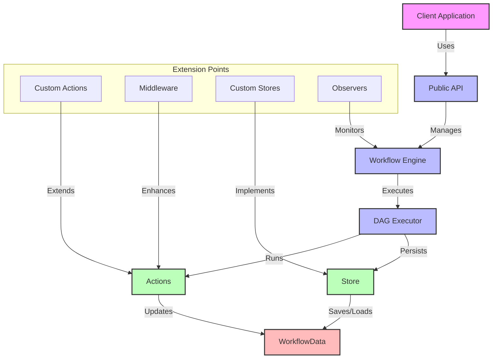

# Architecture Overview

Flow Orchestrator is designed as a lightweight, embeddable workflow engine for Go applications. This document provides a high-level overview of its architecture and design principles.

## Design Goals

Flow Orchestrator was created with several core design goals:

1. **High Performance**: Optimized for minimal memory allocations and maximum throughput
2. **Thread Safety**: All components designed for concurrent access with minimal lock contention
3. **Persistence**: Ability to save and resume workflows across application restarts
4. **Observability**: Comprehensive metrics for monitoring and optimization
5. **Extensibility**: Support for multiple orchestration patterns
6. **Embeddability**: Clean API for integration into any Go application

## Core Architecture

The system is composed of several modular components that work together to execute workflows:

```
+---------------------+
|    Public API       |  <- Entry point for applications
+----------+----------+
           |
+----------v----------+
|  Workflow Engine    |  <- Orchestrates workflow execution
+----------+----------+
           |
+----------v----------+
|   DAG Executor      |  <- Executes nodes based on dependencies
+----------+----------+
           |
+-----+----+----+-----+
      |         |
+-----v----+ +--v------+
|  Actions | |  Store  |  <- Actions execute, Store persists
+----------+ +---------+
```

### System Interactions

The following diagram shows how the components interact in more detail:



### Workflow Engine

The Workflow Engine is the central component that:

- Manages the workflow lifecycle
- Coordinates the execution of the DAG
- Provides persistence capabilities
- Exposes metrics and observability hooks

### DAG (Directed Acyclic Graph)

The DAG component:

- Represents workflow as nodes with dependencies
- Ensures acyclicity (no circular dependencies)
- Performs topological sorting for execution order
- Provides a fluent builder API for workflow definition

### Actions

Actions are the executable units that:

- Implement business logic for workflow steps
- Access and modify shared workflow data
- Signal completion or failure of nodes
- Are enhanced through middleware for cross-cutting concerns

### Stores

Stores provide persistence capabilities to:

- Save workflow state between executions
- Enable resumable workflows after crashes or restarts
- Support different backend storage mechanisms
- Maintain execution history and node status

## Memory Model

Flow Orchestrator employs several memory optimization techniques:

1. **Arena Allocation**: Reduces GC pressure by allocating related objects together
2. **String Interning**: Deduplicates strings to reduce memory usage
3. **Object Pooling**: Reuses objects to minimize allocations
4. **Lock-Free Algorithms**: Where possible, uses atomic operations instead of mutexes

## Package Organization

The codebase is organized into several packages:

- `pkg/workflow`: Public API and interfaces
  - `workflow/builder`: Fluent builder API for workflows
  - `workflow/dag`: DAG implementation and topological sorting
  - `workflow/action`: Action interfaces and implementations
  - `workflow/store`: Persistence implementations
  - `workflow/middleware`: Middleware for cross-cutting concerns

- `internal`: Implementation details
  - `internal/engine`: Core workflow engine implementation
  - `internal/arena`: Memory arena implementations
  - `internal/executor`: DAG execution logic
  - `internal/metrics`: Metrics collection
  - `internal/observer`: Observer hooks for monitoring

## Execution Flow

When a workflow executes:

1. The engine validates the DAG for acyclicity
2. The DAG is topologically sorted to determine execution order
3. Nodes are executed according to their dependencies
4. Node status is tracked and persisted
5. Workflow data is shared between nodes
6. On completion, the final state is persisted
7. Metrics are collected and reported

## Middleware System

Flow Orchestrator uses a middleware system for cross-cutting concerns:

- Logging and tracing
- Retries and circuit breaking
- Timeouts and rate limiting
- Metrics collection
- Permission checks
- Input validation

Middleware uses a functional composition pattern, making it easy to chain multiple behaviors:

```go
action := LoggingMiddleware(RetryMiddleware(3, time.Second)(myAction))
```

## Persistence Layer

The persistence layer allows workflows to be saved and resumed:

- In-memory store for ephemeral workflows
- File-based stores (JSON, FlatBuffers) for simple persistence
- Database adapters for production use
- Custom store implementations for specialized needs

## Extensibility Points

The system provides several extension points:

- Custom Action implementations
- Middleware for cross-cutting concerns
- Custom Store implementations
- Observer hooks for monitoring
- Metrics collectors
- Custom executor strategies

## Performance Characteristics

Flow Orchestrator is designed for high performance:

- Minimal memory allocations
- Efficient concurrency with fine-grained locking
- Binary serialization for persistence
- Optimized graph traversal algorithms
- Specialized memory management

For a more detailed understanding of specific components, refer to the component-specific documentation in the next sections. 