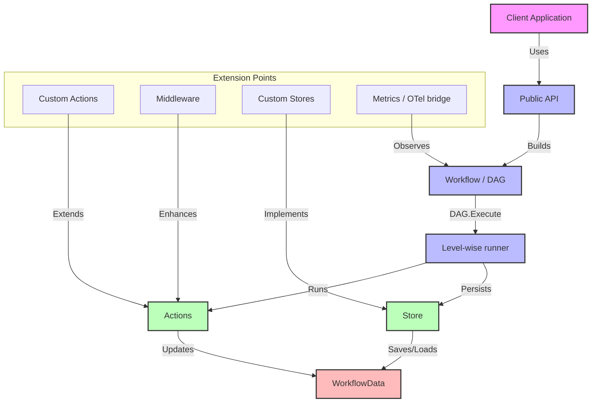

# Architecture Overview

Flow Orchestrator is designed as a lightweight, embeddable workflow engine for Go applications. This document provides a high-level overview of its architecture and design principles.

## Design Goals

Flow Orchestrator was created with several core design goals:

1. **High Performance**: Optimized for minimal memory allocations and maximum throughput
2. **Thread Safety**: All components designed for concurrent access with minimal lock contention
3. **Persistence**: Ability to save and resume workflows across application restarts
4. **Observability**: Comprehensive metrics for monitoring and optimization
5. **Extensibility**: Support for multiple orchestration patterns
6. **Embeddability**: Clean API for integration into any Go application

## Core Architecture

The system is composed of several modular components that work together to execute workflows:

```
+---------------------+
|    Public API       |  <- Entry point for applications
+----------+----------+
           |
+----------v----------+
|  Workflow / DAG     |  <- Holds structure + execution context
+----------+----------+
           |
+----------v----------+
|  DAG.Execute        |  <- Runs nodes level-wise by dependencies
+----------+----------+
           |
+-----+----+----+-----+
      |         |
+-----v----+ +--v------+
|  Actions | |  Store  |  <- Actions execute, Store persists
+----------+ +---------+
```

### System Interactions

The following diagram shows how the components interact in more detail:


```mermaid
graph TD
    A[Client Application] -->|Uses| B[Public API]
    B -->|Builds| C[Workflow / DAG]
    C -->|DAG.Execute| D[Level-wise runner]
    D -->|Runs| E[Actions]
    D -->|Persists| F[Store]
    E -->|Updates| G[WorkflowData]
    F -->|Saves/Loads| G
    
    subgraph "Extension Points"
        H[Custom Actions]
        I[Middleware]
        J[Custom Stores]
        K[Metrics / OTel bridge]
    end
    
    H -->|Extends| E
    I -->|Enhances| E
    J -->|Implements| F
    K -->|Observes| C
    
    style A fill:#f9f,stroke:#333,stroke-width:2px
    style B fill:#bbf,stroke:#333,stroke-width:2px
    style C fill:#bbf,stroke:#333,stroke-width:2px
    style D fill:#bbf,stroke:#333,stroke-width:2px
    style E fill:#bfb,stroke:#333,stroke-width:2px
    style F fill:#bfb,stroke:#333,stroke-width:2px
    style G fill:#fbb,stroke:#333,stroke-width:2px
```

### Workflow Engine

Workflow execution (`DAG.Execute` / `Workflow.Execute`) is the central flow that:

- Coordinates execution of the DAG, level by level
- Tracks node status on the `WorkflowData`
- Provides persistence via the wired `WorkflowStore`
- Records per-operation metrics (exportable to OpenTelemetry)

### DAG (Directed Acyclic Graph)

The DAG component:

- Represents workflow as nodes with dependencies
- Ensures acyclicity (no circular dependencies)
- Performs topological sorting for execution order
- Provides a fluent builder API for workflow definition

### Actions

Actions are the executable units that:

- Implement business logic for workflow steps
- Access and modify shared workflow data
- Signal completion or failure of nodes
- Are enhanced through middleware for cross-cutting concerns

### Stores

Stores provide persistence capabilities to:

- Save workflow state between executions
- Enable resumable workflows after crashes or restarts
- Support different backend storage mechanisms
- Maintain execution history and node status

## Memory Model

Flow Orchestrator employs several memory optimization techniques:

1. **Arena Allocation**: Reduces GC pressure by allocating related objects together
2. **String Interning**: Deduplicates strings to reduce memory usage
3. **Object Pooling**: Reuses objects to minimize allocations
4. **Lock-free config reads**: the metrics config is swapped via `atomic.Pointer`, so reads avoid a mutex (the executor itself uses a channel-semaphore + goroutines, not lock-free scheduling)

## Package Organization

The codebase is organized into a public package and an internal tree:

- `pkg/workflow`: the public API — a single Go package made up of flat `.go`
  files (the builder, DAG, nodes, actions, middleware, stores, `WorkflowData`,
  execution config, error sentinels, version). It is **not** split into
  `builder`/`dag`/`action`/`store` subpackages; those concerns are all files
  within `pkg/workflow`. Its only subpackages are:
  - `pkg/workflow/metrics`: public metrics facade (incl. the OTel bridge)
  - `pkg/workflow/schema`: the FlatBuffers schema (`.fbs`)

- `internal/workflow`: implementation details, not importable by consumers:
  - `internal/workflow/arena`: memory arena allocator + string pool
  - `internal/workflow/fb`: generated FlatBuffers code
  - `internal/workflow/memory`: object/buffer pools
  - `internal/workflow/metrics`: metrics collector (the facade aliases this)
  - `internal/workflow/utils`: internal utilities (e.g. secure random)
  - `internal/workflow/benchmark`: internal benchmarks

## Execution Flow

When a workflow executes:

1. The engine validates the DAG for acyclicity
2. The DAG is topologically sorted to determine execution order
3. Nodes are executed according to their dependencies
4. Node status is tracked in the shared workflow data
5. Workflow data is shared between nodes
6. If the store implements `Checkpointer`, progress is durably checkpointed at
   each completed level barrier (crash-resume); on completion the final state is
   persisted
7. Metrics are collected and reported

## Middleware System

Flow Orchestrator uses a middleware system for cross-cutting concerns:

- Logging and tracing
- Retries and circuit breaking
- Timeouts and rate limiting
- Metrics collection
- Permission checks
- Input validation

Middleware uses a functional composition pattern, making it easy to chain multiple behaviors:

```go
action := LoggingMiddleware(RetryMiddleware(3, time.Second)(myAction))
```

## Persistence Layer

The persistence layer allows workflows to be saved and resumed:

- `InMemoryStore` for ephemeral workflows (e.g. testing)
- File-based stores: `JSONFileStore` and `FlatBuffersStore`
- Custom store implementations via the `WorkflowStore` interface

A store may additionally implement the optional `Checkpointer` interface to enable
**durable crash-resume**: the run is checkpointed at each completed level barrier,
and re-running `Execute` with the same `WorkflowID`/store/DAG resumes from the last
checkpoint (skipping `Completed` nodes). All three built-in stores implement it; a
store that does not keeps the prior save-at-boundaries behavior with zero overhead.
Non-completed nodes re-run on resume — an **at-least-once** contract that requires
side-effecting actions to be idempotent (see the
[Persistence guide](../guides/persistence.md#durability--idempotency-crash-resume)).

## Extensibility Points

The system provides several extension points:

- Custom Action implementations (the `Action` interface)
- Middleware for cross-cutting concerns
- Custom Store implementations (the `WorkflowStore` interface)
- Metrics collection, exportable to OpenTelemetry via the metrics bridge

## Performance Characteristics

Flow Orchestrator is designed for high performance:

- Minimal memory allocations
- Efficient concurrency with fine-grained locking
- Binary serialization for persistence
- Optimized graph traversal algorithms
- Specialized memory management

For a more detailed understanding of specific components, refer to the component-specific documentation in the next sections. 