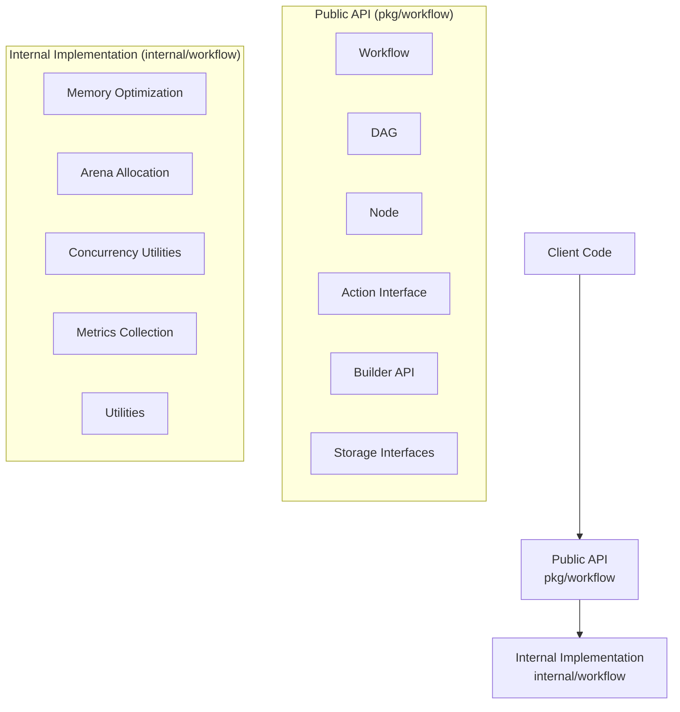
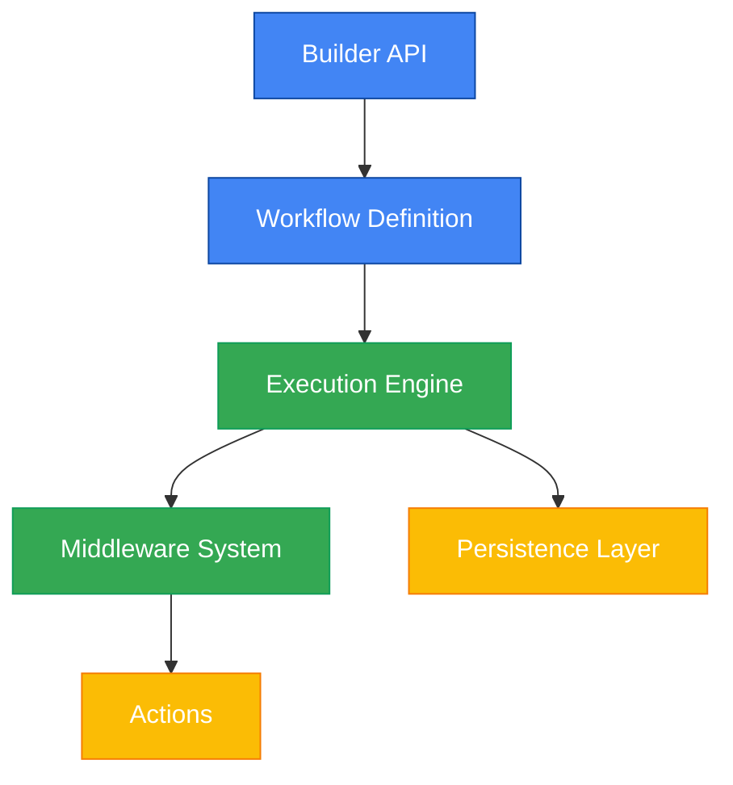
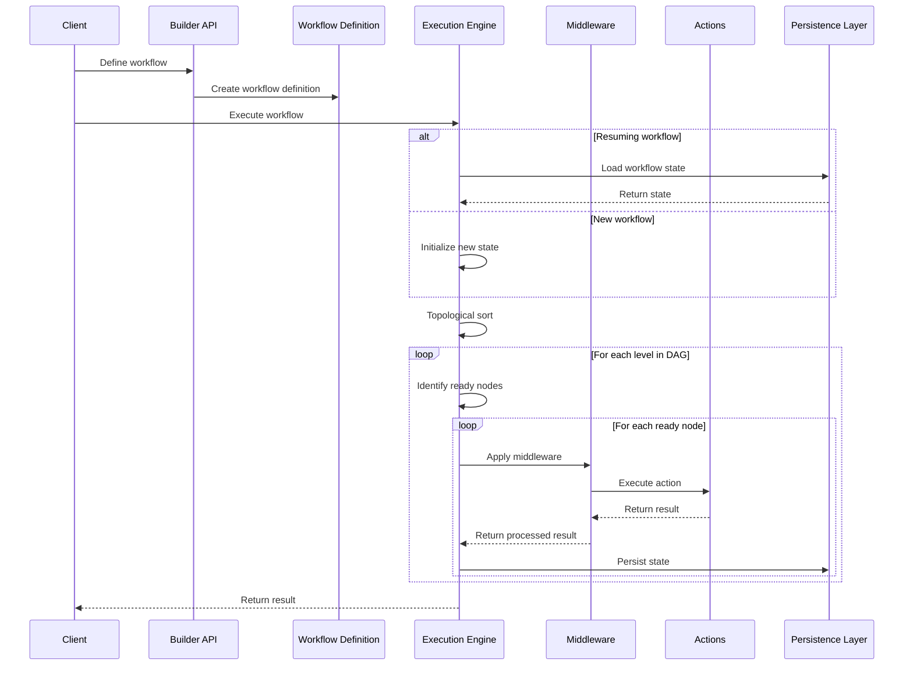

# Architecture Overview

## Introduction

Flow Orchestrator is a Go library for defining and executing workflows as Directed Acyclic Graphs (DAGs). It provides a modular architecture centered around a workflow engine that executes DAGs of tasks, with a focus on reliability, performance, and extensibility.

## Package Structure

Flow Orchestrator follows a clean separation between public API and internal implementation:



### Public API (`pkg/workflow`)

The public API is designed to be stable, well-documented, and user-friendly. It contains:

- **Core Types**: `Workflow`, `DAG`, `Node`, and `Action` interface
- **Builder API**: Fluent interface for defining workflows
- **Middleware System**: Cross-cutting concerns like logging, retries
- **Data Management**: `WorkflowData` for workflow state
- **Storage**: `WorkflowStore` interface and implementations

### Internal Implementation (`internal/workflow`)

The internal packages contain implementation details that users shouldn't depend on directly:

- **Memory Management**: Arena allocation, object pooling
- **Concurrency Utilities**: Thread-safe data structures
- **Metrics Collection**: Performance monitoring

For detailed information on memory management and concurrent data structures, see [Memory Management and Concurrent Data Structures](memory_and_concurrency.md).

This separation provides several benefits:
- **API Stability**: Implementation details can change without breaking user code
- **Clearer API**: Users can easily identify what they should use
- **Implementation Freedom**: Internal code can be refactored freely

## System Architecture

Flow Orchestrator follows a modular architecture with clear separation of concerns:



### System Interaction Flow

The following diagram illustrates how the different components interact during workflow execution:



## Core Components

### Builder API

The Builder API provides a fluent interface for defining workflows:

- **WorkflowBuilder**: Creates workflow definitions using a fluent interface
- **NodeBuilder**: Configures individual nodes within a workflow
- **ActionBuilder**: Defines actions to be executed by nodes

### Workflow Definition

The Workflow Definition represents the structure of a workflow:

- **Workflow**: The top-level container for a workflow execution
- **DAG**: The directed acyclic graph representing the workflow structure
- **Node**: Individual units of work within the workflow
- **Action**: The actual implementation of work to be performed

### Execution Engine

The Execution Engine is responsible for executing workflows:

- **Topological Sorting**: Determines the execution order of nodes
- **Parallel Execution**: Executes independent nodes concurrently
- **State Management**: Tracks the state of workflow execution
- **Error Handling**: Manages errors during execution

### Middleware System

The Middleware System provides a way to add cross-cutting concerns:

- **Middleware Stack**: Manages a collection of middleware
- **Built-in Middleware**: Provides common functionality (logging, retries, timeouts)
- **Custom Middleware**: Allows for extension with custom behavior

### Actions

Actions are the executable units of work:

- **ActionFunc**: Function type that implements the Action interface
- **CompositeAction**: Combines multiple actions into one
- **ValidationAction**: Validates input data
- **MapAction**: Transforms data

### Persistence Layer

The Persistence Layer enables workflow state to be saved and restored:

- **WorkflowStore**: Interface for storage implementations
- **FlatBuffersStore**: Efficient binary serialization
- **InMemoryStore**: In-memory storage for testing

## Interaction Flow

1. **Workflow Definition**: The client defines a workflow using the Builder API
2. **Workflow Validation**: The workflow is validated to ensure it's properly formed
3. **Workflow Execution**: The Execution Engine executes the workflow
4. **Node Execution**: Each node executes its action with the shared workflow data
5. **State Persistence**: The workflow state is persisted at defined points
6. **Result Retrieval**: The client retrieves the results of the workflow execution

## Design Principles

Flow Orchestrator is built on the following design principles:

### Fluent API Design

The Builder API provides a fluent interface for defining workflows, making it intuitive and easy to use:

```go
builder := workflow.NewWorkflowBuilder().
    WithWorkflowID("data-processing")

builder.AddStartNode("fetch-data").
    WithAction(fetchDataAction)

builder.AddNode("process-data").
    WithAction(processDataAction).
    DependsOn("fetch-data")
```

### Separation of Concerns

Each component has a clear responsibility:

- **Builder API**: Workflow definition
- **Execution Engine**: Workflow execution
- **Middleware System**: Cross-cutting concerns
- **Persistence Layer**: State management

### Performance Optimization

Performance is optimized through:

- **Parallel Execution**: Independent nodes are executed concurrently
- **Memory Efficiency**: Arena-based memory management and string interning
- **Efficient Serialization**: FlatBuffers for binary serialization

### Extensibility

The system is designed to be extensible:

- **Custom Actions**: Implement the Action interface
- **Custom Middleware**: Create middleware functions
- **Custom Storage**: Implement the WorkflowStore interface

### Embeddability

Flow Orchestrator is designed to be embedded in other applications:

- **No External Dependencies**: Minimal dependencies on external libraries
- **Clear API Boundaries**: Well-defined interfaces for integration
- **Configurable Components**: Components can be configured for specific needs

## Key Design Patterns

Flow Orchestrator uses several key design patterns:

### Builder Pattern

The Builder Pattern is used for constructing workflows:

```go
builder := workflow.NewWorkflowBuilder()
// Configure the workflow
workflow, err := builder.Build()
```

### Directed Acyclic Graph (DAG)

The DAG pattern represents workflows as a collection of nodes with dependencies:

```go
dag := workflow.NewDAG("my-workflow")
dag.AddNode(node1)
dag.AddNode(node2)
dag.AddDependency("node1", "node2")
```

### Middleware Pattern

The Middleware Pattern adds behavior to actions:

```go
middleware := workflow.LoggingMiddleware()
wrappedAction := middleware(action)
```

### Repository Pattern

The Repository Pattern abstracts storage operations:

```go
store := workflow.NewFlatBuffersStore("/path/to/storage")
workflow.Store = store
```

### Data-Oriented Design

Data-Oriented Design focuses on efficient data structures and memory layout:

```go
data := workflow.NewWorkflowData()
data.WithArena(arena.NewArena())
```

## Conclusion

Flow Orchestrator provides a powerful and flexible system for defining and executing workflows. Its modular architecture, fluent API, and focus on performance make it suitable for a wide range of workflow orchestration needs. 