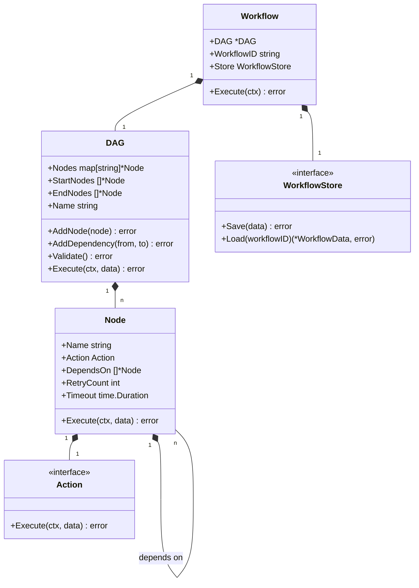
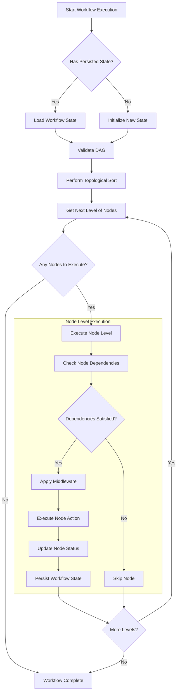

# Workflow Engine Core

The Workflow Engine Core is the central component of Flow Orchestrator, responsible for defining and executing workflows as Directed Acyclic Graphs (DAGs).

## Package Structure

The Workflow Engine is implemented across two package hierarchies:

1. **Public API** (`pkg/workflow`): Contains the interfaces and types that users interact with
2. **Internal Implementation** (`internal/workflow`): Contains implementation details

This document focuses on the architecture and design of the workflow engine, while implementation details are abstracted away from users.

## Overview

The Workflow Engine Core is the central component of Flow Orchestrator, responsible for defining and executing workflows. It implements the Directed Acyclic Graph (DAG) pattern to represent workflows as a collection of nodes with dependencies between them.

## Component Structure

The Workflow Engine Core consists of several key subcomponents:

1. **Workflow**: The top-level container for a workflow execution
2. **DAG**: The directed acyclic graph representing the workflow structure
3. **Node**: Individual units of work within the workflow
4. **Action**: The actual implementation of work to be performed
5. **WorkflowData**: The shared data store for workflow execution



## Detailed Component Design

### Workflow

The `Workflow` struct serves as the main entry point for workflow execution:

```go
type Workflow struct {
    DAG        *DAG
    WorkflowID string
    Store      WorkflowStore
}
```

**Responsibilities:**
- Coordinating the execution of the DAG
- Managing workflow state persistence through the Store
- Providing a clean API for workflow execution

**Key Methods:**
- `Execute(ctx context.Context) error`: Executes the workflow
- `WithWorkflowID(id string) *Workflow`: Sets the workflow ID
- `FromBuilder(builder *WorkflowBuilder) (*Workflow, error)`: Creates a workflow from a builder

### DAG (Directed Acyclic Graph)

The `DAG` struct represents the structure of a workflow as a directed acyclic graph:

```go
type DAG struct {
    Nodes      map[string]*Node
    StartNodes []*Node
    EndNodes   []*Node
    Name       string
    CycleNodes []string
    mu         sync.RWMutex
}
```

**Responsibilities:**
- Maintaining the graph structure of nodes and dependencies
- Validating the graph (e.g., detecting cycles)
- Determining execution order through topological sorting
- Coordinating node execution

**Key Methods:**
- `AddNode(node *Node) error`: Adds a node to the DAG
- `AddDependency(fromNode, toNode string) error`: Adds a dependency between nodes
- `Validate() error`: Validates the DAG structure
- `Execute(ctx context.Context, data *WorkflowData) error`: Executes the DAG
- `TopologicalSort() ([][]*Node, error)`: Sorts nodes for execution

### Node

The `Node` struct represents a single unit of work in the workflow:

```go
type Node struct {
    Name       string
    Action     Action
    DependsOn  []*Node
    RetryCount int
    Timeout    time.Duration
}
```

**Responsibilities:**
- Encapsulating a unit of work (via the Action)
- Tracking dependencies on other nodes
- Managing execution options (retries, timeout)

**Key Methods:**
- `Execute(ctx context.Context, data *WorkflowData) error`: Executes the node's action
- `AddDependency(dep *Node)`: Adds a dependency to this node
- `WithRetries(count int) *Node`: Configures retry behavior
- `WithTimeout(timeout time.Duration) *Node`: Sets an execution timeout

### Action

The `Action` interface defines the contract for executable work:

```go
type Action interface {
    Execute(ctx context.Context, data *WorkflowData) error
}
```

**Implementations:**
- `ActionFunc`: Function type that implements the Action interface
- `CompositeAction`: Combines multiple actions into one
- `ValidationAction`: Validates input data
- `MapAction`: Transforms data
- `RetryableAction`: Adds retry capability to an action

**Key Patterns:**
- Function adapters for easy action creation
- Composition for building complex actions
- Middleware for cross-cutting concerns

### WorkflowData

The `WorkflowData` struct serves as the central data store for workflow execution:

```go
type WorkflowData struct {
    mu             sync.RWMutex
    data           map[string]interface{}
    nodeStatus     map[string]NodeStatus
    outputs        map[string]interface{}
    ID             string
    metricsConfig  *metrics.MetricsConfig
    metrics        *metrics.MetricsCollector
    stringInterner *StringInterner
    arena          *arena.Arena
    stringPool     *arena.StringPool
}
```

**Responsibilities:**
- Storing and retrieving workflow data
- Tracking node status
- Managing node outputs
- Optimizing memory usage (arena, string interning)
- Collecting metrics

**Key Methods:**
- `Set(key string, value interface{})`: Stores a value
- `Get(key string) (interface{}, bool)`: Retrieves a value
- `SetNodeStatus(nodeName string, status NodeStatus)`: Updates node status
- `GetNodeStatus(nodeName string) (NodeStatus, bool)`: Gets node status
- `SetOutput(nodeName string, output interface{})`: Stores node output
- `GetOutput(nodeName string) (interface{}, bool)`: Retrieves node output

## Execution Flow

The execution flow within the Workflow Engine Core follows these steps:



1. **Initialization**:
   - A `Workflow` is created, either directly or via a `WorkflowBuilder`
   - The `DAG` structure is validated

2. **Execution Start**:
   - `Workflow.Execute()` is called with a context
   - The workflow loads any existing state from the `Store`

3. **DAG Execution**:
   - The `DAG` performs topological sorting to determine execution order
   - Levels of nodes are identified (nodes at the same level can execute in parallel)

4. **Node Execution**:
   - For each level, nodes are executed in parallel if possible
   - Each node's dependencies are checked before execution
   - Node status is tracked in `WorkflowData`

5. **Action Execution**:
   - Each node executes its `Action`
   - The action operates on the shared `WorkflowData`
   - Middleware may be applied to actions

6. **Completion**:
   - After all nodes complete, the workflow state is saved
   - Results can be retrieved from `WorkflowData`

## Error Handling

The Workflow Engine Core handles errors at multiple levels:

1. **Node-Level Error Handling**:
   - Retry mechanisms for transient failures
   - Timeout handling to prevent indefinite execution
   - Status tracking to identify failed nodes

2. **Workflow-Level Error Handling**:
   - Propagation of node errors to the workflow level
   - Context cancellation for graceful shutdown
   - State persistence for recovery

3. **Action-Level Error Handling**:
   - Error wrapping for context
   - Middleware for specialized error handling
   - Conditional retry based on error types

## Performance Considerations

The Workflow Engine Core is designed with performance in mind:

1. **Memory Efficiency**:
   - Arena-based memory management
   - String interning to reduce allocations
   - Efficient data structures

2. **Concurrency**:
   - Parallel execution of independent nodes
   - Lock-free data structures where possible
   - Minimal lock contention

3. **Scalability**:
   - Configurable worker pools
   - Resource-aware execution
   - Efficient dependency resolution

## Extension Points

The Workflow Engine Core provides several extension points:

1. **Custom Actions**:
   - Implement the `Action` interface
   - Use function adapters for simple cases
   - Compose actions for complex behavior

2. **Middleware**:
   - Create custom middleware functions
   - Add to the middleware stack
   - Apply to specific actions or globally

3. **Storage**:
   - Implement the `WorkflowStore` interface
   - Provide custom serialization/deserialization
   - Integrate with different storage backends

## Usage Examples

### Basic Workflow Execution

```go
// Create a workflow
workflow := &workflow.Workflow{
    DAG:        dag,
    WorkflowID: "simple-workflow",
    Store:      store,
}

// Execute the workflow
err := workflow.Execute(context.Background())
```

### Using the Builder API

```go
// Create a workflow builder
builder := workflow.NewWorkflowBuilder().
    WithWorkflowID("order-processing").
    WithStateStore(store)

// Add workflow steps
builder.AddStartNode("validate-order").
    WithAction(validateOrderAction)

builder.AddNode("process-payment").
    WithAction(processPaymentAction).
    DependsOn("validate-order")

// Build and execute the workflow
dag, _ := builder.Build()
workflow := &workflow.Workflow{
    DAG:        dag,
    WorkflowID: "order-processing",
    Store:      store,
}
err := workflow.Execute(context.Background())
```

## Conclusion

The Workflow Engine Core provides a robust foundation for defining and executing workflows. By implementing the DAG pattern and providing a clean API, it enables complex workflow orchestration while maintaining performance and flexibility.

The component's design emphasizes separation of concerns, extensibility, and performance, making it suitable for a wide range of workflow orchestration needs within Go applications. 

## Testing Approaches

The Workflow Engine Core is tested using multiple complementary approaches to ensure correctness, reliability, and performance:

### Unit Testing

Traditional unit tests verify the behavior of individual components and their interactions. These tests focus on specific functionality and edge cases.

### Property-Based Testing

Property-based testing is used to verify that the workflow engine satisfies fundamental invariants across a wide range of inputs. This approach automatically explores the input space to find edge cases and provides statistical confidence in the correctness of the implementation.

Key properties tested include:
- Dependency execution order (nodes only execute after dependencies complete)
- Deterministic execution (same inputs produce same outputs)
- Cancellation behavior (workflows can be properly cancelled)
- Cycle detection (DAG validation correctly identifies cycles)
- Workflow data operations (data store correctly handles values)
- Node status transitions (nodes transition through correct states)

Property tests are implemented using the [gopter](https://github.com/leanovate/gopter) library and are located in `pkg/workflow/workflow_properties_test.go`.

### Integration Testing

Integration tests verify the end-to-end behavior of the workflow engine, including interactions with external components like storage backends.

### Performance Testing

Benchmarks measure the performance characteristics of the workflow engine under various conditions, ensuring it meets performance requirements for different workflow sizes and complexities. 