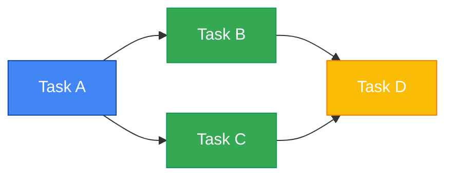
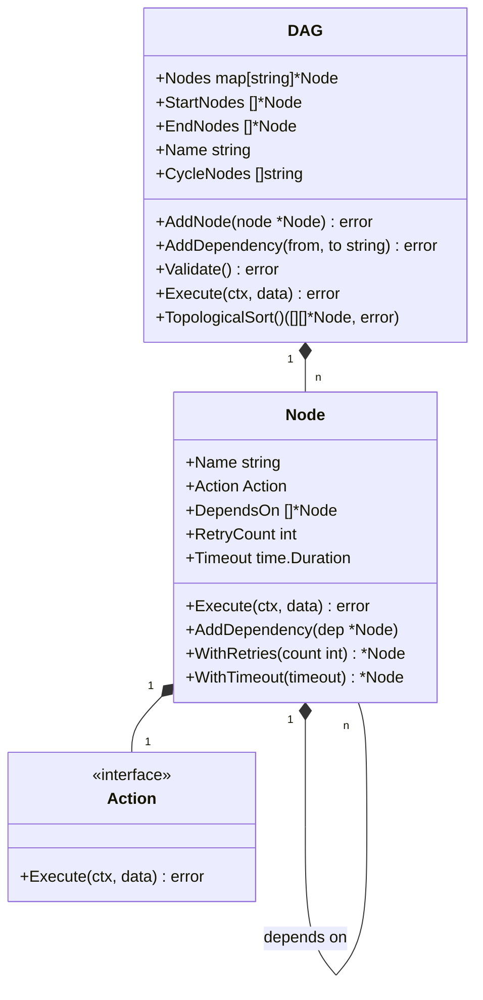
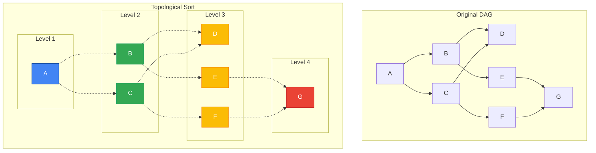
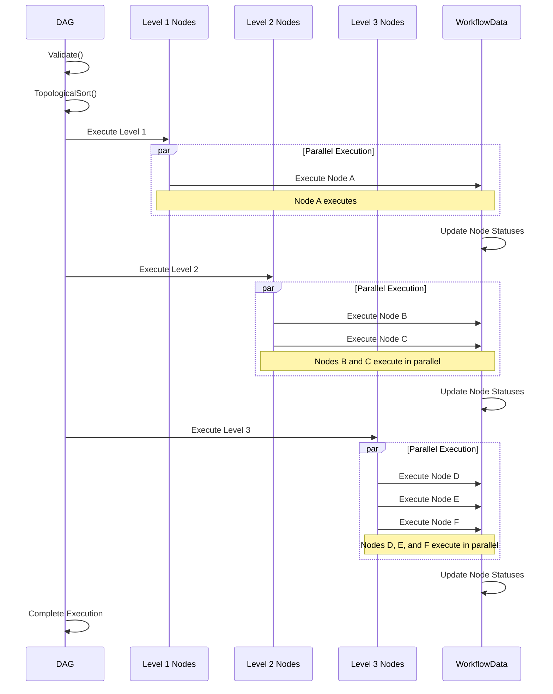

# DAG Execution Model

This document explains the Directed Acyclic Graph (DAG) execution model used by Flow Orchestrator. 

## Public API

The DAG execution model is exposed through the following public API components in the `pkg/workflow` package:

- `DAG`: Represents the workflow structure
- `Node`: Represents a unit of work
- `Action`: Interface for executable work
- `Workflow`: Top-level execution container

## Conceptual Model

A workflow is represented as a Directed Acyclic Graph (DAG) where:
- Each node represents a discrete task or action
- Edges represent execution dependencies
- The acyclic property ensures that workflows can complete without infinite loops

## Overview

The Directed Acyclic Graph (DAG) execution model is the core paradigm used by Flow Orchestrator to represent and execute workflows. This document explains how DAGs are structured, validated, and executed within the system.

## What is a DAG?

A Directed Acyclic Graph (DAG) is a graph structure consisting of:
- **Nodes**: Individual units of work (tasks)
- **Directed Edges**: Dependencies between nodes (one node depends on another)
- **Acyclic Property**: No cycles are allowed (a node cannot depend on itself directly or indirectly)

In Flow Orchestrator, DAGs are used to model workflows where:
- Each node represents a discrete task or action
- Edges represent execution dependencies
- The acyclic property ensures that workflows can complete without infinite loops



## DAG Structure in Flow Orchestrator

### Core Components

The DAG structure in Flow Orchestrator consists of:

```go
type DAG struct {
    Nodes      map[string]*Node
    StartNodes []*Node
    EndNodes   []*Node
    Name       string
    CycleNodes []string
    mu         sync.RWMutex
}
```

- **Nodes**: A map of all nodes in the DAG, indexed by name
- **StartNodes**: Nodes with no dependencies (entry points)
- **EndNodes**: Nodes with no dependents (exit points)
- **Name**: Identifier for the DAG
- **CycleNodes**: Used for cycle detection and reporting

### Node Structure

Each node in the DAG is represented by:

```go
type Node struct {
    Name       string
    Action     Action
    DependsOn  []*Node
    RetryCount int
    Timeout    time.Duration
}
```

- **Name**: Unique identifier for the node
- **Action**: The actual work to be performed
- **DependsOn**: List of nodes that must complete before this node can execute
- **RetryCount**: Number of retry attempts if execution fails
- **Timeout**: Maximum execution time



## DAG Construction

### Using the Builder API

The recommended way to construct a DAG is through the fluent Builder API:

```go
builder := workflow.NewWorkflowBuilder().
    WithWorkflowID("data-processing")

// Add nodes with dependencies
builder.AddStartNode("fetch-data").
    WithAction(fetchDataAction)

builder.AddNode("process-data").
    WithAction(processDataAction).
    DependsOn("fetch-data")

builder.AddNode("store-data").
    WithAction(storeDataAction).
    DependsOn("process-data")

// Build the DAG
dag, err := builder.Build()
```

### Direct Construction

For advanced use cases, DAGs can be constructed directly:

```go
// Create a new DAG
dag := workflow.NewDAG("manual-workflow")

// Create nodes
fetchNode := workflow.NewNode("fetch", fetchAction)
processNode := workflow.NewNode("process", processAction)
storeNode := workflow.NewNode("store", storeAction)

// Add nodes to DAG
dag.AddNode(fetchNode)
dag.AddNode(processNode)
dag.AddNode(storeNode)

// Add dependencies
dag.AddDependency("fetch", "process")
dag.AddDependency("process", "store")

// Validate the DAG
err := dag.Validate()
```

## DAG Validation

Before execution, DAGs are validated to ensure they meet the requirements:

1. **Cycle Detection**: Ensures the graph is truly acyclic
2. **Node Existence**: Verifies all referenced nodes exist
3. **Start/End Node Identification**: Identifies entry and exit points
4. **Connectivity**: Ensures all nodes are reachable

The validation process uses a depth-first search algorithm to detect cycles:

```go
func (d *DAG) detectCycle(nodeName string, visited, inProgress map[string]bool) bool {
    // If node is already being processed in current path, we found a cycle
    if inProgress[nodeName] {
        d.CycleNodes = append(d.CycleNodes, nodeName)
        return true
    }

    // If node was already visited in another path, no cycle here
    if visited[nodeName] {
        return false
    }

    // Mark node as in progress for current path
    inProgress[nodeName] = true

    // Check all dependencies
    node := d.Nodes[nodeName]
    for _, dep := range node.DependsOn {
        if d.detectCycle(dep.Name, visited, inProgress) {
            d.CycleNodes = append(d.CycleNodes, nodeName)
            return true
        }
    }

    // Mark node as visited and no longer in progress
    visited[nodeName] = true
    inProgress[nodeName] = false
    return false
}
```

## Topological Sorting

To determine the execution order, Flow Orchestrator performs topological sorting on the DAG:

1. **Level Identification**: Nodes are grouped into levels based on their dependencies
2. **Parallel Execution**: Nodes within the same level can be executed in parallel
3. **Sequential Levels**: Levels are executed sequentially



The topological sorting algorithm:

```go
func (d *DAG) GetLevels() [][]*Node {
    // Initialize data structures
    levels := make([][]*Node, 0)
    visited := make(map[string]bool)
    
    // Process until all nodes are visited
    for len(visited) < len(d.Nodes) {
        // Find nodes ready for current level
        currentLevel := make([]*Node, 0)
        
        for name, node := range d.Nodes {
            if visited[name] {
                continue
            }
            
            // Check if all dependencies are visited
            allDepsVisited := true
            for _, dep := range node.DependsOn {
                if !visited[dep.Name] {
                    allDepsVisited = false
                    break
                }
            }
            
            if allDepsVisited {
                currentLevel = append(currentLevel, node)
            }
        }
        
        // Add current level to levels
        levels = append(levels, currentLevel)
        
        // Mark nodes in current level as visited
        for _, node := range currentLevel {
            visited[node.Name] = true
        }
    }
    
    return levels
}
```

## Execution Process

The DAG execution process follows these steps:

1. **Validation**: The DAG is validated to ensure it's properly formed
2. **Topological Sorting**: Nodes are organized into execution levels
3. **Level-by-Level Execution**: Each level is executed, with nodes in the same level potentially running in parallel
4. **Node Execution**: Each node executes its action with the shared workflow data
5. **Status Tracking**: Node status is tracked in the workflow data
6. **Error Handling**: Errors are handled according to node configuration (retries, timeouts)



### Parallel Execution

Flow Orchestrator can execute independent nodes in parallel:

```go
func ExecuteNodesInLevel(ctx context.Context, level []*Node, data *WorkflowData) error {
    // Create error channel and wait group
    errChan := make(chan error, len(level))
    var wg sync.WaitGroup
    
    // Execute each node in this level in parallel
    for _, node := range level {
        wg.Add(1)
        go func(n *Node) {
            defer wg.Done()
            
            // Execute the node
            err := n.Execute(ctx, data)
            if err != nil {
                errChan <- err
            }
        }(node)
    }
    
    // Wait for all nodes to complete
    wg.Wait()
    close(errChan)
    
    // Check for errors
    for err := range errChan {
        return err // Return the first error encountered
    }
    
    return nil
}
```

## Error Handling

DAG execution includes robust error handling:

1. **Node-Level Retries**: Individual nodes can be configured with retry policies
2. **Error Propagation**: Errors are propagated up to the workflow level
3. **Partial Execution**: The system tracks which nodes have completed successfully
4. **Recovery**: Workflows can be resumed from the last successful state

## Persistence and Recovery

DAGs can be persisted and recovered:

1. **State Persistence**: The workflow state, including node statuses, is persisted
2. **Incremental Execution**: When resumed, only incomplete nodes are executed
3. **Idempotent Execution**: Nodes are designed to be safely re-executed if necessary

## Performance Considerations

For optimal DAG execution performance:

1. **Balanced DAG Structure**: Design DAGs with balanced levels for maximum parallelism
2. **Appropriate Granularity**: Choose the right level of granularity for nodes
3. **Resource Awareness**: Consider resource constraints when executing parallel nodes
4. **Efficient Actions**: Implement actions that complete quickly or yield appropriately

## Best Practices

When designing and executing DAGs:

1. **Clear Naming**: Use clear, descriptive names for nodes
2. **Appropriate Dependencies**: Only add necessary dependencies
3. **Error Handling**: Implement proper error handling at the node level
4. **Idempotent Actions**: Design actions to be idempotent when possible
5. **Monitoring**: Add appropriate logging and metrics for visibility
6. **Testing**: Test DAGs with different execution scenarios

## Conclusion

The DAG execution model provides a powerful and flexible way to represent and execute workflows in Flow Orchestrator. By understanding how DAGs are structured, validated, and executed, you can design efficient and reliable workflows for your applications.

The combination of parallel execution, error handling, and persistence capabilities makes the DAG execution model suitable for a wide range of workflow orchestration needs, from simple linear processes to complex, multi-path workflows with sophisticated dependency structures. 