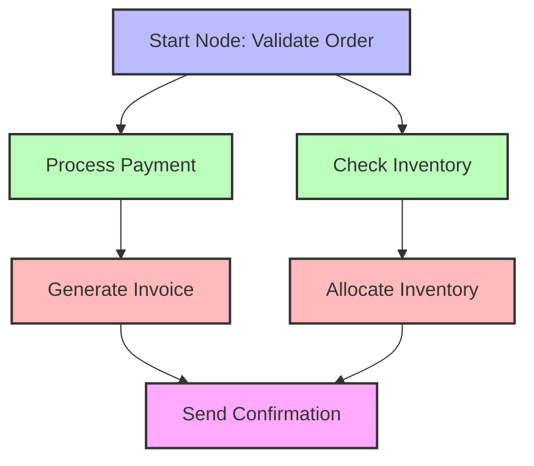

# Basic Concepts

This guide explains the core concepts and terminology used in Flow Orchestrator. Understanding these concepts will help you effectively use the library for your workflow needs.

## Core Concepts

### Workflow

A workflow is the top-level container for a set of coordinated tasks. In Flow Orchestrator, a workflow:

- Has a unique identifier
- Contains a Directed Acyclic Graph (DAG) of nodes
- Can be executed, paused, resumed, and persisted
- Maintains state across executions

```go
workflow := &workflow.Workflow{
    DAG:        dag,
    WorkflowID: "my-workflow",
    Store:      store,
}
```

### Directed Acyclic Graph (DAG)

A DAG represents the structure of a workflow as a collection of nodes with dependencies between them. Key characteristics:

- **Directed**: Dependencies flow in one direction
- **Acyclic**: No cycles are allowed (a node cannot depend on itself directly or indirectly)
- **Graph**: A network of nodes connected by dependencies

Here's an example of a DAG for an order processing workflow:



```go
dag := workflow.NewDAG("my-dag")
// Add nodes and dependencies
```

### Node

A node represents a single unit of work in a workflow. Each node:

- Has a unique name within the workflow
- Contains an action to execute
- May depend on other nodes
- Has execution options (retries, timeout)

```go
node := workflow.NewNode("process-data", processDataAction)
node.WithRetries(3).WithTimeout(5 * time.Second)
```

### Action

An action is the executable code that performs the actual work of a node. The Action interface:

```go
type Action interface {
    Execute(ctx context.Context, data *WorkflowData) error
}
```

You can create actions as functions:

```go
processDataAction := func(ctx context.Context, data *workflow.WorkflowData) error {
    // Process data
    return nil
}
```

### WorkflowData

`WorkflowData` is the shared data store for workflow execution. It provides:

- Thread-safe data storage and retrieval
- Type-safe getters and setters
- Node status tracking
- Node output storage

```go
// Store a value
data.Set("user_id", 123)

// Retrieve a value
userID, ok := data.GetInt("user_id")

// Store node output
data.SetOutput("fetch-data", fetchResult)

// Get node output
output, ok := data.GetOutput("fetch-data")
```

### WorkflowStore

`WorkflowStore` is an interface for persisting workflow state:

```go
type WorkflowStore interface {
    Save(data *WorkflowData) error
    Load(workflowID string) (*WorkflowData, error)
    ListWorkflows() ([]string, error)
    Delete(workflowID string) error
}
```

Implementations include:
- `InMemoryStore`: For ephemeral workflows
- `JSONFileStore`: For simple file-based persistence
- `FlatBuffersStore`: For high-performance production use

### Middleware

Middleware provides a way to add cross-cutting concerns to actions:

```go
type Middleware func(Action) Action
```

Examples include:
- Logging
- Retries
- Timeouts
- Metrics collection
- Validation

```go
// Apply middleware to an action
loggedAction := workflow.LoggingMiddleware()(myAction)

// Apply multiple middleware with a stack
stack := workflow.NewMiddlewareStack()
stack.Use(workflow.LoggingMiddleware())
stack.Use(workflow.RetryMiddleware(3, time.Second))
wrappedAction := stack.Apply(myAction)
```

## Building Blocks

### WorkflowBuilder

The `WorkflowBuilder` provides a fluent interface for defining workflows:

```go
builder := workflow.NewWorkflowBuilder().
    WithWorkflowID("order-processing").
    WithStateStore(store)

// Add nodes
builder.AddStartNode("validate-order").
    WithAction(validateOrderAction)

builder.AddNode("process-payment").
    WithAction(processPaymentAction).
    DependsOn("validate-order")

// Build the DAG
dag, err := builder.Build()
```

### Node Status

Nodes have several possible status values that track their execution state:

- `Pending`: Node has not yet started execution
- `Running`: Node is currently executing
- `Completed`: Node has completed successfully
- `Failed`: Node has failed execution
- `Skipped`: Node was skipped due to dependency failures

```go
// Get a node's status
status, exists := data.GetNodeStatus("process-payment")

// Set a node's status
data.SetNodeStatus("process-payment", workflow.Completed)
```

## Execution Model

### Topological Execution

Flow Orchestrator executes workflows using a topological sort algorithm:

1. Nodes are grouped into levels based on their dependencies
2. Nodes within a level can be executed in parallel
3. A level is only executed after all nodes in previous levels are complete

### Parallel Execution

Nodes without dependencies between them can be executed in parallel:

```go
builder.AddNode("check-inventory").
    WithAction(checkInventoryAction).
    DependsOn("validate-order")

builder.AddNode("calculate-tax").
    WithAction(calculateTaxAction).
    DependsOn("validate-order")

// check-inventory and calculate-tax can execute in parallel
```

### Error Handling

Flow Orchestrator provides several mechanisms for error handling:

- **Retries**: Automatically retry failed actions
- **Error Types**: Distinguish between different error categories
- **Node Status**: Track execution status of nodes

```go
// With retry middleware
builder.AddNode("flaky-service").
    WithAction(workflow.RetryMiddleware(3, time.Second)(serviceAction))

// With built-in node retries
builder.AddNode("flaky-service").
    WithAction(serviceAction).
    WithRetries(3)
```

## Next Steps

Now that you understand the basic concepts, you might want to:

- Try the [Quickstart Guide](./quickstart.md) if you haven't already
- Follow the [Your First Workflow](./first-workflow.md) tutorial
- Learn about the [Middleware System](../guides/middleware.md)
- Explore the [DAG Execution Model](../architecture/dag-execution.md) in depth 