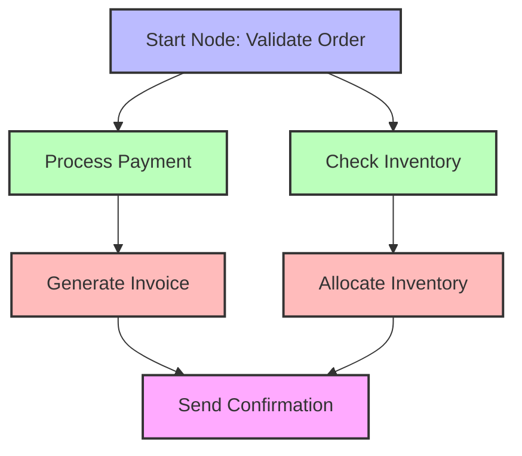

# Basic Concepts

This guide explains the core concepts and terminology used in Flow Orchestrator. Understanding these concepts will help you effectively use the library for your workflow needs.

## Core Concepts

### Workflow

A workflow is the top-level container for a set of coordinated tasks. In Flow Orchestrator, a workflow:

- Has a unique identifier
- Contains a Directed Acyclic Graph (DAG) of nodes
- Can be executed, paused, resumed, and persisted
- Maintains state across executions

```go
workflow := &workflow.Workflow{
    DAG:        dag,
    WorkflowID: "my-workflow",
    Store:      store,
}
```

### Directed Acyclic Graph (DAG)

A DAG represents the structure of a workflow as a collection of nodes with dependencies between them. Key characteristics:

- **Directed**: Dependencies flow in one direction
- **Acyclic**: No cycles are allowed (a node cannot depend on itself directly or indirectly)
- **Graph**: A network of nodes connected by dependencies

Here's an example of a DAG for an order processing workflow:


```mermaid
graph TD
    A[Start Node: Validate Order] --> B[Process Payment]
    A --> C[Check Inventory]
    B --> D[Generate Invoice]
    C --> E[Allocate Inventory]
    D --> F[Send Confirmation]
    E --> F
    
    style A fill:#bbf,stroke:#333,stroke-width:2px
    style B fill:#bfb,stroke:#333,stroke-width:2px
    style C fill:#bfb,stroke:#333,stroke-width:2px
    style D fill:#fbb,stroke:#333,stroke-width:2px
    style E fill:#fbb,stroke:#333,stroke-width:2px
    style F fill:#faf,stroke:#333,stroke-width:2px
```

```go
dag := workflow.NewDAG("my-dag")
// Add nodes and dependencies
```

### Node

A node represents a single unit of work in a workflow. Each node:

- Has a unique name within the workflow
- Contains an action to execute
- May depend on other nodes
- Has execution options (retries, timeout)

```go
// NewNode takes an Action; wrap a plain func with ActionFunc.
// (The builder's AddNode(...).WithAction(...) accepts a bare func directly.)
node := workflow.NewNode("process-data", workflow.ActionFunc(processDataAction))
node.WithRetries(3).WithTimeout(5 * time.Second)
```

### Action

An action is the executable code that performs the actual work of a node. The Action interface:

```go
type Action interface {
    Execute(ctx context.Context, data *WorkflowData) error
}
```

You can create actions as functions:

```go
processDataAction := func(ctx context.Context, data *workflow.WorkflowData) error {
    // Process data
    return nil
}
```

### WorkflowData

`WorkflowData` is the shared data store for workflow execution. It provides:

- Thread-safe data storage and retrieval
- Type-safe getters and setters
- Node status tracking
- Node output storage

```go
// Store a value
data.Set("user_id", 123)

// Retrieve a value
userID, ok := data.GetInt("user_id")

// Store node output
data.SetOutput("fetch-data", fetchResult)

// Get node output
output, ok := data.GetOutput("fetch-data")
```

#### Typed keys (compile-time type safety)

For data shared between nodes, you can declare a typed `Key[T]` once and use the
package-level `Set`/`Get` helpers. Producer and consumer share the key, so storing
or reading the wrong type is a compile error rather than a runtime assertion. This
is additive over the string API — both reach the same underlying store.

```go
// Declare once, share between nodes.
var UserID = workflow.NewKey[int]("user_id")

// Producer
workflow.Set(data, UserID, 123)

// Consumer — id is typed int, no assertion needed
id, ok := workflow.Get(data, UserID)
n := workflow.GetOr(data, UserID, -1) // fallback when absent/wrong-type
```

### WorkflowStore

`WorkflowStore` is an interface for persisting workflow state:

```go
type WorkflowStore interface {
    Save(data *WorkflowData) error
    Load(workflowID string) (*WorkflowData, error)
    ListWorkflows() ([]string, error)
    Delete(workflowID string) error
}
```

Implementations include:
- `InMemoryStore`: For ephemeral workflows
- `JSONFileStore`: Human-readable file-based persistence; convenient for debugging and external tools that read the JSON
- `FlatBuffersStore`: Faster binary format for high-throughput or large state

All three also implement the optional `Checkpointer` interface, which enables
**durable crash-resume** — a run is checkpointed at each completed level barrier
and resumes from the last checkpoint on re-execution (non-completed nodes re-run,
an at-least-once contract). See the
[Persistence guide → Durability & Idempotency](../guides/persistence.md#durability--idempotency-crash-resume).

### Middleware

Middleware provides a way to add cross-cutting concerns to actions:

```go
type Middleware func(Action) Action
```

Examples include:
- Logging
- Retries
- Timeouts
- Metrics collection
- Validation

```go
// Apply middleware to an action
loggedAction := workflow.LoggingMiddleware()(myAction)

// Apply multiple middleware with a stack
stack := workflow.NewMiddlewareStack()
stack.Use(workflow.LoggingMiddleware())
stack.Use(workflow.RetryMiddleware(3, time.Second))
wrappedAction := stack.Apply(myAction)
```

## Building Blocks

### WorkflowBuilder

The `WorkflowBuilder` provides a fluent interface for defining workflows:

```go
builder := workflow.NewWorkflowBuilder().
    WithWorkflowID("order-processing").
    WithStore(store)

// Add nodes
builder.AddStartNode("validate-order").
    WithAction(validateOrderAction)

builder.AddNode("process-payment").
    WithAction(processPaymentAction).
    DependsOn("validate-order")

// Build the DAG
dag, err := builder.Build()
```

### Node Status

Nodes have several possible status values that track their execution state:

- `Pending`: Initial state. `Execute` sets **every** node to `Pending` when it
  begins, so status is total over the DAG — a node that is never reached (the run
  halted before it, with no failed/skipped dependency of its own) stays `Pending`
  rather than being absent.
- `Running`: Node is currently executing
- `Completed`: Node has completed successfully
- `Failed`: Node's action returned an error
- `Skipped`: The node did **not** run because at least one dependency was in a
  terminal non-resolving state — a non-continue-on-error dependency that `Failed`,
  or a dependency that was itself `Skipped`. The executor writes this status
  (`DEC-CHUNK3-status`); skipping is transitive. `Skipped` is **not** a failure —
  skipped nodes never appear in an `ExecutionError`. (Contrast `Pending`: skipped
  means "an upstream you needed failed"; pending means "the run stopped before
  reaching me".)

```go
// Get a node's status
status, exists := data.GetNodeStatus("process-payment")

// Set a node's status
data.SetNodeStatus("process-payment", workflow.Completed)
```

## Execution Model

### Topological Execution

Flow Orchestrator executes workflows using a topological sort algorithm:

1. Nodes are grouped into levels based on their dependencies
2. Nodes within a level can be executed in parallel
3. A level is only executed after all nodes in previous levels are complete

### Parallel Execution

Nodes without dependencies between them can be executed in parallel:

```go
builder.AddNode("check-inventory").
    WithAction(checkInventoryAction).
    DependsOn("validate-order")

builder.AddNode("calculate-tax").
    WithAction(calculateTaxAction).
    DependsOn("validate-order")

// check-inventory and calculate-tax can execute in parallel
```

### Error Handling

By default execution is **fail-fast**: when a node's action returns an error, the
node is marked `Failed`, in-flight siblings are cancelled, and the workflow stops
without running later levels. Flow Orchestrator provides several mechanisms to
handle errors short of that:

- **Retries**: Automatically retry failed actions
- **Continue-on-error**: Let a specific node fail without halting the workflow
- **Error Types**: Distinguish between different error categories
- **Node Status**: Track execution status of nodes

```go
// With retry middleware
builder.AddNode("flaky-service").
    WithAction(workflow.RetryMiddleware(3, time.Second)(serviceAction))

// With built-in node retries
builder.AddNode("flaky-service").
    WithAction(serviceAction).
    WithRetries(3)

// Continue-on-error: this node may fail without failing the workflow; its
// dependents still run and can inspect its Failed status.
builder.AddNode("optional-step").
    WithAction(optionalAction).
    WithContinueOnError()
```

See the [Error Handling guide](../guides/error-handling.md) for the full
continue-on-error semantics.

## Next Steps

Now that you understand the basic concepts, you might want to:

- Try the [Quickstart Guide](./quickstart.md) if you haven't already
- Follow the [Your First Workflow](./first-workflow.md) tutorial
- Learn about the [Middleware System](../guides/middleware.md)
- Explore the [DAG Execution Model](../architecture/dag-execution.md) in depth 