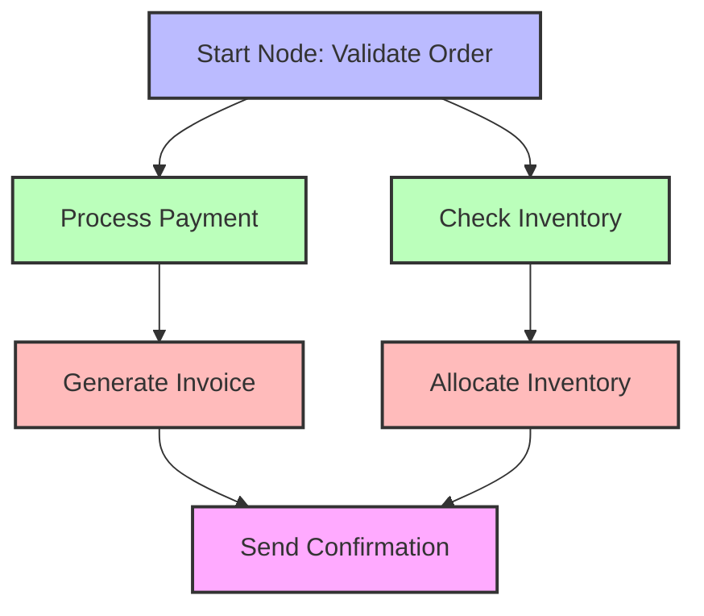

# Basic Concepts

This guide explains the core concepts and terminology used in Flow Orchestrator. Understanding these concepts will help you effectively use the library for your workflow needs.

## Core Concepts

### Workflow

A workflow is the top-level container for a set of coordinated tasks. In Flow Orchestrator, a workflow:

- Has a unique identifier
- Contains a Directed Acyclic Graph (DAG) of nodes
- Can be executed, paused, resumed, and persisted
- Maintains state across executions

```go
wf := &workflow.Workflow{
    DAG:        dag,
    WorkflowID: "my-workflow",
    Store:      store,
}
```

### Directed Acyclic Graph (DAG)

A DAG represents the structure of a workflow as a collection of nodes with dependencies between them. Key characteristics:

- **Directed**: Dependencies flow in one direction
- **Acyclic**: No cycles are allowed (a node cannot depend on itself directly or indirectly)
- **Graph**: A network of nodes connected by dependencies

Here's an example of a DAG for an order processing workflow:


```mermaid
graph TD
    A[Start Node: Validate Order] --> B[Process Payment]
    A --> C[Check Inventory]
    B --> D[Generate Invoice]
    C --> E[Allocate Inventory]
    D --> F[Send Confirmation]
    E --> F
    
    style A fill:#bbf,stroke:#333,stroke-width:2px
    style B fill:#bfb,stroke:#333,stroke-width:2px
    style C fill:#bfb,stroke:#333,stroke-width:2px
    style D fill:#fbb,stroke:#333,stroke-width:2px
    style E fill:#fbb,stroke:#333,stroke-width:2px
    style F fill:#faf,stroke:#333,stroke-width:2px
```

```go
dag := workflow.NewDAG("my-dag")
// Add nodes and dependencies
```

### Node

A node represents a single unit of work in a workflow. Each node:

- Has a unique name within the workflow
- Contains an action to execute
- May depend on other nodes
- Has execution options (retries, timeout)

```go
// NewNode takes an Action; wrap a plain func with ActionFunc.
// (The builder's AddNode(...).WithAction(...) accepts a bare func directly.)
node := workflow.NewNode("process-data", workflow.ActionFunc(processDataAction))
node.WithRetries(3).WithTimeout(5 * time.Second)
```

### Action

An action is the executable code that performs the actual work of a node. The Action interface:

```go
type Action interface {
    Execute(ctx context.Context, data *WorkflowData) error
}
```

You can create actions as functions:

```go
processDataAction := func(ctx context.Context, data *workflow.WorkflowData) error {
    // Process data
    return nil
}
```

### WorkflowData

`WorkflowData` is the shared data store for workflow execution. It provides:

- Thread-safe data storage and retrieval
- Type-safe getters and setters
- Node status tracking
- Node output storage

```go
// Store a value
data.Set("user_id", 123)

// Retrieve a value
userID, ok := data.GetInt("user_id")

// Store node output
data.SetOutput("fetch-data", fetchResult)

// Get node output
output, ok := data.GetOutput("fetch-data")
```

#### Typed keys (compile-time type safety)

For data shared between nodes, you can declare a typed `Key[T]` once and use the
package-level `Set`/`Get` helpers. Producer and consumer share the key, so storing
or reading the wrong type is a compile error rather than a runtime assertion. This
is additive over the string API — both reach the same underlying store.

```go
// Declare once, share between nodes.
var UserID = workflow.NewKey[int]("user_id")

// Producer
workflow.Set(data, UserID, 123)

// Consumer — id is typed int, no assertion needed
id, ok := workflow.Get(data, UserID)
n := workflow.GetOr(data, UserID, -1) // fallback when absent/wrong-type
```

### WorkflowStore

`WorkflowStore` is an interface for persisting workflow state:

```go
type WorkflowStore interface {
    Save(data *WorkflowData) error
    Load(workflowID string) (*WorkflowData, error)
    ListWorkflows() ([]string, error)
    Delete(workflowID string) error
}
```

Implementations include:
- `InMemoryStore`: For ephemeral workflows
- `JSONFileStore`: Human-readable file-based persistence; convenient for debugging and external tools that read the JSON
- `FlatBuffersStore`: Faster binary format for high-throughput or large state

All three also implement the optional `Checkpointer` interface, which enables
**durable crash-resume** — a run is checkpointed at each completed level barrier
and resumes from the last checkpoint on re-execution (non-completed nodes re-run,
an at-least-once contract). See the
[Persistence guide → Durability & Idempotency](../guides/persistence.md#durability--idempotency-crash-resume).

### Middleware

Middleware provides a way to add cross-cutting concerns to actions:

```go
type Middleware func(Action) Action
```

Examples include:
- Logging
- Retries
- Timeouts
- Metrics collection
- Validation

```go
// Apply middleware to an action
loggedAction := workflow.LoggingMiddleware()(myAction)

// Apply multiple middleware with a stack
stack := workflow.NewMiddlewareStack()
stack.Use(workflow.LoggingMiddleware())
stack.Use(workflow.RetryMiddleware(3, time.Second))
wrappedAction := stack.Apply(myAction)
```

## Building Blocks

### WorkflowBuilder

The `WorkflowBuilder` provides a fluent interface for defining workflows:

```go
builder := workflow.NewWorkflowBuilder().
    WithWorkflowID("order-processing").
    WithStore(store)

// Add nodes
builder.AddStartNode("validate-order").
    WithAction(validateOrderAction)

builder.AddNode("process-payment").
    WithAction(processPaymentAction).
    DependsOn("validate-order")

// A store-backed workflow is built with FromBuilder (carries the store to execution):
wf, err := workflow.FromBuilder(builder)
```

> **Note on `WithStore`.** A store reaches execution only via
> `workflow.FromBuilder(builder)`, which produces a `*Workflow` that carries the
> store (and its durability). `builder.Build()` returns a store-less `*DAG`, so
> since **v0.13.0 (REM-04)** calling `Build()` with a store set **returns an error**
> — use `FromBuilder` for a persistent, crash-safe run, or omit `WithStore` for a
> plain in-memory `Build()`.

### Node Status

Nodes have several possible status values that track their execution state:

- `Pending`: Initial state. `Execute` sets **every** node to `Pending` when it
  begins, so status is total over the DAG — a node that is never reached (the run
  halted before it, with no failed/skipped dependency of its own) stays `Pending`
  rather than being absent.
- `Running`: Node is currently executing
- `Completed`: Node has completed successfully
- `Failed`: Node's action returned an error
- `Skipped`: The node did **not** run because at least one dependency was in a
  terminal non-resolving state — a non-continue-on-error dependency that `Failed`,
  or a dependency that was itself `Skipped`. The executor writes this status
  (`DEC-CHUNK3-status`); skipping is transitive. `Skipped` is **not** a failure —
  skipped nodes never appear in an `ExecutionError`. (Contrast `Pending`: skipped
  means "an upstream you needed failed"; pending means "the run stopped before
  reaching me".)
- `Waiting` (added v0.10.0): The node has **parked** on an external event — a
  durable timer's due-time or a signal — rather than on an upstream node. `Waiting`
  is **non-terminal and non-failing**: it never causes dependents to be `Skipped`,
  never trips fail-fast, and is never counted as done. It drives `Workflow.Execute`
  to return `ErrSuspended` at the level barrier (the run is suspended, not
  finished); a later resume, timer `Tick`, or signal delivery re-runs the node,
  which either re-parks or wakes and converges. Treat it as runnable, like
  `Pending`. See the [durable continuations](#durable-continuations) section below.
- `Bypassed` (added v0.11.0): The node is the **not-taken branch of a `ChoiceNode`** —
  it did not run because the routing decision activated a *different* branch, **not**
  because an upstream it needed failed. `Bypassed` is **terminal** (never runs, never
  re-armed) and is deliberately distinct from `Skipped`: `Skipped` preserves the
  failure-diagnostics meaning "an upstream you needed failed/was-skipped", so a clean
  not-taken branch must not be labelled with it. Bypass propagates through a not-taken
  branch's whole subgraph. (One subtlety — the *diamond rule*: a node with a `Bypassed`
  dependency that **also** has a surviving taken/`Completed` ancestor is `Skipped`, not
  `Bypassed`; the taken path wins.) See [conditional branching](#conditional-branching)
  below.
- `Compensated` (added v0.12.0): The node had `Completed`, and its effect has since been
  durably **undone** by its compensating action during a saga rollback. `Compensated` is
  **terminal** and is reached only from `Completed` (a node that never ran successfully is
  never compensated). It is not a failure. See [conditional branching](#conditional-branching)
  and the [Saga / Compensation](../guides/workflow-patterns.md#saga--compensation-durable-rollback) pattern.
- `CompensationFailed` (added v0.12.0): The node had `Completed`, but its compensating
  action was attempted during rollback and **failed** (after honoring `WithRetries`). It is
  **terminal**, and is the honest counterpart of `Compensated`: its effect is **not** undone
  and needs operator attention. Best-effort rollback records each attempted node as one or
  the other, and the aggregate `SagaError` enumerates both.

```go
// Get a node's status
status, exists := data.GetNodeStatus("process-payment")

// Set a node's status
data.SetNodeStatus("process-payment", workflow.Completed)
```

## Execution Model

### Topological Execution

Flow Orchestrator executes workflows using a topological sort algorithm:

1. Nodes are grouped into levels based on their dependencies
2. Nodes within a level can be executed in parallel
3. A level is only executed after all nodes in previous levels are complete

### Parallel Execution

Nodes without dependencies between them can be executed in parallel:

```go
builder.AddNode("check-inventory").
    WithAction(checkInventoryAction).
    DependsOn("validate-order")

builder.AddNode("calculate-tax").
    WithAction(calculateTaxAction).
    DependsOn("validate-order")

// check-inventory and calculate-tax can execute in parallel
```

### Error Handling

By default execution is **fail-fast**: when a node's action returns an error, the
node is marked `Failed`, in-flight siblings are cancelled, and the workflow stops
without running later levels. Flow Orchestrator provides several mechanisms to
handle errors short of that:

- **Retries**: Automatically retry failed actions
- **Continue-on-error**: Let a specific node fail without halting the workflow
- **Error Types**: Distinguish between different error categories
- **Node Status**: Track execution status of nodes

```go
// With retry middleware
builder.AddNode("flaky-service").
    WithAction(workflow.RetryMiddleware(3, time.Second)(serviceAction))

// With built-in node retries
builder.AddNode("flaky-service").
    WithAction(serviceAction).
    WithRetries(3)

// Continue-on-error: this node may fail without failing the workflow; its
// dependents still run and can inspect its Failed status.
builder.AddNode("optional-step").
    WithAction(optionalAction).
    WithContinueOnError()
```

See the [Error Handling guide](../guides/error-handling.md) for the full
continue-on-error semantics.

## Durable Continuations

<a id="durable-continuations"></a>

Added in **v0.10.0**, a workflow can **suspend** on an external event and **resume**
later — a durable timer's due-time, an inbound signal, or a data condition — without
holding a process open or paying a determinism tax. The mechanism reuses the M9
crash-resume seam: a node that must wait *parks* (status `Waiting`), the run drains
to its level barrier, the checkpoint flushes the parked state, and `Workflow.Execute`
returns `ErrSuspended`. The process may then exit. Waking is just re-entering
`Execute` (or `Tick`/`DeliverAndResume`); the parked node re-runs and either re-parks
or fires. "**Suspend is a crash you chose.**"

Three declared suspension node types express this — all built as first-class nodes, so
they participate in the DAG's topological ordering, checkpointing, and resume like any
other node:

- **`AddTimer(name, d)`** — a durable sleep. It parks until an **absolute** due-time
  (`clock.Now()+d`, frozen at the first encounter and persisted), so it survives crash
  and suspend; an overdue timer fires immediately on the next resume/`Tick`.
- **`AddWaitForSignal(name, signalName)`** — parks until a named `Signal` is delivered
  to the workflow's durable mailbox (via `DeliverSignal` / `DeliverAndResume`), then
  applies the payload and converges. Delivery is durable and decoupled from the running
  process — a signal can arrive when nothing is running, and is buffered.
- **`AddWaitForCondition(name, predicate)`** — parks while a predicate over the workflow
  data is false, re-evaluating on each wake.

There is **no mandatory background service**: the host drives waking on its own schedule
(`Tick` for due timers, `DeliverAndResume` for signals). See the
[Persistence guide → Durable Continuations](../guides/persistence.md) and the
[API reference → Durable continuations](../reference/api-reference.md#durable-continuations).

## Conditional Branching

<a id="conditional-branching"></a>

Added in **v0.11.0**, Flow Orchestrator supports **true workflow-level branching**: a
`ChoiceNode` routes execution down exactly **one** of several branches, and a `MergeNode`
reconverges them with an **OR-join**. Unlike the earlier "run every node, decide inside
the action" pattern, a not-taken branch genuinely **does not run** — its nodes become
`Bypassed`. This is a static, declared structure (no dynamic graph mutation, no
determinism tax), and the branching semantics are machine-checked in TLA+.

- **`AddChoice(name)`** evaluates ordered `When(predicate, target)` arms in **declared
  order, first match wins**, and activates that one branch; every other branch entry (and
  its subgraph) is `Bypassed`. An `Otherwise(target)` supplies a default; with no
  `Otherwise` and no match, the choice **fails** with `ErrNoBranchMatched` (a routing
  dead-end is a typed error, never a silent hang). The predicate is `func(*WorkflowData)
  bool` and must read only **guaranteed-run-ancestor or seed keys** — reading an absent
  key returns the zero value and simply falls through to the next arm.
- **`AddMerge(name).From(tail1, tail2, ...)`** OR-joins the named branch tails: it **fires
  iff ≥1 taken branch-tail completed** (a `Bypassed` tail is satisfied, not blocking). If
  **every** branch was bypassed, the merge is itself `Bypassed` (bypass composes downward).
  A failure on the taken branch fails the run fail-fast, as usual.

```go
wb.AddChoice("route").
    When(func(d *workflow.WorkflowData) bool { amt, _ := d.GetInt("amount"); return amt > 1000 }, "big").
    When(func(d *workflow.WorkflowData) bool { amt, _ := d.GetInt("amount"); return amt > 0 },    "small").
    Otherwise("zero")
// ... branch bodies, each ending at a tail node ...
wb.AddMerge("done").From("bigTail", "smallTail", "zero")
wb.AddNode("after").DependsOn("done")
```

Only **structured, single-`ChoiceNode`, local** OR-joins are expressible — the builder
rejects unstructured reconvergence at `Build()` time (see the
[API reference → Conditional branching](../reference/api-reference.md#conditional-branching)
and [ADR-0010](../architecture/adr/0010-conditional-branching-bypassed-status.md)).

## Saga / Compensation

<a id="saga-compensation"></a>

Added in **v0.12.0**, a node can declare a **compensating action** with
`WithCompensation`. If the run fails with a hard error — or the caller cancels / the
context deadline fires — the engine **rolls back**: it invokes the compensation of every
`Completed` node in **reverse-topological order** to durably undo their effects, marking
each `Compensated` (or `CompensationFailed`). This completes the durable-workflow arc:
forward durability (M9/M10) + branching (M11) + **undo** (M12).

```go
builder.AddNode("process-payment").
    WithAction(processPaymentAction).
    WithCompensation(func(ctx context.Context, data *workflow.WorkflowData) error {
        pid, _ := data.GetString("payment_id")
        key, _ := workflow.CompensationIdempotencyKey(ctx) // stable across an at-least-once re-run
        return refundPayment(ctx, pid, key)                // MUST be idempotent
    }).
    DependsOn("reserve-inventory")
```

Key points: only `Completed` compensable nodes are compensated (a `Bypassed` / `Skipped`
/ never-run node has nothing to undo); rollback is **best-effort** and reports the exact
`{compensated, failedToCompensate, skipped}` partition via a typed `SagaError`; the
rollback is itself **crash-safe** (checkpointed per reverse level), so it is
**at-least-once** — **compensations must be idempotent**, and the engine supplies a stable
`CompensationIdempotencyKey` handle to drive downstream dedup. The whole reverse pass is
bounded by `WithRollbackTimeout` (default 5 minutes). The compensation/abort semantics are
machine-checked in TLA+, with zero determinism tax.

See the [Saga / Compensation pattern](../guides/workflow-patterns.md#saga--compensation-durable-rollback),
the [API reference → Saga / Compensation](../reference/api-reference.md#saga--compensation-added-v0120),
and [ADR-0011](../architecture/adr/0011-saga-compensation-durable-rollback.md).

## Next Steps

Now that you understand the basic concepts, you might want to:

- Try the [Quickstart Guide](./quickstart.md) if you haven't already
- Follow the [Your First Workflow](./first-workflow.md) tutorial
- Learn about the [Middleware System](../guides/middleware.md)
- Explore the [DAG Execution Model](../architecture/dag-execution.md) in depth 