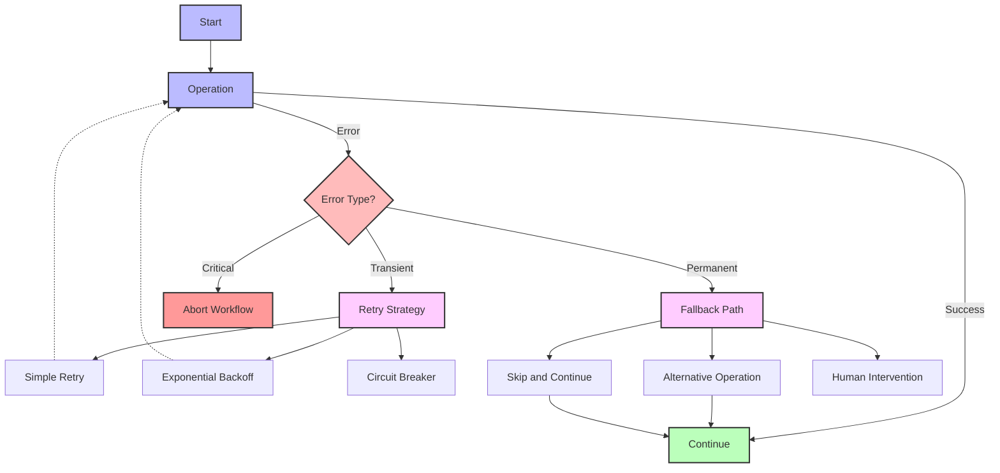
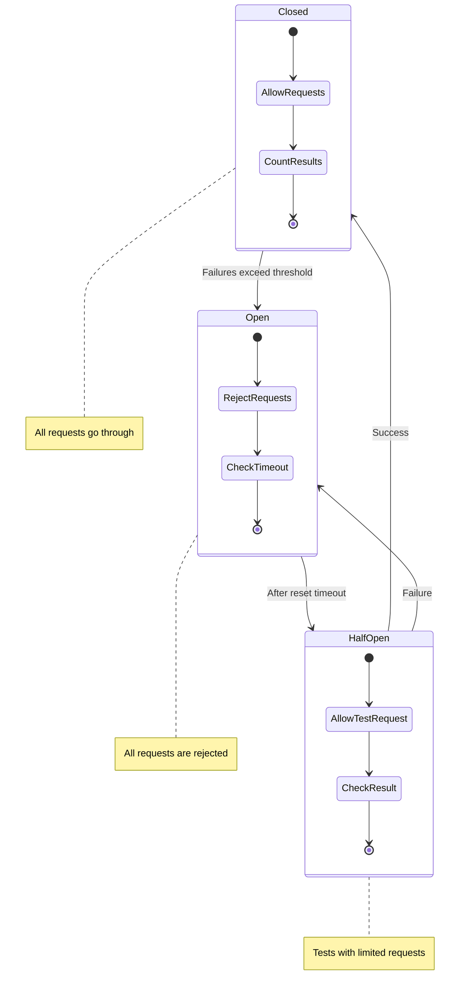

# Error Handling Strategies

This guide explores comprehensive strategies for handling errors in Flow Orchestrator workflows. Effective error handling is crucial for building robust, production-grade workflows that can gracefully recover from failures.

## Understanding Error Types

When designing error handling for Flow Orchestrator workflows, it's helpful to categorize errors:

### By Source

1. **Action Errors**: Errors returned from node action execution
2. **Middleware Errors**: Errors generated by middleware components
3. **Workflow Engine Errors**: Errors from the workflow engine itself (validation, dependency resolution)
4. **Context Errors**: Errors due to cancellation or timeout

### By Nature

1. **Transient Errors**: Temporary failures that may resolve on retry (network issues, rate limits)
2. **Permanent Errors**: Errors that won't be resolved by retrying (invalid input, business rule violations)
3. **Resource Errors**: Errors related to resource availability (out of memory, disk space)
4. **Logic Errors**: Bugs or logical problems in the workflow implementation

## Error Handling Patterns

The following diagram illustrates common error handling patterns in Flow Orchestrator:



## Error Handling Mechanisms

Flow Orchestrator provides several mechanisms for handling errors:

### 1. Node-Level Retries

The simplest approach is configuring retry behavior at the node level:

```go
// Configure a node with 3 retry attempts
builder.AddNode("api-call").
    WithAction(apiCallAction).
    WithRetries(3)
```

This approach works well for transient errors that might resolve with a simple retry.

### 2. Retry Middleware

For more sophisticated retry logic, use the retry middleware:

```go
// Create retry middleware with exponential backoff
retryMiddleware := workflow.RetryMiddleware(
    3,                      // Max retries
    500*time.Millisecond,   // Initial delay
    workflow.WithExponentialBackoff(2.0), // Multiplier for backoff
    workflow.WithMaxDelay(10*time.Second),
    workflow.WithRetryableErrors(
        []string{"connection_error", "timeout_error"},
    ),
)

// Apply middleware to an action
retryableAction := retryMiddleware(myAction)

// Use in workflow
builder.AddNode("api-call").
    WithAction(retryableAction)
```

This provides fine-grained control over retry behavior.

### 3. Error Handling Nodes

For complex error handling, add dedicated nodes that handle specific error cases:

```go
// Main operation node
builder.AddNode("process-payment").
    WithAction(processPaymentAction).
    DependsOn("validate-order")

// Error handling node
builder.AddNode("handle-payment-failure").
    WithAction(func(ctx context.Context, data *workflow.WorkflowData) error {
        // Check if payment processing failed
        status, _ := data.GetNodeStatus("process-payment")
        if status != workflow.Failed {
            // Nothing to do if payment succeeded
            return nil
        }
        
        // Check if we can use alternative payment method
        hasAlternative, _ := data.GetBool("has_alternative_payment")
        if hasAlternative {
            // Try alternative payment method
            return alternativePaymentAction.Execute(ctx, data)
        }
        
        // Log the failure for manual handling
        paymentID, _ := data.GetString("payment_attempt_id")
        data.Set("manual_review_required", true)
        data.Set("failure_reason", "Payment failed with no alternative")
        
        return nil
    }).
    DependsOn("process-payment")

// Continue workflow
builder.AddNode("fulfill-order").
    WithAction(func(ctx context.Context, data *workflow.WorkflowData) error {
        // Only proceed if payment succeeded
        paymentStatus, _ := data.GetNodeStatus("process-payment")
        alternativeStatus, _ := data.GetNodeStatus("handle-payment-failure")
        
        // Check if either primary or alternative payment succeeded
        if paymentStatus != workflow.Completed && 
           (alternativeStatus != workflow.Completed || 
            !data.Has("alternative_payment_id")) {
            // Skip fulfillment
            return nil
        }
        
        // Fulfill the order
        return fulfillOrderAction.Execute(ctx, data)
    }).
    DependsOn("handle-payment-failure")
```

This approach allows complex recovery logic and different strategies depending on the error.

### 4. Timeout Handling

Handle timeouts using the timeout middleware or context timeouts:

```go
// Using timeout middleware
timeoutAction := workflow.TimeoutMiddleware(5 * time.Second)(longRunningAction)

// Or with context timeouts
builder.AddNode("long-operation").
    WithAction(func(ctx context.Context, data *workflow.WorkflowData) error {
        // Create a timeout for this specific operation
        timeoutCtx, cancel := context.WithTimeout(ctx, 10*time.Second)
        defer cancel()
        
        // Use the timeout context
        err := longRunningOperation(timeoutCtx)
        if err != nil {
            if errors.Is(err, context.DeadlineExceeded) {
                // Handle timeout specifically
                data.Set("operation_timeout", true)
                return fmt.Errorf("operation timed out after 10s")
            }
            return err
        }
        
        return nil
    })
```

### 5. Circuit Breaker Pattern

Implement a circuit breaker to prevent cascading failures:

```go
// Create a circuit breaker
cb := workflow.NewCircuitBreaker(
    3,                  // Failure threshold
    30*time.Second,     // Reset timeout
    workflow.WithHalfOpenState(true),
)

// Create a circuit breaker middleware
cbMiddleware := func(next workflow.Action) workflow.Action {
    return workflow.ActionFunc(func(ctx context.Context, data *workflow.WorkflowData) error {
        if !cb.AllowRequest() {
            return fmt.Errorf("circuit open, too many failures")
        }
        
        err := next.Execute(ctx, data)
        if err != nil {
            cb.RecordFailure()
            return err
        }
        
        cb.RecordSuccess()
        return nil
    })
}

// Apply to an action
protectedAction := cbMiddleware(externalServiceAction)
```

The circuit breaker works by transitioning between three states:



This pattern prevents repeated calls to failing services.

## Structured Error Handling

Define structured error types for better error handling:

```go
// Define error types
const (
    ErrValidation   = "validation_error"
    ErrProcessing   = "processing_error"
    ErrExternal     = "external_service_error"
    ErrPermission   = "permission_error"
    ErrNotFound     = "not_found_error"
)

// Create a structured error
func newError(errType string, message string, cause error) error {
    return fmt.Errorf("%s: %s: %w", errType, message, cause)
}

// In your action
func myAction(ctx context.Context, data *workflow.WorkflowData) error {
    // ...
    if !isValid {
        return newError(ErrValidation, "Invalid input data", nil)
    }
    
    resp, err := callExternalService()
    if err != nil {
        return newError(ErrExternal, "Failed to call external service", err)
    }
    // ...
}

// In error handling
func handleError(ctx context.Context, data *workflow.WorkflowData) error {
    errorOutput, ok := data.GetOutput("previous-step")
    if !ok {
        return nil
    }
    
    err := errorOutput.(error)
    if err == nil {
        return nil
    }
    
    // Check error type
    if strings.Contains(err.Error(), ErrValidation) {
        // Handle validation error
        data.Set("validation_failed", true)
    } else if strings.Contains(err.Error(), ErrExternal) {
        // Handle external service error
        data.Set("external_service_failed", true)
    }
    
    return nil
}
```

## Error Handling Patterns

### 1. Dead-Letter Pattern

Send failed operations to a "dead letter" storage for later processing:

```go
func deadLetterAction(ctx context.Context, data *workflow.WorkflowData) error {
    // Get operation details
    operationName, _ := data.GetString("operation_name")
    operationData, _ := data.Get("operation_data")
    
    // Create dead letter record
    deadLetter := map[string]interface{}{
        "workflow_id":    data.ID,
        "node":           operationName,
        "data":           operationData,
        "error_message":  data.Get("error_message"),
        "timestamp":      time.Now().Format(time.RFC3339),
    }
    
    // Store dead letter (in a real implementation, this would use a database)
    deadLetterJSON, _ := json.Marshal(deadLetter)
    
    // Log or store the dead letter
    fmt.Printf("Dead letter: %s\n", string(deadLetterJSON))
    
    // Mark as handled
    data.Set("dead_lettered", true)
    
    return nil
}
```

### 2. Compensating Transactions

Implement compensating actions to roll back partial work:

```go
// Step 1: Book hotel
builder.AddNode("book-hotel").
    WithAction(bookHotelAction)

// Step 2: Book flight 
builder.AddNode("book-flight").
    WithAction(bookFlightAction).
    DependsOn("book-hotel")

// Compensation: Cancel hotel if flight booking fails
builder.AddNode("cancel-hotel-if-needed").
    WithAction(func(ctx context.Context, data *workflow.WorkflowData) error {
        flightStatus, _ := data.GetNodeStatus("book-flight")
        
        if flightStatus == workflow.Failed {
            // Flight booking failed, need to cancel hotel
            hotelBookingID, _ := data.GetString("hotel_booking_id")
            
            // Call hotel cancellation API
            err := cancelHotelBooking(hotelBookingID)
            if err != nil {
                // Log but don't fail - we still want to continue the error path
                fmt.Printf("Warning: Failed to cancel hotel: %v\n", err)
            } else {
                data.Set("hotel_cancelled", true)
            }
        }
        
        return nil
    }).
    DependsOn("book-flight")
```

### 3. Saga Pattern

For distributed transactions, implement a saga pattern with coordinated compensating actions:

```go
// Define action with compensation
type compensatableAction struct {
    action       workflow.Action
    compensation workflow.Action
}

// Execute a saga with compensation on failure
func executeSaga(ctx context.Context, data *workflow.WorkflowData, 
                 actions []compensatableAction) error {
    completedActions := 0
    
    // Execute each action in sequence
    for i, step := range actions {
        // Execute the action
        err := step.action.Execute(ctx, data)
        if err != nil {
            // Action failed, execute compensations in reverse order
            for j := completedActions - 1; j >= 0; j-- {
                compensationErr := actions[j].compensation.Execute(ctx, data)
                if compensationErr != nil {
                    // Log compensation error but continue
                    fmt.Printf("Compensation %d failed: %v\n", j, compensationErr)
                }
            }
            return fmt.Errorf("saga failed at step %d: %w", i, err)
        }
        
        completedActions++
    }
    
    return nil
}

// Usage in workflow
sagaAction := workflow.ActionFunc(func(ctx context.Context, data *workflow.WorkflowData) error {
    saga := []compensatableAction{
        {
            action: reserveInventoryAction,
            compensation: cancelInventoryAction,
        },
        {
            action: processPaymentAction,
            compensation: refundPaymentAction,
        },
        {
            action: createShipmentAction,
            compensation: cancelShipmentAction,
        },
    }
    
    return executeSaga(ctx, data, saga)
})

// Use in workflow
builder.AddNode("process-order").
    WithAction(sagaAction)
```

## Monitoring and Debugging Errors

### Logging Errors

Use the logging middleware to capture errors:

```go
// Create logging middleware
loggingMiddleware := workflow.LoggingMiddleware()

// Apply to a node
builder.AddNode("api-call").
    WithAction(loggingMiddleware(apiCallAction))
```

### Error Metrics

Collect error metrics for monitoring:

```go
// Create metrics middleware
metricsMiddleware := workflow.MetricsMiddleware()

// Apply to a node
builder.AddNode("api-call").
    WithAction(metricsMiddleware(apiCallAction))
```

### Debugging Failed Workflows

When a workflow fails:

1. Check the node status to identify which node failed:
   ```go
   status, _ := data.GetNodeStatus("problematic-node")
   ```

2. Examine node outputs for error details:
   ```go
   errorOutput, _ := data.GetOutput("problematic-node")
   ```

3. Check workflow data for additional context:
   ```go
   contextValue, _ := data.Get("relevant_context")
   ```

4. For persistent workflows, retrieve the workflow state:
   ```go
   storedData, err := store.Load("workflow-id")
   ```

## Best Practices

1. **Design for failure**: Assume operations can and will fail
2. **Categorize errors**: Distinguish between recoverable and non-recoverable errors
3. **Use retries wisely**: Only retry operations that may succeed on subsequent attempts
4. **Implement compensating actions**: Include rollback steps for partial failures
5. **Add timeout protection**: Prevent operations from hanging indefinitely
6. **Log extensively**: Capture detailed error information for debugging
7. **Monitor error rates**: Track error patterns to identify systemic issues
8. **Store workflow state**: Use persistence to enable recovery and debugging
9. **Handle context cancellation**: Check for context cancellation and timeout
10. **Fail gracefully**: When failure is unavoidable, provide clear error information

## Conclusion

Effective error handling is essential for building robust workflows. By combining the strategies in this guide, you can create workflows that gracefully handle failures, recover when possible, and provide clear information when recovery isn't possible.

Remember that different error handling strategies are appropriate for different scenarios. Simple retries work well for transient issues, while complex distributed transactions may require the saga pattern with compensating actions.

Choose the approach that best fits your workflow's requirements and failure modes. 