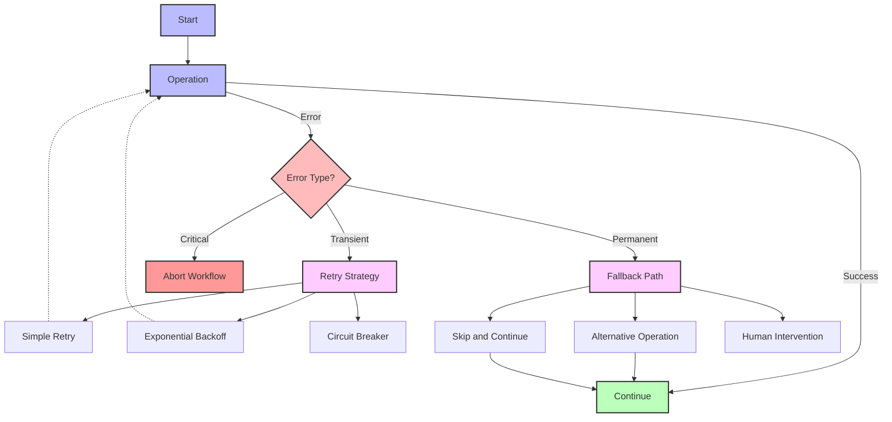
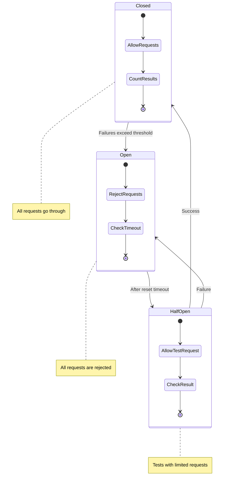

# Error Handling Strategies

This guide explores comprehensive strategies for handling errors in Flow Orchestrator workflows. Effective error handling is crucial for building robust, production-grade workflows that can gracefully recover from failures.

## Understanding Error Types

When designing error handling for Flow Orchestrator workflows, it's helpful to categorize errors:

### By Source

1. **Action Errors**: Errors returned from node action execution
2. **Middleware Errors**: Errors generated by middleware components
3. **Workflow Engine Errors**: Errors from the workflow engine itself (validation, dependency resolution)
4. **Context Errors**: Errors due to cancellation or timeout

### By Nature

1. **Transient Errors**: Temporary failures that may resolve on retry (network issues, rate limits)
2. **Permanent Errors**: Errors that won't be resolved by retrying (invalid input, business rule violations)
3. **Resource Errors**: Errors related to resource availability (out of memory, disk space)
4. **Logic Errors**: Bugs or logical problems in the workflow implementation

## Error Handling Patterns

The following diagram illustrates common error handling patterns in Flow Orchestrator:


```mermaid
graph TD
    A[Start] --> B[Operation]
    B -->|Success| C[Continue]
    B -->|Error| D{Error Type?}
    
    D -->|Transient| E[Retry Strategy]
    D -->|Permanent| F[Fallback Path]
    D -->|Critical| G[Abort Workflow]
    
    E --> E1[Simple Retry]
    E --> E2[Exponential Backoff]
    E --> E3[Circuit Breaker]
    
    F --> F1[Alternative Operation]
    F --> F2[Skip and Continue]
    F --> F3[Human Intervention]
    
    E1 -.-> B
    E2 -.-> B
    
    F1 --> C
    F2 --> C
    
    style A fill:#bbf,stroke:#333,stroke-width:2px
    style B fill:#bbf,stroke:#333,stroke-width:2px
    style C fill:#bfb,stroke:#333,stroke-width:2px
    style D fill:#fbb,stroke:#333,stroke-width:2px
    style G fill:#f99,stroke:#333,stroke-width:2px
    style E fill:#fcf,stroke:#333,stroke-width:2px
    style F fill:#fcf,stroke:#333,stroke-width:2px
```

## Error Handling Mechanisms

Flow Orchestrator provides several mechanisms for handling errors:

### 1. Node-Level Retries

The simplest approach is configuring retry behavior at the node level:

```go
// Configure a node with 3 retry attempts
builder.AddNode("api-call").
    WithAction(apiCallAction).
    WithRetries(3)
```

This approach works well for transient errors that might resolve with a simple retry.

### 2. Retry Middleware

For more sophisticated retry logic, use the retry middleware:

```go
// Create retry middleware with 3 retries and 500ms backoff (includes jitter)
retryMiddleware := workflow.RetryMiddleware(3, 500*time.Millisecond)

// Apply middleware to an action
retryableAction := retryMiddleware(myAction)

// Use in workflow
builder.AddNode("api-call").
    WithAction(retryableAction)

// For selective retry based on error types, use ConditionalRetryMiddleware
selectiveRetry := workflow.ConditionalRetryMiddleware(
    3,
    500*time.Millisecond,
    func(err error) bool {
        // Only retry transient errors
        return strings.Contains(err.Error(), "connection") ||
               strings.Contains(err.Error(), "timeout")
    },
)
```

This provides fine-grained control over retry behavior.

### 3. Continue-on-Error

By default, execution is **fail-fast**: when a node's action returns an error, the
node is recorded as `Failed`, the executor cancels its in-flight siblings in that
level, and `DAG.Execute` returns an `*ExecutionError` **without running any later
level**. A normal `Failed` node therefore blocks its dependents simply by halting
the run. If several nodes in the halting level fail concurrently before
cancellation takes effect, the `*ExecutionError` captures **all** of them (see
[Aggregate Execution Error](../reference/api-reference.md#aggregate-execution-error)).

Mark a node with `WithContinueOnError()` to opt that node out of fail-fast: its
failure is still recorded as `Failed`, but it does **not** cancel siblings and
does **not** fail the workflow. Execution continues, the node's dependents run,
and they observe its `Failed` status via `GetNodeStatus` and branch on it.

```go
// This node may fail without halting the workflow.
builder.AddNode("optional-enrichment").
    WithAction(enrichAction).
    WithContinueOnError().
    DependsOn("load")

// Dependent runs even when optional-enrichment failed, and branches on its status.
builder.AddNode("finalize").
    WithAction(func(ctx context.Context, data *workflow.WorkflowData) error {
        if status, _ := data.GetNodeStatus("optional-enrichment"); status == workflow.Failed {
            // proceed without the optional enrichment
        }
        return finalizeAction.Execute(ctx, data)
    }).
    DependsOn("optional-enrichment")
```

Dependency resolution rule (DEC-P21-depguard): a dependency resolves (stops
blocking its dependents) when it `Completed`, **or** when it is a
continue-on-error node that `Failed`. A *normal* `Failed` dependency still blocks
(fail-fast), as do `Skipped`/`Running`/`Pending` dependencies. `DAG.Execute`
returns `nil` if and only if every node that is **not** continue-on-error
succeeded; when one or more fail-fast nodes fail it returns an `*ExecutionError`
aggregating those failures (continue-on-error failures are tolerated and excluded
— inspect their per-node status instead). These semantics are machine-checked
(gopter property suite + a TLA+ model); see
[Verification](../reference/api-reference.md#verification) and
[`specs/README.md`](../../specs/README.md).

> **Important:** the "Error Handling Nodes" pattern below relies on a recovery node
> running *after* its upstream node fails. That only works if the upstream node is
> marked `WithContinueOnError()` — otherwise the upstream failure halts the
> workflow fail-fast before the recovery node's level runs.

#### Context cancellation and timeouts

Cancellation is distinct from failure, and **cancellation always wins**
(`DEC-CHUNK6`). When the context passed to `DAG.Execute` is cancelled or its
deadline is exceeded, `Execute` returns the **wrapped context error**, never an
`*ExecutionError`:

```go
err := dag.Execute(ctx, data)
if errors.Is(err, context.Canceled) || errors.Is(err, context.DeadlineExceeded) {
    // the run was cancelled / timed out — handled separately from a workflow failure
}

var execErr *workflow.ExecutionError
if errors.As(err, &execErr) {
    // a genuine workflow FAILURE (this is never returned for a cancelled run)
}
```

The contract:

- **A cancelled run never returns an `*ExecutionError`.** The executor checks
  `ctx.Err()` after each level, *before* it would build any `*ExecutionError`. If
  the context is done, it returns the wrapped ctx error and **drops the
  incidental cancel-induced node errors** (a well-behaved action returns
  `ctx.Err()` when it observes the cancel; that is noise, not the reason the
  workflow stopped). This holds whether the cancel lands **between levels** or
  **mid-level**, and even when a genuine fail-fast failure coexisted in the same
  level. The caller's question — *why did the workflow stop?* — is answered by the
  context error.
- **Genuine coexisting failures stay observable via node status.** A node that
  truly failed is still recorded `Failed`; inspect `GetNodeStatus` to find it even
  though `Execute` returned the ctx error.
- **Un-run and downstream nodes stay `Pending`, not `Skipped`.** The Skipped sweep
  is suppressed on the cancel path: `Skipped` means "an upstream you needed
  failed", whereas a cancelled run "stopped before reaching me" — that is
  `Pending` (preserving the `DEC-CHUNK3-status` distinction). A node that ended
  `Failed` *only* because it observed the cancellation therefore does **not** mark
  its downstream `Skipped`.
- **There is no `Cancelled` status.** In-flight nodes keep whatever status
  `node.Execute` wrote; the run-level cancellation is reported through the returned
  error, not a per-node state.

This is machine-checked by `TestCancellationProperty` (a gopter property over
random DAGs, both pre-cancelled and cancel-during-run, mutation-proven to bite).
Context cancellation is a Layer-1 (gopter) guarantee and is intentionally outside
the TLA+ model (which has no ctx/cancel action); see
[`specs/README.md`](../../specs/README.md).

### 4. Error Handling Nodes

For complex error handling, add dedicated nodes that handle specific error cases.
The node whose failure you want to recover from is marked continue-on-error so the
recovery node downstream actually runs:

```go
// Main operation node — continue-on-error so a failure does not halt the workflow
// and the recovery node below can run and inspect its status.
builder.AddNode("process-payment").
    WithAction(processPaymentAction).
    WithContinueOnError().
    DependsOn("validate-order")

// Error handling node
builder.AddNode("handle-payment-failure").
    WithAction(func(ctx context.Context, data *workflow.WorkflowData) error {
        // Check if payment processing failed
        status, _ := data.GetNodeStatus("process-payment")
        if status != workflow.Failed {
            // Nothing to do if payment succeeded
            return nil
        }
        
        // Check if we can use alternative payment method
        hasAlternative, _ := data.GetBool("has_alternative_payment")
        if hasAlternative {
            // Try alternative payment method
            return alternativePaymentAction.Execute(ctx, data)
        }
        
        // Log the failure for manual handling
        paymentID, _ := data.GetString("payment_attempt_id")
        data.Set("manual_review_required", true)
        data.Set("failure_reason", "Payment failed with no alternative")
        
        return nil
    }).
    DependsOn("process-payment")

// Continue workflow
builder.AddNode("fulfill-order").
    WithAction(func(ctx context.Context, data *workflow.WorkflowData) error {
        // Only proceed if payment succeeded
        paymentStatus, _ := data.GetNodeStatus("process-payment")
        alternativeStatus, _ := data.GetNodeStatus("handle-payment-failure")
        
        // Check if either primary or alternative payment succeeded
        if paymentStatus != workflow.Completed && 
           (alternativeStatus != workflow.Completed || 
            !data.HasKey("alternative_payment_id")) {
            // Skip fulfillment
            return nil
        }
        
        // Fulfill the order
        return fulfillOrderAction.Execute(ctx, data)
    }).
    DependsOn("handle-payment-failure")
```

This approach allows complex recovery logic and different strategies depending on the error.

### 5. Timeout Handling

Handle timeouts using the timeout middleware or context timeouts:

```go
// Using timeout middleware
timeoutAction := workflow.TimeoutMiddleware(5 * time.Second)(longRunningAction)

// Or with context timeouts
builder.AddNode("long-operation").
    WithAction(func(ctx context.Context, data *workflow.WorkflowData) error {
        // Create a timeout for this specific operation
        timeoutCtx, cancel := context.WithTimeout(ctx, 10*time.Second)
        defer cancel()
        
        // Use the timeout context
        err := longRunningOperation(timeoutCtx)
        if err != nil {
            if errors.Is(err, context.DeadlineExceeded) {
                // Handle timeout specifically
                data.Set("operation_timeout", true)
                return fmt.Errorf("operation timed out after 10s")
            }
            return err
        }
        
        return nil
    })
```

### 6. Circuit Breaker Pattern

You can implement a circuit breaker as custom middleware to prevent cascading failures:

```go
// Simple circuit breaker as custom middleware
func CircuitBreakerMiddleware(threshold int, resetTimeout time.Duration) workflow.Middleware {
    var failures int64
    var lastFailure time.Time
    var mu sync.Mutex

    return func(next workflow.Action) workflow.Action {
        return workflow.ActionFunc(func(ctx context.Context, data *workflow.WorkflowData) error {
            mu.Lock()
            if failures >= int64(threshold) && time.Since(lastFailure) < resetTimeout {
                mu.Unlock()
                return fmt.Errorf("circuit open, too many failures")
            }
            mu.Unlock()

            err := next.Execute(ctx, data)
            mu.Lock()
            defer mu.Unlock()
            if err != nil {
                failures++
                lastFailure = time.Now()
                return err
            }
            failures = 0
            return nil
        })
    }
}

// Apply to an action
protectedAction := CircuitBreakerMiddleware(3, 30*time.Second)(externalServiceAction)
```

The circuit breaker works by transitioning between three states:


```mermaid
stateDiagram-v2
    Closed --> Open: Failures exceed threshold
    Open --> HalfOpen: After reset timeout
    HalfOpen --> Closed: Success
    HalfOpen --> Open: Failure
    
    state Closed {
        [*] --> AllowRequests
        AllowRequests --> CountResults
        CountResults --> [*]
    }
    
    state Open {
        [*] --> RejectRequests
        RejectRequests --> CheckTimeout
        CheckTimeout --> [*]
    }
    
    state HalfOpen {
        [*] --> AllowTestRequest
        AllowTestRequest --> CheckResult
        CheckResult --> [*]
    }
    
    note right of Closed: All requests go through
    note right of Open: All requests are rejected
    note right of HalfOpen: Tests with limited requests
```

This pattern prevents repeated calls to failing services.

## Structured Error Handling

Flow Orchestrator exposes **sentinel errors** so callers branch with `errors.Is` /
`errors.As` — **never** by string-matching the message. There are two **intentionally
distinct** families (they are *not* aliased), mirroring
[api-reference.md → Error Sentinels](../reference/api-reference.md#error-sentinels):

- **Store / persistence domain** (returned by `WorkflowStore` and its validation guards):
  `ErrNotFound`, `ErrValidation`, `ErrCorruptData`, `ErrIO`.
- **Action-execution domain** (an `Action`'s runtime behavior):
  `ErrInputNotFound`, `ErrInvalidInput`, `ErrExecutionFailed`.

`ErrNotFound` (no workflow on disk) is a different concept from `ErrInputNotFound` (a data
key absent inside an action) — branch on the sentinel from the domain you are handling.

### Branching on store errors with `errors.Is`

```go
_, err := store.Load(workflowID)
switch {
case errors.Is(err, workflow.ErrNotFound):
    // no such workflow — first run, or it was deleted
case errors.Is(err, workflow.ErrCorruptData):
    // file present but undecodable (malformed/truncated/version-skewed).
    // For FlatBuffers this now fires on a clean *guard reject* — the layered
    // bounds guard (size cap, root-offset sanity, element caps) rejects the
    // input before the decode — not only via the recover() backstop. In every
    // case data == nil and no panic escapes.
case errors.Is(err, workflow.ErrIO):
    // transient/environmental I/O (permissions, full disk) — safe to retry
case err != nil:
    // unexpected
case err == nil:
    // loaded
}
```

Each store error wraps its underlying cause with `%w`, so the category stays stable while the
detail remains reachable. **`ErrCorruptData` and `ErrIO` keep a path-free headline** — they
do not render the absolute file path in `Error()` (it would leak the host's layout). For
`ErrIO`, the underlying OS error is still reachable for debugging via `errors.As` (it is
exposed through a multi-error `Unwrap`, not the message string):

```go
_, err := store.Load(workflowID)
if errors.Is(err, workflow.ErrIO) {
    var pathErr *os.PathError // reachable via errors.As even though Error() is path-free
    if errors.As(err, &pathErr) {
        log.Printf("I/O failure on %s: %v", pathErr.Op, pathErr.Err) // your log, your call to include the path
    }
}
```

### Returning sentinels from your own actions

For action-level failures, wrap an action-domain sentinel with `%w` so downstream handlers
can branch on it:

```go
func myAction(ctx context.Context, data *workflow.WorkflowData) error {
    name, ok := data.GetString("user_name")
    if !ok {
        return fmt.Errorf("%w: user_name", workflow.ErrInputNotFound)
    }
    if name == "" {
        return fmt.Errorf("%w: user_name must not be empty", workflow.ErrInvalidInput)
    }
    if err := callExternalService(name); err != nil {
        return fmt.Errorf("%w: external service: %w", workflow.ErrExecutionFailed, err)
    }
    return nil
}

// A downstream handler branches with errors.Is — not strings.Contains:
func handleError(err error) {
    switch {
    case errors.Is(err, workflow.ErrInvalidInput):   // bad input
    case errors.Is(err, workflow.ErrInputNotFound):  // missing input
    case errors.Is(err, workflow.ErrExecutionFailed): // downstream failure
    }
}
```

## Error Handling Patterns

### 1. Dead-Letter Pattern

Send failed operations to a "dead letter" storage for later processing:

```go
func deadLetterAction(ctx context.Context, data *workflow.WorkflowData) error {
    // Get operation details
    operationName, _ := data.GetString("operation_name")
    operationData, _ := data.Get("operation_data")
    errMessage, _ := data.GetString("error_message")

    // Create dead letter record
    deadLetter := map[string]interface{}{
        "workflow_id":    data.ID,
        "node":           operationName,
        "data":           operationData,
        "error_message":  errMessage,
        "timestamp":      time.Now().Format(time.RFC3339),
    }
    
    // Store dead letter (in a real implementation, this would use a database)
    deadLetterJSON, _ := json.Marshal(deadLetter)
    
    // Log or store the dead letter
    fmt.Printf("Dead letter: %s\n", string(deadLetterJSON))
    
    // Mark as handled
    data.Set("dead_lettered", true)
    
    return nil
}
```

### 2. Compensating Transactions

Implement compensating actions to roll back partial work:

```go
// Step 1: Book hotel
builder.AddNode("book-hotel").
    WithAction(bookHotelAction)

// Step 2: Book flight 
builder.AddNode("book-flight").
    WithAction(bookFlightAction).
    DependsOn("book-hotel")

// Compensation: Cancel hotel if flight booking fails
builder.AddNode("cancel-hotel-if-needed").
    WithAction(func(ctx context.Context, data *workflow.WorkflowData) error {
        flightStatus, _ := data.GetNodeStatus("book-flight")
        
        if flightStatus == workflow.Failed {
            // Flight booking failed, need to cancel hotel
            hotelBookingID, _ := data.GetString("hotel_booking_id")
            
            // Call hotel cancellation API
            err := cancelHotelBooking(hotelBookingID)
            if err != nil {
                // Log but don't fail - we still want to continue the error path
                fmt.Printf("Warning: Failed to cancel hotel: %v\n", err)
            } else {
                data.Set("hotel_cancelled", true)
            }
        }
        
        return nil
    }).
    DependsOn("book-flight")
```

### 3. Saga Pattern

For distributed transactions, implement a saga pattern with coordinated compensating actions:

```go
// Define action with compensation
type compensatableAction struct {
    action       workflow.Action
    compensation workflow.Action
}

// Execute a saga with compensation on failure
func executeSaga(ctx context.Context, data *workflow.WorkflowData, 
                 actions []compensatableAction) error {
    completedActions := 0
    
    // Execute each action in sequence
    for i, step := range actions {
        // Execute the action
        err := step.action.Execute(ctx, data)
        if err != nil {
            // Action failed, execute compensations in reverse order
            for j := completedActions - 1; j >= 0; j-- {
                compensationErr := actions[j].compensation.Execute(ctx, data)
                if compensationErr != nil {
                    // Log compensation error but continue
                    fmt.Printf("Compensation %d failed: %v\n", j, compensationErr)
                }
            }
            return fmt.Errorf("saga failed at step %d: %w", i, err)
        }
        
        completedActions++
    }
    
    return nil
}

// Usage in workflow
sagaAction := workflow.ActionFunc(func(ctx context.Context, data *workflow.WorkflowData) error {
    saga := []compensatableAction{
        {
            action: reserveInventoryAction,
            compensation: cancelInventoryAction,
        },
        {
            action: processPaymentAction,
            compensation: refundPaymentAction,
        },
        {
            action: createShipmentAction,
            compensation: cancelShipmentAction,
        },
    }
    
    return executeSaga(ctx, data, saga)
})

// Use in workflow
builder.AddNode("process-order").
    WithAction(sagaAction)
```

## Monitoring and Debugging Errors

### Logging Errors

Use the logging middleware to capture errors:

```go
// Create logging middleware
loggingMiddleware := workflow.LoggingMiddleware()

// Apply to a node
builder.AddNode("api-call").
    WithAction(loggingMiddleware(apiCallAction))
```

### Error Metrics

Collect error metrics for monitoring:

```go
// Create metrics middleware
metricsMiddleware := workflow.MetricsMiddleware()

// Apply to a node
builder.AddNode("api-call").
    WithAction(metricsMiddleware(apiCallAction))
```

### Debugging Failed Workflows

When a workflow fails:

1. Check the node status to identify which node failed:
   ```go
   status, _ := data.GetNodeStatus("problematic-node")
   ```

2. Examine node outputs for error details:
   ```go
   errorOutput, _ := data.GetOutput("problematic-node")
   ```

3. Check workflow data for additional context:
   ```go
   contextValue, _ := data.Get("relevant_context")
   ```

4. For persistent workflows, retrieve the workflow state:
   ```go
   storedData, err := store.Load("workflow-id")
   ```

## Best Practices

1. **Design for failure**: Assume operations can and will fail
2. **Categorize errors**: Distinguish between recoverable and non-recoverable errors
3. **Use retries wisely**: Only retry operations that may succeed on subsequent attempts
4. **Implement compensating actions**: Include rollback steps for partial failures
5. **Add timeout protection**: Prevent operations from hanging indefinitely
6. **Log extensively**: Capture detailed error information for debugging
7. **Monitor error rates**: Track error patterns to identify systemic issues
8. **Store workflow state**: Use persistence to enable recovery and debugging
9. **Handle context cancellation**: Check for context cancellation and timeout
10. **Fail gracefully**: When failure is unavoidable, provide clear error information

## Conclusion

Effective error handling is essential for building robust workflows. By combining the strategies in this guide, you can create workflows that gracefully handle failures, recover when possible, and provide clear information when recovery isn't possible.

Remember that different error handling strategies are appropriate for different scenarios. Simple retries work well for transient issues, while complex distributed transactions may require the saga pattern with compensating actions.

Choose the approach that best fits your workflow's requirements and failure modes. 