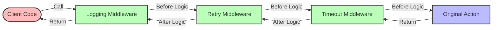

# Middleware System

The Flow Orchestrator middleware system provides a powerful way to add cross-cutting concerns to workflow actions without modifying the core action logic. This guide explains the middleware architecture, built-in middleware, and how to create custom middleware.

## Middleware Concepts

### What is Middleware?

In Flow Orchestrator, middleware is a function that wraps an action, providing additional functionality before and/or after the action executes. Middleware follows a functional composition pattern, where each middleware can:

1. Execute code before the action runs
2. Execute code after the action runs
3. Modify the context or workflow data
4. Handle errors from the action
5. Skip the action execution entirely

The middleware signature is:

```go
type Middleware func(Action) Action
```

### How Middleware Works

Middleware wraps the original action, returning a new action that includes the additional behavior:

```go
// Simple logging middleware
func LoggingMiddleware() Middleware {
    return func(next Action) Action {
        return ActionFunc(func(ctx context.Context, data *WorkflowData) error {
            // Before action execution
            fmt.Printf("Starting action for node %s\n", data.CurrentNode)
            
            // Execute the wrapped action
            err := next.Execute(ctx, data)
            
            // After action execution
            if err != nil {
                fmt.Printf("Action failed: %v\n", err)
            } else {
                fmt.Printf("Action completed successfully\n")
            }
            
            return err
        })
    }
}
```

### Middleware Chain

Multiple middleware can be combined into a chain, where each middleware wraps the next one in sequence:



The middleware chain is executed from the outside in and then from the inside out:

1. Logging middleware executes its "before" logic
2. Retry middleware executes its "before" logic
3. Timeout middleware executes its "before" logic
4. Original action executes
5. Timeout middleware executes its "after" logic
6. Retry middleware executes its "after" logic
7. Logging middleware executes its "after" logic

```go
// Create middleware chain
func ApplyMiddleware(action Action, middleware ...Middleware) Action {
    for i := len(middleware) - 1; i >= 0; i-- {
        action = middleware[i](action)
    }
    return action
}

// Usage
action := ApplyMiddleware(
    myAction,
    LoggingMiddleware(),
    RetryMiddleware(3, time.Second),
    TimeoutMiddleware(5 * time.Second),
)
```

## Built-in Middleware

Flow Orchestrator provides several built-in middleware for common cross-cutting concerns:

### Logging Middleware

Logs the execution of actions, including start time, end time, and errors:

```go
// Basic usage
action := workflow.LoggingMiddleware()(myAction)

// With custom logger
logger := log.New(os.Stdout, "WORKFLOW: ", log.LstdFlags)
action := workflow.LoggingMiddleware(workflow.WithLogger(logger))(myAction)
```

### Retry Middleware

Automatically retries failed actions with configurable backoff:

```go
// Basic usage with 3 retries and 1 second delay
action := workflow.RetryMiddleware(3, time.Second)(myAction)

// With exponential backoff
action := workflow.RetryMiddleware(
    3,
    500*time.Millisecond,
    workflow.WithExponentialBackoff(2.0),
    workflow.WithMaxDelay(10*time.Second),
)(myAction)

// With selective retry based on error types
action := workflow.RetryMiddleware(
    3,
    time.Second,
    workflow.WithRetryableErrors([]string{"connection_error", "timeout_error"}),
)(myAction)
```

### Timeout Middleware

Adds a timeout to action execution:

```go
// Add a 5-second timeout
action := workflow.TimeoutMiddleware(5 * time.Second)(myAction)
```

### Metrics Middleware

Collects metrics about action execution, including counts and timing:

```go
// Basic usage
action := workflow.MetricsMiddleware()(myAction)

// With custom metrics registry
registry := metrics.NewRegistry()
action := workflow.MetricsMiddleware(
    workflow.WithMetricsRegistry(registry),
    workflow.WithMetricsPrefix("my_workflow"),
)(myAction)
```

### Circuit Breaker Middleware

Implements the circuit breaker pattern to prevent cascading failures:

```go
// Create a circuit breaker that trips after 5 failures
// and resets after 30 seconds
cb := workflow.NewCircuitBreaker(5, 30*time.Second)

// Create middleware using the circuit breaker
cbMiddleware := func(next workflow.Action) workflow.Action {
    return workflow.ActionFunc(func(ctx context.Context, data *workflow.WorkflowData) error {
        if !cb.AllowRequest() {
            return fmt.Errorf("circuit open, too many failures")
        }
        
        err := next.Execute(ctx, data)
        if err != nil {
            cb.RecordFailure()
            return err
        }
        
        cb.RecordSuccess()
        return nil
    })
}

// Apply to an action
action := cbMiddleware(myAction)
```

### Tracing Middleware

Adds distributed tracing to workflow actions:

```go
// With OpenTelemetry
action := workflow.TracingMiddleware(
    workflow.WithTracerProvider(tracerProvider),
    workflow.WithSpanName("my-workflow-action"),
)(myAction)
```

## Using Middleware in Workflows

There are several ways to apply middleware to workflow actions:

### 1. Direct Application

Apply middleware directly to an action:

```go
// Create an action with middleware
retryableAction := workflow.RetryMiddleware(3, time.Second)(myAction)

// Use in workflow
builder.AddNode("api-call").
    WithAction(retryableAction)
```

### 2. Using Middleware Stack

For multiple middleware, use a middleware stack:

```go
// Create middleware stack
stack := workflow.NewMiddlewareStack()
stack.Use(workflow.LoggingMiddleware())
stack.Use(workflow.RetryMiddleware(3, time.Second))
stack.Use(workflow.TimeoutMiddleware(5 * time.Second))

// Apply stack to action
action := stack.Apply(myAction)

// Use in workflow
builder.AddNode("api-call").
    WithAction(action)
```

### 3. Global Middleware

Apply middleware to all actions in a workflow:

```go
// Create middleware
loggingMiddleware := workflow.LoggingMiddleware()
retryMiddleware := workflow.RetryMiddleware(3, time.Second)

// Apply to all nodes using a builder wrapper
func withMiddleware(builder *workflow.Builder) *workflow.Builder {
    originalAddNode := builder.AddNode
    
    builder.AddNode = func(name string) *workflow.NodeBuilder {
        nodeBuilder := originalAddNode(name)
        originalWithAction := nodeBuilder.WithAction
        
        nodeBuilder.WithAction = func(action workflow.Action) *workflow.NodeBuilder {
            // Apply middleware to the action
            wrappedAction := loggingMiddleware(retryMiddleware(action))
            return originalWithAction(wrappedAction)
        }
        
        return nodeBuilder
    }
    
    return builder
}

// Usage
builder := withMiddleware(workflow.NewWorkflowBuilder())

// Now all nodes will automatically get the middleware
builder.AddNode("step1").
    WithAction(step1Action)

builder.AddNode("step2").
    WithAction(step2Action)
```

## Creating Custom Middleware

You can create custom middleware to address specific requirements:

### Basic Middleware Template

```go
// Create a new middleware
func MyCustomMiddleware(options ...Option) Middleware {
    // Parse options
    opts := &middlewareOptions{
        // Default values
    }
    for _, option := range options {
        option(opts)
    }
    
    // Return the middleware function
    return func(next Action) Action {
        return ActionFunc(func(ctx context.Context, data *WorkflowData) error {
            // Before logic
            fmt.Println("Before action execution")
            
            // Modify context if needed
            ctx = context.WithValue(ctx, "my_key", "my_value")
            
            // Execute next middleware/action
            err := next.Execute(ctx, data)
            
            // After logic (still executes even if action returns error)
            fmt.Println("After action execution")
            
            // Modify error if needed
            if err != nil {
                return fmt.Errorf("enhanced error: %w", err)
            }
            
            return nil
        })
    }
}

// Option type for configuration
type Option func(*middlewareOptions)
type middlewareOptions struct {
    // Configuration fields
}

// Configuration options
func WithSomeOption(value string) Option {
    return func(opts *middlewareOptions) {
        opts.someOption = value
    }
}
```

### Example: Rate Limiting Middleware

Here's a complete example of a rate limiting middleware:

```go
// RateLimitMiddleware limits the execution rate of an action
func RateLimitMiddleware(rps int) Middleware {
    // Create a token bucket rate limiter
    limit := rate.Limit(rps)
    limiter := rate.NewLimiter(limit, rps)
    
    return func(next Action) Action {
        return ActionFunc(func(ctx context.Context, data *WorkflowData) error {
            // Wait for rate limit token
            if err := limiter.Wait(ctx); err != nil {
                return fmt.Errorf("rate limit wait canceled: %w", err)
            }
            
            // Execute the action
            return next.Execute(ctx, data)
        })
    }
}

// Usage
action := workflow.RateLimitMiddleware(10)(myAction) // 10 requests per second
```

### Example: Validation Middleware

A middleware that validates workflow data before executing an action:

```go
// ValidationRule defines a validation function
type ValidationRule func(*WorkflowData) error

// ValidationMiddleware creates middleware that validates data
func ValidationMiddleware(rules ...ValidationRule) Middleware {
    return func(next Action) Action {
        return ActionFunc(func(ctx context.Context, data *WorkflowData) error {
            // Run all validation rules
            for _, rule := range rules {
                if err := rule(data); err != nil {
                    return fmt.Errorf("validation failed: %w", err)
                }
            }
            
            // If all validations pass, execute the action
            return next.Execute(ctx, data)
        })
    }
}

// Example validation rules
func RequiredField(field string) ValidationRule {
    return func(data *WorkflowData) error {
        if !data.Has(field) {
            return fmt.Errorf("required field missing: %s", field)
        }
        return nil
    }
}

func NumberRange(field string, min, max float64) ValidationRule {
    return func(data *WorkflowData) error {
        val, ok := data.GetFloat(field)
        if !ok {
            return fmt.Errorf("field not found or not a number: %s", field)
        }
        if val < min || val > max {
            return fmt.Errorf("field %s value %.2f outside range %.2f-%.2f",
                field, val, min, max)
        }
        return nil
    }
}

// Usage
action := workflow.ValidationMiddleware(
    RequiredField("user_id"),
    RequiredField("amount"),
    NumberRange("amount", 0.01, 1000.00),
)(paymentAction)
```

## Middleware Best Practices

1. **Keep middleware focused**: Each middleware should handle a single cross-cutting concern
2. **Make middleware configurable**: Use functional options pattern for configuration
3. **Handle errors gracefully**: Ensure middleware doesn't mask the original error
4. **Be mindful of order**: The order of middleware application matters
5. **Consider performance**: Middleware adds overhead, so use only what you need
6. **Make middleware reusable**: Design middleware to be reusable across workflows
7. **Add proper logging**: Include appropriate logging for debugging
8. **Pass through context**: Always use the provided context for timeouts and cancellation
9. **Use descriptive names**: Name middleware clearly to indicate its purpose
10. **Test middleware independently**: Write unit tests for middleware in isolation

## Middleware Order Considerations

The order in which you apply middleware matters. As a general rule:

1. **Outer → Inner**: Middleware is applied from outer to inner
2. **First applied = outermost layer**

For example:

```go
action := LoggingMiddleware()(RetryMiddleware(3, time.Second)(myAction))
```

In this case:
1. RetryMiddleware wraps myAction
2. LoggingMiddleware wraps RetryMiddleware

The execution flow would be:
1. LoggingMiddleware (before logic)
2. RetryMiddleware (before logic)
3. myAction
4. RetryMiddleware (after logic, including potential retries)
5. LoggingMiddleware (after logic)

### Recommended Ordering

A general recommended ordering for common middleware:

1. **Logging/Tracing** (outermost) - To log everything including other middleware
2. **Metrics** - To measure performance including retries
3. **Circuit Breaker** - To prevent calls if the circuit is open
4. **Rate Limiting** - To limit request rates
5. **Timeout** - To set overall timeout
6. **Validation** - To validate before expensive operations
7. **Retry** (innermost) - To retry the core action

```go
action := LoggingMiddleware()(
    MetricsMiddleware()(
        CircuitBreakerMiddleware()(
            RateLimitMiddleware(10)(
                TimeoutMiddleware(5 * time.Second)(
                    ValidationMiddleware(/* rules */)(
                        RetryMiddleware(3, time.Second)(
                            myAction
                        )
                    )
                )
            )
        )
    )
)
```

## Advanced Middleware Techniques

### Conditional Middleware

Apply middleware only under certain conditions:

```go
// Apply retry middleware only to certain actions
func ConditionalRetryMiddleware(condition func(*WorkflowData) bool, retries int) Middleware {
    return func(next Action) Action {
        return ActionFunc(func(ctx context.Context, data *WorkflowData) error {
            if condition(data) {
                // Apply retry middleware
                return RetryMiddleware(retries, time.Second)(next).Execute(ctx, data)
            }
            // Skip middleware
            return next.Execute(ctx, data)
        })
    }
}

// Usage
action := ConditionalRetryMiddleware(
    func(data *WorkflowData) bool {
        // Only apply retries to external API calls
        return data.CurrentNode == "external-api-call"
    },
    3,
)(myAction)
```

### Middleware with State

Create middleware that maintains state across executions:

```go
// Middleware factory that creates middleware with shared state
func NewCachingMiddleware() Middleware {
    // Shared cache across all wrapped actions
    cache := make(map[string]interface{})
    var mutex sync.RWMutex
    
    return func(next Action) Action {
        return ActionFunc(func(ctx context.Context, data *WorkflowData) error {
            // Generate cache key from workflow data
            key := fmt.Sprintf("%s:%s", data.ID, data.CurrentNode)
            
            // Check cache
            mutex.RLock()
            cachedResult, found := cache[key]
            mutex.RUnlock()
            
            if found {
                // Use cached result
                data.SetOutput(data.CurrentNode, cachedResult)
                return nil
            }
            
            // Execute action
            err := next.Execute(ctx, data)
            if err != nil {
                return err
            }
            
            // Cache result
            if output, ok := data.GetOutput(data.CurrentNode); ok {
                mutex.Lock()
                cache[key] = output
                mutex.Unlock()
            }
            
            return nil
        })
    }
}
```

## Conclusion

Middleware provides a powerful way to add cross-cutting concerns to your workflows without modifying the core action logic. By using the built-in middleware and creating custom middleware, you can add sophisticated behaviors like logging, retries, timeouts, and validation to your workflows in a clean, composable way.

The middleware pattern in Flow Orchestrator follows functional composition principles, making it easy to combine multiple middleware to create complex behavior. Remember to consider the order of middleware application, as it affects the execution flow and error handling behavior.

For more advanced workflow patterns and error handling strategies, see the [Workflow Patterns](./workflow-patterns.md) and [Error Handling](./error-handling.md) guides. 