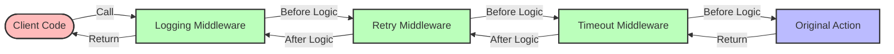

# Middleware System

The Flow Orchestrator middleware system provides a powerful way to add cross-cutting concerns to workflow actions without modifying the core action logic. This guide explains the middleware architecture, built-in middleware, and how to create custom middleware.

## Middleware Concepts

### What is Middleware?

In Flow Orchestrator, middleware is a function that wraps an action, providing additional functionality before and/or after the action executes. Middleware follows a functional composition pattern, where each middleware can:

1. Execute code before the action runs
2. Execute code after the action runs
3. Modify the context or workflow data
4. Handle errors from the action
5. Skip the action execution entirely

The middleware signature is:

```go
type Middleware func(Action) Action
```

### How Middleware Works

Middleware wraps the original action, returning a new action that includes the additional behavior:

```go
// Simple logging middleware
func LoggingMiddleware() Middleware {
    return func(next Action) Action {
        return ActionFunc(func(ctx context.Context, data *WorkflowData) error {
            // Before action execution
            fmt.Println("Starting action")
            
            // Execute the wrapped action
            err := next.Execute(ctx, data)
            
            // After action execution
            if err != nil {
                fmt.Printf("Action failed: %v\n", err)
            } else {
                fmt.Printf("Action completed successfully\n")
            }
            
            return err
        })
    }
}
```

### Middleware Chain

Multiple middleware can be combined into a chain, where each middleware wraps the next one in sequence:


```mermaid
graph LR
    Client(["Client Code"]) -->|Call| M1["Logging Middleware"]
    M1 -->|Before Logic| M2["Retry Middleware"]
    M2 -->|Before Logic| M3["Timeout Middleware"]
    M3 -->|Before Logic| A["Original Action"]
    
    A -->|Return| M3
    M3 -->|After Logic| M2
    M2 -->|After Logic| M1
    M1 -->|Return| Client
    
    style A fill:#bbf,stroke:#333,stroke-width:2px
    style M1 fill:#bfb,stroke:#333,stroke-width:2px
    style M2 fill:#bfb,stroke:#333,stroke-width:2px
    style M3 fill:#bfb,stroke:#333,stroke-width:2px
    style Client fill:#fbb,stroke:#333,stroke-width:2px
```

The middleware chain is executed from the outside in and then from the inside out:

1. Logging middleware executes its "before" logic
2. Retry middleware executes its "before" logic
3. Timeout middleware executes its "before" logic
4. Original action executes
5. Timeout middleware executes its "after" logic
6. Retry middleware executes its "after" logic
7. Logging middleware executes its "after" logic

```go
// Create middleware chain
func ApplyMiddleware(action Action, middleware ...Middleware) Action {
    for i := len(middleware) - 1; i >= 0; i-- {
        action = middleware[i](action)
    }
    return action
}

// Usage
action := ApplyMiddleware(
    myAction,
    LoggingMiddleware(),
    RetryMiddleware(3, time.Second),
    TimeoutMiddleware(5 * time.Second),
)
```

## Built-in Middleware

Flow Orchestrator provides several built-in middleware for common cross-cutting concerns:

### Logging Middleware

Logs the execution of actions, including start time, end time, and errors:

```go
// Basic usage — logs start/end time and any errors
action := workflow.LoggingMiddleware()(myAction)
```

### Retry Middleware

Automatically retries failed actions with configurable backoff:

```go
// Basic usage with 3 retries and 1 second backoff (includes jitter)
action := workflow.RetryMiddleware(3, time.Second)(myAction)

// For selective retry based on error types, use ConditionalRetryMiddleware
action := workflow.ConditionalRetryMiddleware(
    3,
    time.Second,
    func(err error) bool {
        // Only retry on transient errors
        return strings.Contains(err.Error(), "connection") ||
               strings.Contains(err.Error(), "timeout")
    },
)(myAction)

// For testing/benchmarks where you don't want backoff delays
action := workflow.NoDelayRetryMiddleware(3)(myAction)
```

### Timeout Middleware

Adds a timeout to action execution:

```go
// Add a 5-second timeout
action := workflow.TimeoutMiddleware(5 * time.Second)(myAction)
```

### Metrics

There is **no metrics middleware.** The no-op `MetricsMiddleware()` placeholder was
**removed in v0.13.0** (it measured a duration and discarded it — it never recorded
anywhere). Real per-operation metrics are a first-class `Workflow` concern, not a
middleware wrap: set `Workflow.MetricsConfig` to enable operation metrics on the
workflow's internally-built `WorkflowData`, then read them back with
`Workflow.GetMetrics()` after `Execute` returns, or export them through the
OpenTelemetry bridge. See the [Observability guide](./observability.md).

### Validation Middleware

Validates workflow data before executing the action:

```go
// Validate required fields before processing
action := workflow.ValidationMiddleware(func(data *workflow.WorkflowData) error {
    if _, ok := data.GetString("user_id"); !ok {
        return fmt.Errorf("user_id is required")
    }
    return nil
})(myAction)
```

## Using Middleware in Workflows

There are several ways to apply middleware to workflow actions:

### 1. Direct Application

Apply middleware directly to an action:

```go
// Create an action with middleware
retryableAction := workflow.RetryMiddleware(3, time.Second)(myAction)

// Use in workflow
builder.AddNode("api-call").
    WithAction(retryableAction)
```

### 2. Using Middleware Stack

For multiple middleware, use a middleware stack:

```go
// Create middleware stack
stack := workflow.NewMiddlewareStack()
stack.Use(workflow.LoggingMiddleware())
stack.Use(workflow.RetryMiddleware(3, time.Second))
stack.Use(workflow.TimeoutMiddleware(5 * time.Second))

// Apply stack to action
action := stack.Apply(myAction)

// Use in workflow
builder.AddNode("api-call").
    WithAction(action)
```

### 3. Applying Middleware to Multiple Nodes

Use a helper function to wrap actions consistently:

```go
// Create a shared middleware stack
stack := workflow.NewMiddlewareStack()
stack.Use(workflow.LoggingMiddleware())
stack.Use(workflow.RetryMiddleware(3, time.Second))

// Helper to apply the stack to any action
wrap := func(fn func(context.Context, *workflow.WorkflowData) error) workflow.Action {
    return stack.Apply(workflow.ActionFunc(fn))
}

// Apply to multiple nodes
builder.AddNode("step1").
    WithAction(wrap(step1Func))

builder.AddNode("step2").
    WithAction(wrap(step2Func))
```

## Creating Custom Middleware

You can create custom middleware to address specific requirements:

### Basic Middleware Template

```go
// Create a new middleware
func MyCustomMiddleware(options ...Option) Middleware {
    // Parse options
    opts := &middlewareOptions{
        // Default values
    }
    for _, option := range options {
        option(opts)
    }
    
    // Return the middleware function
    return func(next Action) Action {
        return ActionFunc(func(ctx context.Context, data *WorkflowData) error {
            // Before logic
            fmt.Println("Before action execution")
            
            // Modify context if needed
            ctx = context.WithValue(ctx, "my_key", "my_value")
            
            // Execute next middleware/action
            err := next.Execute(ctx, data)
            
            // After logic (still executes even if action returns error)
            fmt.Println("After action execution")
            
            // Modify error if needed
            if err != nil {
                return fmt.Errorf("enhanced error: %w", err)
            }
            
            return nil
        })
    }
}

// Option type for configuration
type Option func(*middlewareOptions)
type middlewareOptions struct {
    // Configuration fields
}

// Configuration options
func WithSomeOption(value string) Option {
    return func(opts *middlewareOptions) {
        opts.someOption = value
    }
}
```

### Example: Rate Limiting Middleware

Here's a complete example of a rate limiting middleware:

```go
// RateLimitMiddleware limits the execution rate of an action
func RateLimitMiddleware(rps int) Middleware {
    // Create a token bucket rate limiter
    limit := rate.Limit(rps)
    limiter := rate.NewLimiter(limit, rps)
    
    return func(next Action) Action {
        return ActionFunc(func(ctx context.Context, data *WorkflowData) error {
            // Wait for rate limit token
            if err := limiter.Wait(ctx); err != nil {
                return fmt.Errorf("rate limit wait canceled: %w", err)
            }
            
            // Execute the action
            return next.Execute(ctx, data)
        })
    }
}

// Usage (this is YOUR middleware, defined above — not shipped by the library)
action := RateLimitMiddleware(10)(myAction) // 10 requests per second
```

### Example: Validation Middleware

A middleware that validates workflow data before executing an action:

```go
// ValidationRule defines a validation function
type ValidationRule func(*WorkflowData) error

// ValidationMiddleware creates middleware that validates data
func ValidationMiddleware(rules ...ValidationRule) Middleware {
    return func(next Action) Action {
        return ActionFunc(func(ctx context.Context, data *WorkflowData) error {
            // Run all validation rules
            for _, rule := range rules {
                if err := rule(data); err != nil {
                    return fmt.Errorf("validation failed: %w", err)
                }
            }
            
            // If all validations pass, execute the action
            return next.Execute(ctx, data)
        })
    }
}

// Example validation rules
func RequiredField(field string) ValidationRule {
    return func(data *WorkflowData) error {
        if !data.HasKey(field) {
            return fmt.Errorf("required field missing: %s", field)
        }
        return nil
    }
}

func NumberRange(field string, min, max float64) ValidationRule {
    return func(data *WorkflowData) error {
        val, ok := data.GetFloat64(field)
        if !ok {
            return fmt.Errorf("field not found or not a number: %s", field)
        }
        if val < min || val > max {
            return fmt.Errorf("field %s value %.2f outside range %.2f-%.2f",
                field, val, min, max)
        }
        return nil
    }
}

// Usage
action := workflow.ValidationMiddleware(
    RequiredField("user_id"),
    RequiredField("amount"),
    NumberRange("amount", 0.01, 1000.00),
)(paymentAction)
```

## Middleware Best Practices

1. **Keep middleware focused**: Each middleware should handle a single cross-cutting concern
2. **Make middleware configurable**: Use functional options pattern for configuration
3. **Handle errors gracefully**: Ensure middleware doesn't mask the original error
4. **Be mindful of order**: The order of middleware application matters
5. **Consider performance**: Middleware adds overhead, so use only what you need
6. **Make middleware reusable**: Design middleware to be reusable across workflows
7. **Add proper logging**: Include appropriate logging for debugging
8. **Pass through context**: Always use the provided context for timeouts and cancellation
9. **Use descriptive names**: Name middleware clearly to indicate its purpose
10. **Test middleware independently**: Write unit tests for middleware in isolation

## Middleware Order Considerations

The order in which you apply middleware matters. As a general rule:

1. **Outer → Inner**: Middleware is applied from outer to inner
2. **First applied = outermost layer**

For example:

```go
action := LoggingMiddleware()(RetryMiddleware(3, time.Second)(myAction))
```

In this case:
1. RetryMiddleware wraps myAction
2. LoggingMiddleware wraps RetryMiddleware

The execution flow would be:
1. LoggingMiddleware (before logic)
2. RetryMiddleware (before logic)
3. myAction
4. RetryMiddleware (after logic, including potential retries)
5. LoggingMiddleware (after logic)

### Recommended Ordering

A general recommended ordering for common middleware:

1. **Logging** (outermost) - To log everything including other middleware
2. **Timeout** - To set overall timeout
3. **Validation** - To validate before expensive operations
4. **Retry** (innermost) - To retry the core action

(Metrics are not middleware — see [Metrics](#metrics) above; enable them via
`Workflow.MetricsConfig`.)

```go
action := LoggingMiddleware()(
    TimeoutMiddleware(5 * time.Second)(
        ValidationMiddleware(validator)(
            RetryMiddleware(3, time.Second)(
                myAction,
            ),
        ),
    ),
)
```

## Advanced Middleware Techniques

### Conditional Retry

Use `ConditionalRetryMiddleware` to retry only for specific error types:

```go
// Only retry transient errors, not validation errors
action := workflow.ConditionalRetryMiddleware(
    3,                    // maxRetries
    500*time.Millisecond, // backoff (with exponential increase per attempt)
    func(err error) bool {
        // Only retry transient errors
        return !errors.Is(err, workflow.ErrInvalidInput)
    },
)(myAction)
```

### Middleware with State

Create middleware that maintains state across executions:

```go
// Middleware factory that tracks execution counts
func NewExecutionCounterMiddleware() (Middleware, func() int64) {
    var count int64

    middleware := func(next Action) Action {
        return ActionFunc(func(ctx context.Context, data *WorkflowData) error {
            atomic.AddInt64(&count, 1)
            return next.Execute(ctx, data)
        })
    }

    getCount := func() int64 {
        return atomic.LoadInt64(&count)
    }

    return middleware, getCount
}
```

## Conclusion

Middleware provides a powerful way to add cross-cutting concerns to your workflows without modifying the core action logic. By using the built-in middleware and creating custom middleware, you can add sophisticated behaviors like logging, retries, timeouts, and validation to your workflows in a clean, composable way.

The middleware pattern in Flow Orchestrator follows functional composition principles, making it easy to combine multiple middleware to create complex behavior. Remember to consider the order of middleware application, as it affects the execution flow and error handling behavior.

For more advanced workflow patterns and error handling strategies, see the [Workflow Patterns](./workflow-patterns.md) and [Error Handling](./error-handling.md) guides. 