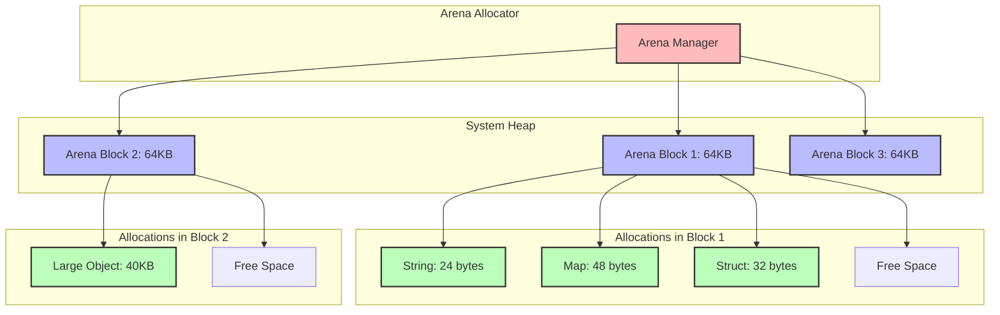

# Memory and Performance Optimization

This guide describes the memory management and concurrent data structures used in Flow Orchestrator, along with techniques to optimize workflow performance.

## Memory Management

Flow Orchestrator uses custom memory management components to optimize performance and reduce garbage collection pressure in high-throughput scenarios.

### Arena Memory Allocator

The Arena memory allocator provides efficient memory allocation with minimal overhead. It allocates memory in large blocks and then sub-allocates from these blocks, reducing the number of system allocations and garbage collection pressure.



#### Key Features

- **Block-based allocation**: Allocates memory in large blocks to reduce system calls
- **Zero-allocation string operations**: Provides string utilities that avoid allocations
- **Fast reset**: Quickly frees all memory in an arena without individual deallocations
- **Thread safety**: Optionally provides thread-safe allocation operations
- **Memory pooling**: Reuses arena blocks to further reduce allocations

#### Usage

```go
// Create a new arena
arena := workflow.NewArena()

// Allocate memory
data := arena.Alloc(1024)

// Allocate and copy a string
str := arena.AllocString("example string")

// Reset the arena (free all allocations at once)
arena.Reset()

// Free the arena
arena.Free()
```

### String Pool

The String Pool provides string interning capabilities, allowing strings with the same content to share the same memory, reducing memory usage for repeated strings.

#### Key Features

- **String interning**: Stores only one copy of each unique string
- **Memory efficiency**: Reduces memory usage for repeated strings
- **Pre-interned common strings**: Common strings are pre-interned for efficiency
- **Thread-safe operations**: Safe for concurrent use

#### Usage

```go
// Create a new string pool with an arena
arena := NewArena()
pool := NewStringPool(arena)

// Intern a string
str1 := pool.Intern("example")
str2 := pool.Intern("example")

// str1 and str2 point to the same memory
```

### Buffer Pool

The Buffer Pool provides a pool of reusable byte buffers, reducing allocations for temporary buffers used in operations like serialization and network I/O.

#### Key Features

- **Size-based pooling**: Maintains separate pools for different buffer sizes
- **Automatic sizing**: Provides buffers of appropriate size for the requested capacity
- **Buffer reuse**: Reuses buffers to reduce allocations
- **Thread-safe operations**: Safe for concurrent use

#### Usage

```go
// Get a buffer from the pool
buf := GetBuffer(1024)

// Use the buffer
// ...

// Return the buffer to the pool
PutBuffer(buf)

// Or use the WithBuffer helper
err := WithBuffer(1024, func(buf *[]byte) error {
    // Use the buffer
    return nil
})
```

### Node Pool

The Node Pool provides a pool of reusable workflow nodes, reducing allocations when creating and executing workflows.

#### Key Features

- **Node reuse**: Reuses node objects to reduce allocations
- **Automatic cleaning**: Cleans nodes before returning them to the pool
- **Thread-safe operations**: Safe for concurrent use

#### Usage

```go
// Get a node from the pool
node := GetNode()

// Configure the node
node.Name = "example"
node.Action = someAction

// Use the node
// ...

// Return the node to the pool
PutNode(node)
```

## Concurrent Data Structures

Flow Orchestrator uses custom concurrent data structures to ensure thread safety and high performance in multi-threaded scenarios.

### Concurrent Map

The Concurrent Map provides a thread-safe map implementation with better performance characteristics than using a standard map with a mutex in high-concurrency scenarios.

#### Key Features

- **Thread-safe operations**: All operations are safe for concurrent use
- **Fine-grained locking**: Uses sharding to reduce lock contention
- **Full map operations**: Provides all standard map operations (get, set, delete, etc.)
- **Iteration support**: Supports iterating over all keys and values

#### Usage

```go
// Create a new concurrent map
cm := NewConcurrentMap()

// Set a value
cm.Set("key", "value")

// Get a value
value, exists := cm.Get("key")

// Delete a value
cm.Delete("key")

// Iterate over all items
cm.ForEach(func(key string, value interface{}) {
    // Process key and value
})
```

### Read Map (Lock-Free Map)

The Read Map provides a lock-free map implementation optimized for read-heavy workloads, using atomic operations to ensure thread safety without locks for read operations.

#### Key Features

- **Lock-free reads**: Read operations don't require locks
- **Atomic updates**: Updates are performed atomically
- **Copy-on-write semantics**: Updates create a new copy of the map
- **Thread-safe operations**: All operations are safe for concurrent use

## Performance Optimization Techniques

### 1. Use Appropriate Concurrency Settings

Configure the workflow engine with appropriate concurrency settings:

```go
options := workflow.WorkflowOptions{
    MaxConcurrency: runtime.NumCPU(), // Set based on available CPU cores
}

workflow := &workflow.Workflow{
    DAG:        dag,
    WorkflowID: "my-workflow",
    Store:      store,
    Options:    options,
}
```

### 2. Optimize Action Size

- **Right-size actions**: Actions shouldn't be too small (overhead) or too large (blocks parallelism)
- **Batch operations**: Group related small operations into a single action
- **Split large actions**: Break down large operations to improve parallelism

### 3. Use Memory Optimization Features

Enable memory optimization features for high-throughput scenarios:

```go
options := workflow.WorkflowOptions{
    EnableArenaAllocator: true,
    ArenaSize: 64 * 1024, // 64KB blocks
    EnableStringInterning: true,
    EnableBufferPooling: true,
    EnableNodePooling: true,
}
```

### 4. Minimize State Size

- Keep workflow data compact
- Use string interning for repeated strings
- Avoid storing large objects in workflow data
- Clean up temporary data when no longer needed

### 5. Optimize Persistence

- Use FlatBuffers store for high performance
- Batch persistence operations
- Configure appropriate persistence intervals
- Use compression for large workflow states

```go
// Create a FlatBuffers store with compression
store, err := workflow.NewFlatBuffersStore(
    "./workflow_data", 
    workflow.WithCompression(true),
)
```

### 6. Profile and Tune

Use Go's profiling tools to identify bottlenecks:

```bash
# CPU profiling
go test -bench=. -cpuprofile=cpu.prof

# Memory profiling
go test -bench=. -memprofile=mem.prof

# Block profiling (contention)
go test -bench=. -blockprofile=block.prof
```

### 7. Optimize DAG Structure

- Minimize dependencies between nodes
- Organize nodes to maximize parallelism
- Consider using composite actions for tightly coupled operations

## Benchmarking Your Workflows

Use the built-in benchmarking tools to measure performance:

```go
// Create a workflow benchmark
bench := workflow.NewBenchmark(dag)

// Run the benchmark
results := bench.Run(10) // Run 10 iterations

// Print results
fmt.Printf("Average execution time: %v\n", results.AvgExecutionTime)
fmt.Printf("Memory allocations: %d\n", results.Allocations)
fmt.Printf("Bytes allocated: %d\n", results.BytesAllocated)
```

## Conclusion

Flow Orchestrator provides several tools and techniques to optimize performance for high-throughput scenarios. By using the appropriate memory management features, concurrent data structures, and optimization techniques, you can achieve significant performance improvements for your workflows.

For more detailed information on performance characteristics, see the [Benchmarks](./benchmarks.md) guide. 