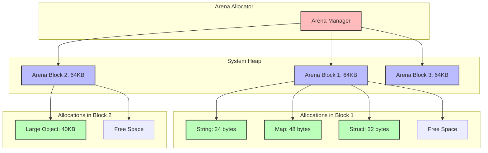

# Memory and Performance Optimization

This guide describes the memory management and concurrent data structures used in Flow Orchestrator, along with techniques to optimize workflow performance.

## Memory Management

Flow Orchestrator uses custom memory management components to optimize performance and reduce garbage collection pressure in high-throughput scenarios.

> **API accuracy note:** The arena and string pool shown below are exported from the `pkg/workflow/arena` package — import that package directly (e.g. `arena.NewArena()`), not `workflow.NewArena()`. The buffer pool and node pool live in `internal/workflow/memory`: they are **internal implementation details** used automatically by the engine and are **not** part of the importable public API.

### Arena Memory Allocator

The Arena memory allocator provides efficient memory allocation with minimal overhead. It allocates memory in large blocks and then sub-allocates from these blocks, reducing the number of system allocations and garbage collection pressure.


```mermaid
graph TD
    subgraph "System Heap"
        A1[Arena Block 1: 64KB]
        A2[Arena Block 2: 64KB]
        A3[Arena Block 3: 64KB]
    end
    
    subgraph "Arena Allocator"
        M["Arena Manager"]
    end
    
    M --> A1
    M --> A2
    M --> A3
    
    subgraph "Allocations in Block 1"
        A1 --> O1[String: 24 bytes]
        A1 --> O2[Map: 48 bytes]
        A1 --> O3[Struct: 32 bytes]
        A1 --> O4[Free Space]
    end
    
    subgraph "Allocations in Block 2"
        A2 --> O5[Large Object: 40KB]
        A2 --> O6[Free Space]
    end
    
    style A1 fill:#bbf,stroke:#333,stroke-width:2px
    style A2 fill:#bbf,stroke:#333,stroke-width:2px
    style A3 fill:#bbf,stroke:#333,stroke-width:2px
    style M fill:#fbb,stroke:#333,stroke-width:2px
    style O1 fill:#bfb,stroke:#333,stroke-width:2px
    style O2 fill:#bfb,stroke:#333,stroke-width:2px
    style O3 fill:#bfb,stroke:#333,stroke-width:2px
    style O5 fill:#bfb,stroke:#333,stroke-width:2px
```

#### Key Features

- **Block-based allocation**: Allocates memory in large blocks to reduce system calls
- **Zero-allocation string operations**: Provides string utilities that avoid allocations
- **Fast reset**: Quickly frees all memory in an arena without individual deallocations
- **Thread safety**: Optionally provides thread-safe allocation operations
- **Memory pooling**: Reuses arena blocks to further reduce allocations

#### Usage

```go
import "github.com/ppcavalcante/flow-orchestrator/pkg/workflow/arena"

// Create a new arena (lives in pkg/workflow/arena, not the root workflow package)
a := arena.NewArena()

// Allocate memory
data := a.Alloc(1024)

// Allocate and copy a string
str := a.AllocString("example string")

// Reset the arena (reuse all memory at once)
a.Reset()
```

### String Pool

The String Pool provides string interning capabilities, allowing strings with the same content to share the same memory, reducing memory usage for repeated strings.

#### Key Features

- **String interning**: Stores only one copy of each unique string
- **Memory efficiency**: Reduces memory usage for repeated strings
- **Pre-interned common strings**: Common strings are pre-interned for efficiency
- **Thread-safe operations**: Safe for concurrent use

#### Usage

```go
import "github.com/ppcavalcante/flow-orchestrator/pkg/workflow/arena"

// Create a string pool backed by an arena (both live in pkg/workflow/arena)
a := arena.NewArena()
pool := arena.NewStringPool(a)

// Intern a string — repeated content shares memory
str1 := pool.Intern("example")
str2 := pool.Intern("example")
// str1 and str2 point to the same backing memory
```

### Buffer Pool

The Buffer Pool provides a pool of reusable byte buffers, reducing allocations for temporary buffers used in operations like serialization and network I/O.

#### Key Features

- **Size-based pooling**: Maintains separate pools for different buffer sizes
- **Automatic sizing**: Provides buffers of appropriate size for the requested capacity
- **Buffer reuse**: Reuses buffers to reduce allocations
- **Thread-safe operations**: Safe for concurrent use

#### Usage

```go
// NOTE: the buffer pool lives in internal/workflow/memory and is NOT importable by
// external code (Go internal-package rule). It is an internal optimization used by the
// engine; there is no public buffer-pool API to call directly.
```

### Node Pool

The Node Pool provides a pool of reusable workflow nodes, reducing allocations when creating and executing workflows.

#### Key Features

- **Node reuse**: Reuses node objects to reduce allocations
- **Automatic cleaning**: Cleans nodes before returning them to the pool
- **Thread-safe operations**: Safe for concurrent use

#### Usage

```go
// NOTE: the node pool lives in internal/workflow/memory and is NOT importable by
// external code (Go internal-package rule). It is an internal optimization; there is
// no public node-pool API to call directly.
```

## Concurrent Data Structures

Flow Orchestrator uses custom concurrent data structures to ensure thread safety and high performance in multi-threaded scenarios.

### Concurrent Map

The Concurrent Map provides a thread-safe map implementation with better performance characteristics than using a standard map with a mutex in high-concurrency scenarios.

#### Key Features

- **Thread-safe operations**: All operations are safe for concurrent use
- **Fine-grained locking**: Uses sharding to reduce lock contention
- **Full map operations**: Provides all standard map operations (get, set, delete, etc.)
- **Iteration support**: Supports iterating over all keys and values

#### Usage

```go
// NOTE: as of v0.3.0 the concurrent-map implementation lives in
// internal/workflow/concurrent and is NOT importable by external code (Go
// internal-package rule). It is an internal optimization used by the engine;
// there is no public concurrent-map API to call directly.
```

### Read Map (Lock-Free Map)

The Read Map provides a lock-free map implementation optimized for read-heavy workloads, using atomic operations to ensure thread safety without locks for read operations.

#### Key Features

- **Lock-free reads**: Read operations don't require locks
- **Atomic updates**: Updates are performed atomically
- **Copy-on-write semantics**: Updates create a new copy of the map
- **Thread-safe operations**: All operations are safe for concurrent use

## Performance Optimization Techniques

### 1. Concurrency Behavior

Level-wise execution runs the nodes within each DAG level in parallel, bounded by a **configurable per-level concurrency limit** (default **16**). As of v0.3.0 this limit is set through `ExecutionConfig.MaxConcurrency` and wired end-to-end into `DAG.Execute`:

```go
// On the builder:
dag, _ := workflow.NewWorkflowBuilder().
    WithExecutionConfig(workflow.ExecutionConfig{MaxConcurrency: 8}).
    // ... AddNode(...)
    Build()

// Or directly on a DAG:
dag.WithExecutionConfig(workflow.ExecutionConfig{MaxConcurrency: 8})
```

A non-positive `MaxConcurrency` coerces to the bounded default of 16 — concurrency is **never unbounded** (an unbounded level would spawn one goroutine per node, a goroutine-explosion hazard on large levels). To further influence parallelism, structure your DAG so independent work shares a level (see *Optimize DAG Structure* below).

### 2. Optimize Action Size

- **Right-size actions**: Actions shouldn't be too small (overhead) or too large (blocks parallelism)
- **Batch operations**: Group related small operations into a single action
- **Split large actions**: Break down large operations to improve parallelism

### 3. Use Memory Optimization Features

Enable arena allocation through the `WorkflowData` constructors (there is no `WorkflowOptions` struct):

```go
// Arena allocator: use the arena-backed constructor.
data := workflow.NewWorkflowDataWithArena(
    "my-workflow",
    workflow.DefaultWorkflowDataConfig(),
    64*1024, // optional arena block size in bytes
)
```

String interning is applied automatically by the engine; it is not user-tunable. The previously documented `WorkflowDataConfig.MaxInternStringLength` / `InternStringCapacity` fields were **removed in v0.3.0** — they were inert (written by presets, never read), so removing them is not a behavior change. (Configurable length-gating may return as an honest feature in a future release.)

Buffer pooling and node pooling are internal implementation details applied automatically by the engine; they are not user-configurable toggles.

### 4. Minimize State Size

- Keep workflow data compact
- Use string interning for repeated strings
- Avoid storing large objects in workflow data
- Clean up temporary data when no longer needed

### 5. Optimize Persistence

- Use FlatBuffers store for high performance
- Batch persistence operations
- Configure appropriate persistence intervals

```go
// Create a FlatBuffers store (recommended for performance).
// NewFlatBuffersStore takes only a base directory — there is no compression option.
store, err := workflow.NewFlatBuffersStore("./workflow_data")
```

### 6. Profile and Tune

Use Go's profiling tools to identify bottlenecks:

```bash
# CPU profiling
go test -bench=. -cpuprofile=cpu.prof

# Memory profiling
go test -bench=. -memprofile=mem.prof

# Block profiling (contention)
go test -bench=. -blockprofile=block.prof
```

### 7. Optimize DAG Structure

- Minimize dependencies between nodes
- Organize nodes to maximize parallelism
- Consider using composite actions for tightly coupled operations

## Benchmarking Your Workflows

There is no public benchmarking API. Benchmark your workflows with Go's standard tooling against the benchmark suite under `internal/workflow/benchmark`:

```bash
go test -bench=. -benchmem ./internal/workflow/benchmark/
```

## Conclusion

Flow Orchestrator provides several tools and techniques to optimize performance for high-throughput scenarios. By using the appropriate memory management features, concurrent data structures, and optimization techniques, you can achieve significant performance improvements for your workflows.

For more detailed information on performance characteristics, see the [Benchmarks](./benchmarks.md) guide. 