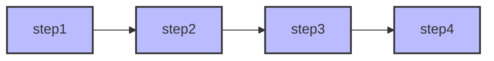
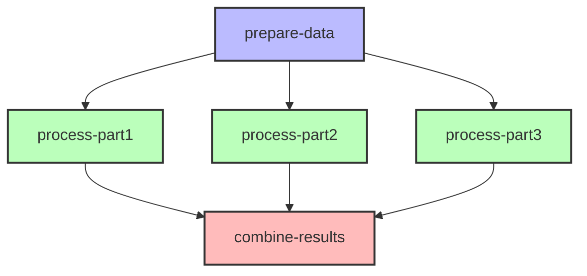
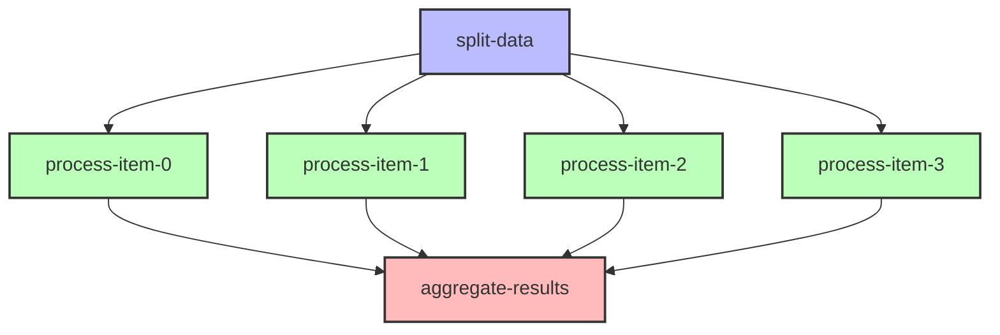
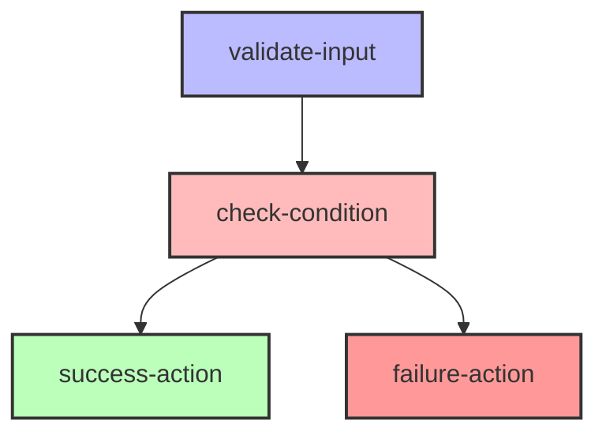

# Common Workflow Patterns

This guide describes common workflow patterns that can be implemented with Flow Orchestrator. Each pattern includes a description, example code, and best practices.

## Basic Patterns

### Sequential Workflow

The simplest workflow pattern is a sequential series of steps, where each step depends on the previous one.

```go
builder := workflow.NewWorkflowBuilder().
    WithWorkflowID("sequential-workflow")

builder.AddStartNode("step1").
    WithAction(step1Action)

builder.AddNode("step2").
    WithAction(step2Action).
    DependsOn("step1")

builder.AddNode("step3").
    WithAction(step3Action).
    DependsOn("step2")

builder.AddNode("step4").
    WithAction(step4Action).
    DependsOn("step3")
```

**Visual Representation:**



**Best Practices:**
- Use meaningful node names that describe the action being performed
- Keep actions focused on a single responsibility
- Consider using middleware for cross-cutting concerns like logging

### Parallel Workflow

In a parallel workflow, multiple steps execute concurrently after a common prerequisite.

```go
builder := workflow.NewWorkflowBuilder().
    WithWorkflowID("parallel-workflow")

builder.AddStartNode("prepare-data").
    WithAction(prepareDataAction)

builder.AddNode("process-part1").
    WithAction(processPart1Action).
    DependsOn("prepare-data")

builder.AddNode("process-part2").
    WithAction(processPart2Action).
    DependsOn("prepare-data")

builder.AddNode("process-part3").
    WithAction(processPart3Action).
    DependsOn("prepare-data")

builder.AddNode("combine-results").
    WithAction(combineResultsAction).
    DependsOn("process-part1", "process-part2", "process-part3")
```

**Visual Representation:**



**Best Practices:**
- Ensure parallel actions are truly independent of each other
- Use the shared `WorkflowData` to pass information between nodes
- Consider using node outputs for structured data sharing

### Fan-Out/Fan-In Workflow

This pattern distributes work across multiple parallel executions and then aggregates the results.

```go
builder := workflow.NewWorkflowBuilder().
    WithWorkflowID("fan-out-fan-in")

builder.AddStartNode("split-data").
    WithAction(func(ctx context.Context, data *workflow.WorkflowData) error {
        // Split input into chunks
        items := []string{"item1", "item2", "item3", "item4"}
        data.Set("items", items)
        data.Set("item_count", len(items))
        return nil
    })

// Dynamic fan-out based on data
processItem := func(itemIndex int) workflow.Action {
    return workflow.ActionFunc(func(ctx context.Context, data *workflow.WorkflowData) error {
        items, _ := data.Get("items")
        itemsList := items.([]string)
        item := itemsList[itemIndex]
        
        // Process the item
        result := fmt.Sprintf("Processed %s", item)
        
        // Store result by index
        data.SetOutput(fmt.Sprintf("process-item-%d", itemIndex), result)
        return nil
    })
}

// Create processing nodes dynamically
for i := 0; i < 4; i++ {
    nodeName := fmt.Sprintf("process-item-%d", i)
    builder.AddNode(nodeName).
        WithAction(processItem(i)).
        DependsOn("split-data")
}

// Aggregate results
builder.AddNode("aggregate-results").
    WithAction(func(ctx context.Context, data *workflow.WorkflowData) error {
        count, _ := data.GetInt("item_count")
        results := make([]string, count)
        
        // Collect all results
        for i := 0; i < count; i++ {
            output, _ := data.GetOutput(fmt.Sprintf("process-item-%d", i))
            results[i] = output.(string)
        }
        
        // Combine results
        data.Set("final_results", results)
        return nil
    }).
    DependsOn(
        "process-item-0", 
        "process-item-1", 
        "process-item-2", 
        "process-item-3",
    )
```

**Visual Representation:**



**Best Practices:**
- Use dynamic node creation for truly dynamic workflows
- Store intermediate results using `SetOutput` to maintain clarity
- Consider batching when dealing with large numbers of items

## Advanced Patterns

### Conditional Action Execution

While Flow Orchestrator's DAG engine executes all nodes whose dependencies are satisfied, you can implement conditional logic within node actions to achieve branching-like behavior. Note that this is not true branching at the workflow level - all nodes will execute if their dependencies are met.

```go
builder := workflow.NewWorkflowBuilder().
    WithWorkflowID("conditional-workflow")

// Initial node
builder.AddStartNode("validate-input").
    WithAction(func(ctx context.Context, data *workflow.WorkflowData) error {
        // Validate and set a condition flag
        valid := true // Determine this based on input
        data.Set("is_valid_input", valid)
        return nil
    })

// Decision node
builder.AddNode("check-condition").
    WithAction(func(ctx context.Context, data *workflow.WorkflowData) error {
        isValid, _ := data.GetBool("is_valid_input")
        
        if isValid {
            data.Set("execution_path", "success")
        } else {
            data.Set("execution_path", "failure")
        }
        return nil
    }).
    DependsOn("validate-input")

// Success path - node will always execute but may do nothing
builder.AddNode("success-action").
    WithAction(func(ctx context.Context, data *workflow.WorkflowData) error {
        path, _ := data.GetString("execution_path")
        if path != "success" {
            // Skip the actual logic but node still executes
            return nil
        }
        // Execute success logic
        return successAction.Execute(ctx, data)
    }).
    DependsOn("check-condition")

// Failure path - node will always execute but may do nothing
builder.AddNode("failure-action").
    WithAction(func(ctx context.Context, data *workflow.WorkflowData) error {
        path, _ := data.GetString("execution_path")
        if path != "failure" {
            // Skip the actual logic but node still executes
            return nil
        }
        // Execute failure logic
        return failureAction.Execute(ctx, data)
    }).
    DependsOn("check-condition")
```

**Visual Representation:**



**Important Note:** This is not true branching at the workflow level. All nodes in the DAG will be executed if their dependencies are satisfied. The conditional logic determines what happens inside each action, not whether the node executes.

**Best Practices:**
- Use flags in `WorkflowData` to control execution paths
- Keep flag names consistent and well-documented
- Consider adding a dedicated decision node that centralizes branching logic
- Document which branches are expected to do actual work based on conditions

### Error Handling Workflow

This pattern demonstrates how to implement error handling within a workflow.

```go
builder := workflow.NewWorkflowBuilder().
    WithWorkflowID("error-handling-workflow")

// Normal flow
builder.AddStartNode("start").
    WithAction(startAction)

// Node that might fail
builder.AddNode("risky-operation").
    WithAction(riskyAction).
    WithRetries(3).  // Built-in retry
    DependsOn("start")

// Error handling node
builder.AddNode("handle-error").
    WithAction(func(ctx context.Context, data *workflow.WorkflowData) error {
        // Check if previous node failed
        status, _ := data.GetNodeStatus("risky-operation")
        
        if status == workflow.Failed {
            // Perform error handling
            data.Set("error_handled", true)
            data.Set("recovery_action", "Performed alternative action")
            return nil
        }
        
        // Nothing to do if the operation succeeded
        return nil
    }).
    DependsOn("risky-operation")

// Completion node
builder.AddNode("complete").
    WithAction(completeAction).
    DependsOn("handle-error")
```

**Visual Representation:**

```
start → risky-operation → handle-error → complete
```

**Best Practices:**
- Use node status to detect and handle failures
- Implement specific error handling nodes after risky operations
- Consider using middleware for retries on transient failures
- Use different strategies for different error types

### Compensation Pattern (Saga-like)

This pattern implements rollback behavior similar to the distributed Saga pattern, but within a single process. It allows you to define compensating actions that undo previous steps when a later step fails.

```go
builder := workflow.NewWorkflowBuilder().
    WithWorkflowID("compensation-workflow")

// Step 1: Reserve inventory
builder.AddStartNode("reserve-inventory").
    WithAction(reserveInventoryAction)

// Step 2: Process payment
builder.AddNode("process-payment").
    WithAction(processPaymentAction).
    DependsOn("reserve-inventory")

// Compensation step for inventory if payment fails
builder.AddNode("rollback-inventory").
    WithAction(func(ctx context.Context, data *workflow.WorkflowData) error {
        // Check if payment failed
        paymentStatus, _ := data.GetNodeStatus("process-payment")
        
        if paymentStatus == workflow.Failed {
            // Get reservation ID
            reservationID, _ := data.GetString("inventory_reservation_id")
            
            // Cancel reservation
            fmt.Printf("Canceling inventory reservation: %s\n", reservationID)
            data.Set("inventory_rolled_back", true)
        }
        
        return nil
    }).
    DependsOn("process-payment")

// Step 3: Create shipment (only if previous steps succeeded)
builder.AddNode("create-shipment").
    WithAction(func(ctx context.Context, data *workflow.WorkflowData) error {
        // Check previous steps status
        paymentStatus, _ := data.GetNodeStatus("process-payment")
        
        if paymentStatus != workflow.Completed {
            // Skip this step if payment failed
            return nil
        }
        
        // Create shipment
        return createShipmentAction.Execute(ctx, data)
    }).
    DependsOn("rollback-inventory")

// Compensation step for payment if shipment fails
builder.AddNode("refund-payment").
    WithAction(func(ctx context.Context, data *workflow.WorkflowData) error {
        shipmentStatus, _ := data.GetNodeStatus("create-shipment")
        paymentStatus, _ := data.GetNodeStatus("process-payment")
        
        // If shipment failed but payment succeeded, refund
        if shipmentStatus == workflow.Failed && paymentStatus == workflow.Completed {
            paymentID, _ := data.GetString("payment_id")
            fmt.Printf("Refunding payment: %s\n", paymentID)
            data.Set("payment_refunded", true)
        }
        
        return nil
    }).
    DependsOn("create-shipment")
```

**Visual Representation:**

```
reserve-inventory → process-payment → rollback-inventory → create-shipment → refund-payment
```

**Important Note:** This is not a true distributed Saga implementation. It operates within a single process and doesn't provide distributed transaction guarantees. It models Saga-like behavior for local workflows.

**Best Practices:**
- Add explicit compensation steps after each operation that might need rollback
- Use node status checking to determine if compensation is needed
- Store operation IDs and other context needed for compensation
- Consider timeouts for long-running operations

## Custom Action Patterns

### MapAction

A pattern for transforming data within a workflow:

```go
// Define a map action that transforms data
mapAction := workflow.MapAction(func(input interface{}) (interface{}, error) {
    // Convert input to specific type
    inputData, ok := input.(map[string]interface{})
    if !ok {
        return nil, fmt.Errorf("expected map but got %T", input)
    }
    
    // Transform the data
    outputData := map[string]interface{}{
        "id":      inputData["user_id"],
        "name":    fmt.Sprintf("%s %s", inputData["first_name"], inputData["last_name"]),
        "active":  true,
        "created": time.Now().Format(time.RFC3339),
    }
    
    return outputData, nil
})

// Use in a workflow
builder.AddNode("transform-user-data").
    WithAction(mapAction)
```

### ValidationAction

A pattern for validating input data:

```go
// Create a validation action
validationAction := workflow.ValidationAction(func(data *workflow.WorkflowData) error {
    // Get values to validate
    email, ok := data.GetString("email")
    if !ok {
        return fmt.Errorf("email is required")
    }
    
    // Validate email format
    if !strings.Contains(email, "@") {
        return fmt.Errorf("invalid email format")
    }
    
    age, ok := data.GetInt("age")
    if !ok {
        return fmt.Errorf("age is required")
    }
    
    if age < 18 {
        return fmt.Errorf("must be 18 or older")
    }
    
    return nil
})

// Use in a workflow
builder.AddNode("validate-user").
    WithAction(validationAction)
```

## Limitations of Flow Orchestrator's DAG Execution Model

It's important to understand the following limitations of the DAG execution model:

1. **No True Conditional Branching**: As a strict DAG engine, Flow Orchestrator executes all nodes whose dependencies are satisfied. There is no native way to conditionally skip executing a node at the engine level - all decisions about whether to perform work must be made within the node actions themselves.

2. **Limited Dynamic Workflow Structure**: The DAG structure is fixed once built. While you can use dynamic node creation during the building phase, you cannot add or remove nodes during execution.

3. **No Native Support for Loops**: DAGs by definition cannot contain cycles, which means the engine doesn't support native looping constructs. Looping must be implemented within node actions or by dynamically creating multiple nodes during the build phase.

4. **Same-Process Execution**: All workflow actions execute within the same process, which limits the engine's ability to implement true distributed patterns like Sagas. While you can make external calls from actions, the engine itself operates in a single process.

## Conclusion

This guide demonstrated common workflow patterns that can be implemented with Flow Orchestrator. These patterns provide templates that you can adapt for your specific use cases, while working within the constraints of the DAG execution model.

Remember that these patterns can be combined and nested to create complex workflows. The key to designing effective workflows is to:

1. Break down the problem into discrete steps
2. Identify dependencies between steps
3. Determine which steps can run in parallel
4. Plan for error cases and recovery
5. Consider how data flows between steps
6. Understand the limitations of the DAG model and work within them

For more advanced patterns and optimizations, see the [Performance Optimization](./performance-optimization.md) and [Error Handling](./error-handling.md) guides. 