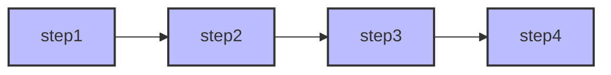
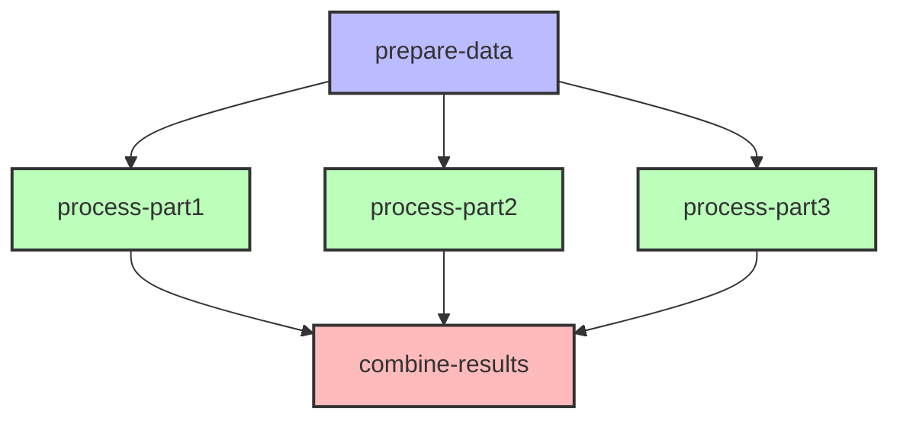
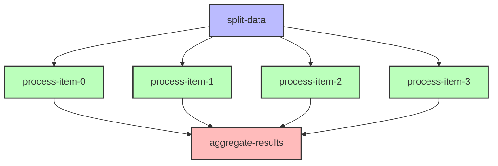
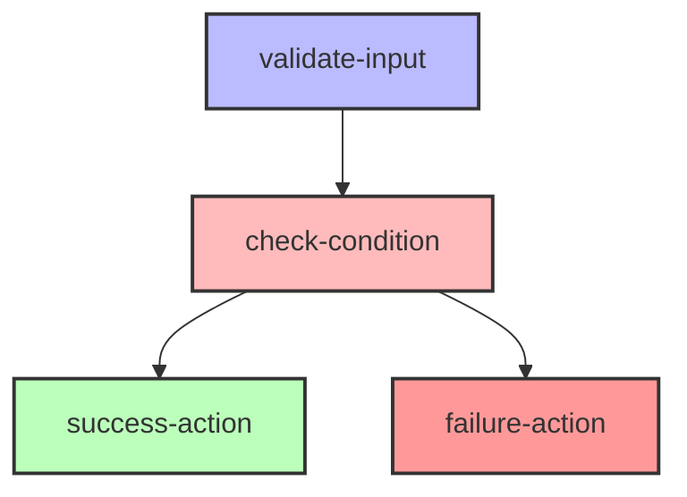

# Common Workflow Patterns

This guide describes common workflow patterns that can be implemented with Flow Orchestrator. Each pattern includes a description, example code, and best practices.

## Basic Patterns

### Sequential Workflow

The simplest workflow pattern is a sequential series of steps, where each step depends on the previous one.

```go
builder := workflow.NewWorkflowBuilder().
    WithWorkflowID("sequential-workflow")

builder.AddStartNode("step1").
    WithAction(step1Action)

builder.AddNode("step2").
    WithAction(step2Action).
    DependsOn("step1")

builder.AddNode("step3").
    WithAction(step3Action).
    DependsOn("step2")

builder.AddNode("step4").
    WithAction(step4Action).
    DependsOn("step3")
```

**Visual Representation:**


```mermaid
graph LR
    A[step1] --> B[step2] --> C[step3] --> D[step4]
    
    style A fill:#bbf,stroke:#333,stroke-width:2px
    style B fill:#bbf,stroke:#333,stroke-width:2px
    style C fill:#bbf,stroke:#333,stroke-width:2px
    style D fill:#bbf,stroke:#333,stroke-width:2px
```

**Best Practices:**
- Use meaningful node names that describe the action being performed
- Keep actions focused on a single responsibility
- Consider using middleware for cross-cutting concerns like logging

### Parallel Workflow

In a parallel workflow, multiple steps execute concurrently after a common prerequisite.

```go
builder := workflow.NewWorkflowBuilder().
    WithWorkflowID("parallel-workflow")

builder.AddStartNode("prepare-data").
    WithAction(prepareDataAction)

builder.AddNode("process-part1").
    WithAction(processPart1Action).
    DependsOn("prepare-data")

builder.AddNode("process-part2").
    WithAction(processPart2Action).
    DependsOn("prepare-data")

builder.AddNode("process-part3").
    WithAction(processPart3Action).
    DependsOn("prepare-data")

builder.AddNode("combine-results").
    WithAction(combineResultsAction).
    DependsOn("process-part1", "process-part2", "process-part3")
```

**Visual Representation:**


```mermaid
graph TD
    A[prepare-data] --> B[process-part1]
    A --> C[process-part2]
    A --> D[process-part3]
    B --> E[combine-results]
    C --> E
    D --> E
    
    style A fill:#bbf,stroke:#333,stroke-width:2px
    style B fill:#bfb,stroke:#333,stroke-width:2px
    style C fill:#bfb,stroke:#333,stroke-width:2px
    style D fill:#bfb,stroke:#333,stroke-width:2px
    style E fill:#fbb,stroke:#333,stroke-width:2px
```

**Best Practices:**
- Ensure parallel actions are truly independent of each other
- Use the shared `WorkflowData` to pass information between nodes
- Consider using node outputs for structured data sharing

### Fan-Out/Fan-In Workflow

This pattern distributes work across multiple parallel executions and then aggregates the results.

```go
builder := workflow.NewWorkflowBuilder().
    WithWorkflowID("fan-out-fan-in")

builder.AddStartNode("split-data").
    WithAction(func(ctx context.Context, data *workflow.WorkflowData) error {
        // Split input into chunks
        items := []string{"item1", "item2", "item3", "item4"}
        data.Set("items", items)
        data.Set("item_count", len(items))
        return nil
    })

// Dynamic fan-out based on data
processItem := func(itemIndex int) workflow.Action {
    return workflow.ActionFunc(func(ctx context.Context, data *workflow.WorkflowData) error {
        items, _ := data.Get("items")
        itemsList := items.([]string)
        item := itemsList[itemIndex]
        
        // Process the item
        result := fmt.Sprintf("Processed %s", item)
        
        // Store result by index
        data.SetOutput(fmt.Sprintf("process-item-%d", itemIndex), result)
        return nil
    })
}

// Create processing nodes dynamically
for i := 0; i < 4; i++ {
    nodeName := fmt.Sprintf("process-item-%d", i)
    builder.AddNode(nodeName).
        WithAction(processItem(i)).
        DependsOn("split-data")
}

// Aggregate results
builder.AddNode("aggregate-results").
    WithAction(func(ctx context.Context, data *workflow.WorkflowData) error {
        count, _ := data.GetInt("item_count")
        results := make([]string, count)
        
        // Collect all results
        for i := 0; i < count; i++ {
            output, _ := data.GetOutput(fmt.Sprintf("process-item-%d", i))
            results[i] = output.(string)
        }
        
        // Combine results
        data.Set("final_results", results)
        return nil
    }).
    DependsOn(
        "process-item-0", 
        "process-item-1", 
        "process-item-2", 
        "process-item-3",
    )
```

**Visual Representation:**


```mermaid
graph TD
    A[split-data] --> B[process-item-0]
    A --> C[process-item-1]
    A --> D[process-item-2]
    A --> E[process-item-3]
    B --> F[aggregate-results]
    C --> F
    D --> F
    E --> F
    
    style A fill:#bbf,stroke:#333,stroke-width:2px
    style B fill:#bfb,stroke:#333,stroke-width:2px
    style C fill:#bfb,stroke:#333,stroke-width:2px
    style D fill:#bfb,stroke:#333,stroke-width:2px
    style E fill:#bfb,stroke:#333,stroke-width:2px
    style F fill:#fbb,stroke:#333,stroke-width:2px
```

**Best Practices:**
- Use dynamic node creation for truly dynamic workflows
- Store intermediate results using `SetOutput` to maintain clarity
- Consider batching when dealing with large numbers of items

## Advanced Patterns

### Conditional Action Execution (in-action branching)

> **Since v0.11.0, Flow Orchestrator also supports _true_ workflow-level branching** via
> `ChoiceNode` / `MergeNode` — see [True Conditional Branching](#true-conditional-branching-choicenode--mergenode)
> below. The in-action pattern shown here remains valid and is the lightest option when
> every node should still run but do work conditionally; reach for a `ChoiceNode` when a
> not-taken branch should genuinely **not** run.

You can implement conditional logic *within* node actions to achieve branching-like behavior. With this pattern every node still executes if its dependencies are met — the condition only decides what happens inside each action, not whether the node runs.

```go
builder := workflow.NewWorkflowBuilder().
    WithWorkflowID("conditional-workflow")

// Initial node
builder.AddStartNode("validate-input").
    WithAction(func(ctx context.Context, data *workflow.WorkflowData) error {
        // Validate and set a condition flag
        valid := true // Determine this based on input
        data.Set("is_valid_input", valid)
        return nil
    })

// Decision node
builder.AddNode("check-condition").
    WithAction(func(ctx context.Context, data *workflow.WorkflowData) error {
        isValid, _ := data.GetBool("is_valid_input")
        
        if isValid {
            data.Set("execution_path", "success")
        } else {
            data.Set("execution_path", "failure")
        }
        return nil
    }).
    DependsOn("validate-input")

// Success path - node will always execute but may do nothing
builder.AddNode("success-action").
    WithAction(func(ctx context.Context, data *workflow.WorkflowData) error {
        path, _ := data.GetString("execution_path")
        if path != "success" {
            // Skip the actual logic but node still executes
            return nil
        }
        // Execute success logic
        return successAction.Execute(ctx, data)
    }).
    DependsOn("check-condition")

// Failure path - node will always execute but may do nothing
builder.AddNode("failure-action").
    WithAction(func(ctx context.Context, data *workflow.WorkflowData) error {
        path, _ := data.GetString("execution_path")
        if path != "failure" {
            // Skip the actual logic but node still executes
            return nil
        }
        // Execute failure logic
        return failureAction.Execute(ctx, data)
    }).
    DependsOn("check-condition")
```

**Visual Representation:**


```mermaid
graph TD
    A[validate-input] --> B[check-condition]
    B --> C[success-action]
    B --> D[failure-action]
    
    style A fill:#bbf,stroke:#333,stroke-width:2px
    style B fill:#fbb,stroke:#333,stroke-width:2px
    style C fill:#bfb,stroke:#333,stroke-width:2px
    style D fill:#f99,stroke:#333,stroke-width:2px
```

**Important Note:** In *this* pattern, all nodes in the DAG execute if their dependencies are satisfied — the conditional logic determines what happens inside each action, not whether the node runs. For branching where a not-taken branch genuinely does not run, use a `ChoiceNode` (next section).

**Best Practices:**
- Use flags in `WorkflowData` to control execution paths
- Keep flag names consistent and well-documented
- Consider adding a dedicated decision node that centralizes branching logic
- Document which branches are expected to do actual work based on conditions

### True Conditional Branching (ChoiceNode / MergeNode)

Added in **v0.11.0**, a `ChoiceNode` performs **true workflow-level branching**: it routes
execution down exactly **one** branch and marks the rest `Bypassed` (they do not run). A
`MergeNode` reconverges the branches with an **OR-join**. The structure stays static and
declared — no dynamic graph mutation, no determinism tax — and the branching semantics are
machine-checked in TLA+.

```go
builder := workflow.NewWorkflowBuilder().WithWorkflowID("order-routing")

builder.AddStartNode("classify").
    WithAction(func(ctx context.Context, data *workflow.WorkflowData) error {
        data.Set("amount", 2500) // determined from input
        return nil
    })

// Route to exactly one branch, first-match wins.
builder.AddChoice("route").
    When(func(d *workflow.WorkflowData) bool { amt, _ := d.GetInt("amount"); return amt > 1000 }, "manual-review").
    When(func(d *workflow.WorkflowData) bool { amt, _ := d.GetInt("amount"); return amt > 0 },    "auto-approve").
    Otherwise("reject").
    DependsOn("classify")

builder.AddNode("manual-review").WithAction(reviewAction) // "big" branch
builder.AddNode("auto-approve").WithAction(approveAction) // "small" branch
builder.AddNode("reject").WithAction(rejectAction)        // default branch

// OR-join: fires on whichever single branch was taken.
builder.AddMerge("settle").From("manual-review", "auto-approve", "reject")
builder.AddNode("notify").WithAction(notifyAction).DependsOn("settle")
```

**Semantics to know:**
- **First-match, declared order.** `When` arms are evaluated top to bottom; the first
  matching predicate's branch is taken, later matches are ignored.
- **Data-only predicates.** A predicate is `func(*WorkflowData) bool` and may read only
  keys produced by a **guaranteed-run ancestor** or the seed; an absent key reads as the
  zero value and falls through.
- **No match, no `Otherwise` → typed error** (`ErrNoBranchMatched`) — a routing dead-end
  is surfaced, never a silent hang.
- **Not-taken branches are `Bypassed`**, not `Skipped` — a distinct, non-failure status
  (bypass propagates through the whole branch subgraph).
- **The merge OR-joins**: it fires iff ≥1 taken tail completed; if every branch was
  bypassed the merge is itself `Bypassed`.
- **Structured only.** Only single-`ChoiceNode`, local OR-joins are allowed — unstructured
  reconvergence, cross-choice merges, and empty-branch merges are rejected at `Build()`
  (see [API reference → Conditional branching](../reference/api-reference.md#conditional-branching)).

**Best Practices:**
- Give every `When` a mutually-exclusive-enough predicate, or rely on first-match order
  deliberately (order is significant).
- Always provide an `Otherwise` unless an unmatched input is genuinely a workflow error you
  want surfaced as `ErrNoBranchMatched`.
- Use a `MergeNode` (not a plain node) to reconverge branches — a plain node depending on
  two branches of the same choice is rejected at build time.
- For an empty branch (a choice arm with no work), route it to a small pass-through node
  and merge from that — a `Choice → merge` direct tail is not supported.

### Error Handling Workflow

This pattern demonstrates how to implement error handling within a workflow.

> **Note:** for a recovery node to run after the node it recovers from fails, that
> upstream node must be marked `WithContinueOnError()`. Without it, the default
> fail-fast behavior halts the workflow on the failure and the recovery node never
> runs. See [Continue-on-Error](./error-handling.md#3-continue-on-error).

```go
builder := workflow.NewWorkflowBuilder().
    WithWorkflowID("error-handling-workflow")

// Normal flow
builder.AddStartNode("start").
    WithAction(startAction)

// Node that might fail — continue-on-error so handle-error can run after it fails.
builder.AddNode("risky-operation").
    WithAction(riskyAction).
    WithRetries(3).            // Built-in retry
    WithContinueOnError().     // exhaust retries, then fail without halting the workflow
    DependsOn("start")

// Error handling node
builder.AddNode("handle-error").
    WithAction(func(ctx context.Context, data *workflow.WorkflowData) error {
        // Check if previous node failed
        status, _ := data.GetNodeStatus("risky-operation")
        
        if status == workflow.Failed {
            // Perform error handling
            data.Set("error_handled", true)
            data.Set("recovery_action", "Performed alternative action")
            return nil
        }
        
        // Nothing to do if the operation succeeded
        return nil
    }).
    DependsOn("risky-operation")

// Completion node
builder.AddNode("complete").
    WithAction(completeAction).
    DependsOn("handle-error")
```

**Visual Representation:**

```
start → risky-operation → handle-error → complete
```

**Best Practices:**
- Use node status to detect and handle failures
- Implement specific error handling nodes after risky operations
- Consider using middleware for retries on transient failures
- Use different strategies for different error types

### Compensation Pattern (Saga-like)

This pattern implements rollback behavior similar to the distributed Saga pattern, but within a single process. It allows you to define compensating actions that undo previous steps when a later step fails.

> **Note:** the steps whose failure triggers a compensation (`process-payment`,
> `create-shipment`) are marked `WithContinueOnError()` so their compensation nodes
> run after they fail. Under the default fail-fast behavior, the first failure
> halts the workflow before any compensation node runs. See
> [Continue-on-Error](./error-handling.md#3-continue-on-error).

```go
builder := workflow.NewWorkflowBuilder().
    WithWorkflowID("compensation-workflow")

// Step 1: Reserve inventory
builder.AddStartNode("reserve-inventory").
    WithAction(reserveInventoryAction)

// Step 2: Process payment — continue-on-error so rollback-inventory runs on failure.
builder.AddNode("process-payment").
    WithAction(processPaymentAction).
    WithContinueOnError().
    DependsOn("reserve-inventory")

// Compensation step for inventory if payment fails
builder.AddNode("rollback-inventory").
    WithAction(func(ctx context.Context, data *workflow.WorkflowData) error {
        // Check if payment failed
        paymentStatus, _ := data.GetNodeStatus("process-payment")
        
        if paymentStatus == workflow.Failed {
            // Get reservation ID
            reservationID, _ := data.GetString("inventory_reservation_id")
            
            // Cancel reservation
            fmt.Printf("Canceling inventory reservation: %s\n", reservationID)
            data.Set("inventory_rolled_back", true)
        }
        
        return nil
    }).
    DependsOn("process-payment")

// Step 3: Create shipment (only if previous steps succeeded) — continue-on-error
// so refund-payment runs if this step fails.
builder.AddNode("create-shipment").
    WithAction(func(ctx context.Context, data *workflow.WorkflowData) error {
        // Check previous steps status
        paymentStatus, _ := data.GetNodeStatus("process-payment")
        
        if paymentStatus != workflow.Completed {
            // Skip this step if payment failed
            return nil
        }
        
        // Create shipment
        return createShipmentAction.Execute(ctx, data)
    }).
    WithContinueOnError().
    DependsOn("rollback-inventory")

// Compensation step for payment if shipment fails
builder.AddNode("refund-payment").
    WithAction(func(ctx context.Context, data *workflow.WorkflowData) error {
        shipmentStatus, _ := data.GetNodeStatus("create-shipment")
        paymentStatus, _ := data.GetNodeStatus("process-payment")
        
        // If shipment failed but payment succeeded, refund
        if shipmentStatus == workflow.Failed && paymentStatus == workflow.Completed {
            paymentID, _ := data.GetString("payment_id")
            fmt.Printf("Refunding payment: %s\n", paymentID)
            data.Set("payment_refunded", true)
        }
        
        return nil
    }).
    DependsOn("create-shipment")
```

**Visual Representation:**

```
reserve-inventory → process-payment → rollback-inventory → create-shipment → refund-payment
```

**Important Note:** This is not a true distributed Saga implementation. It operates within a single process and doesn't provide distributed transaction guarantees. It models Saga-like behavior for local workflows.

**Best Practices:**
- Add explicit compensation steps after each operation that might need rollback
- Use node status checking to determine if compensation is needed
- Store operation IDs and other context needed for compensation
- Consider timeouts for long-running operations

## Custom Action Patterns

### MapAction

A pattern for transforming data within a workflow:

```go
// NewMapAction(inputKey, outputKey, mapFn) reads inputKey, transforms it, and
// stores the result under outputKey.
mapAction := workflow.NewMapAction("raw_user", "user", func(input interface{}) (interface{}, error) {
    // Convert input to specific type
    inputData, ok := input.(map[string]interface{})
    if !ok {
        return nil, fmt.Errorf("expected map but got %T", input)
    }

    // Transform the data
    outputData := map[string]interface{}{
        "id":      inputData["user_id"],
        "name":    fmt.Sprintf("%s %s", inputData["first_name"], inputData["last_name"]),
        "active":  true,
        "created": time.Now().Format(time.RFC3339),
    }

    return outputData, nil
})

// Use in a workflow
builder.AddNode("transform-user-data").
    WithAction(mapAction)
```

### ValidationAction

A pattern for validating input data:

```go
// NewValidationAction(inputKey, validationFn, outputKey, errorOutputKey) validates
// the value stored at inputKey; validationFn receives that value as interface{}.
validationAction := workflow.NewValidationAction(
    "email",
    func(v interface{}) error {
        email, ok := v.(string)
        if !ok {
            return fmt.Errorf("email must be a string")
        }
        if !strings.Contains(email, "@") {
            return fmt.Errorf("invalid email format")
        }
        return nil
    },
    "email_valid",  // where the success result is stored
    "email_error",  // where error information is stored on failure
)

// Use in a workflow
builder.AddNode("validate-user").
    WithAction(validationAction)
```

For multi-field validation, prefer `ValidationMiddleware(func(*WorkflowData) error)`,
which receives the whole `WorkflowData`.

## Durable Continuation Patterns (v0.10.0)

These patterns let a workflow **suspend** on an external event and **resume** later —
across process restarts and long real-world delays — without holding a process open.
Each uses a declared suspension node that parks in the `Waiting` status; the run
checkpoints and `Workflow.Execute` returns `ErrSuspended`. See the
[Persistence guide → Durable Continuations](./persistence.md#durable-continuations-suspend--resume)
for the full mechanics and requirements (a `Checkpointer` store, and a `SignalStore`
for signals).

### Durable Sleep / Delay

Wait a fixed real-world duration between steps — e.g. "send a follow-up 24h after
signup" — without a running process or a `time.Sleep`. The timer persists an absolute
due-time; an overdue timer fires on the next resume/`Tick`.

```go
b.AddNode("signup").WithAction(signup)
b.AddTimer("wait-24h", 24*time.Hour).DependsOn("signup")
b.AddNode("follow-up").WithAction(sendFollowUp).DependsOn("wait-24h")
// First Execute parks at wait-24h (ErrSuspended). A host loop calls wf.Tick(ctx, now)
// on its schedule; once now >= the due-time the timer fires and follow-up runs.
```

### Human-in-the-Loop Approval

Pause until an operator (or an external system) makes a decision, delivered as a
durable signal. Delivery is decoupled from the running process — the approval can
arrive days later, when nothing is running.

```go
b.AddNode("submit-expense").WithAction(submit)
b.AddWaitForSignal("await-approval", "approval").DependsOn("submit-expense")
b.AddNode("reimburse").WithAction(reimburse).DependsOn("await-approval")

// The first drive parks at await-approval (ErrSuspended). Later, an HTTP handler:
sig := workflow.Signal{ID: "expense-4711", Name: "approval", Payload: decision}
err := wf.DeliverAndResume(ctx, sig) // durably enqueue, then drive the resume
// reimburse can read the decision via data.GetOutput("await-approval").
```

### Wait Until a Condition Holds

Park until a predicate over the workflow data becomes true, re-checked on each wake —
useful when the readiness is state written by another branch or a delivered signal.

```go
b.AddWaitForCondition("await-inventory", func(d *workflow.WorkflowData) bool {
    n, ok := workflow.Get(d, stockKey)
    return ok && n > 0
}).DependsOn("reserve")
```

> **Waking is host-driven — there is no background scheduler.** Drive resumes from
> your own loop/handler: `Execute` on startup (re-arms timers, re-checks signals),
> `Tick(now)` for due timers, `DeliverAndResume(sig)` for signals. Same-`WorkflowID`
> drives within a process are serialized by the `Locker` lease.

## Limitations of Flow Orchestrator's DAG Execution Model

It's important to understand the following limitations of the DAG execution model:

1. **Structured branching only**: Since v0.11.0 a `ChoiceNode` provides true workflow-level branching — a not-taken branch does **not** run (its nodes are `Bypassed`), and a `MergeNode` OR-joins the branches (see [True Conditional Branching](#true-conditional-branching-choicenode--mergenode)). This is deliberately **structured**: only single-`ChoiceNode`, local OR-joins are expressible — unstructured (van der Aalst) reconvergence, cross-choice merges, and empty-branch merges are rejected at `Build()`. For "run every node, decide inside the action" behavior, the in-action pattern above still applies.

2. **Fail-fast by default**: A node failure halts the run by default — in-flight siblings are cancelled and later levels do not execute, so not every node necessarily runs. Mark a node `WithContinueOnError()` to let it fail without halting the workflow (see [Error Handling → Continue-on-Error](./error-handling.md#3-continue-on-error)).

3. **Limited Dynamic Workflow Structure**: The DAG structure is fixed once built. While you can use dynamic node creation during the building phase, you cannot add or remove nodes during execution.

4. **No Native Support for Loops**: DAGs by definition cannot contain cycles, which means the engine doesn't support native looping constructs. Looping must be implemented within node actions or by dynamically creating multiple nodes during the build phase.

5. **Same-Process Execution**: All workflow actions execute within the same process, which limits the engine's ability to implement true distributed patterns like Sagas. While you can make external calls from actions, the engine itself operates in a single process.

## Conclusion

This guide demonstrated common workflow patterns that can be implemented with Flow Orchestrator. These patterns provide templates that you can adapt for your specific use cases, while working within the constraints of the DAG execution model.

Remember that these patterns can be combined and nested to create complex workflows. The key to designing effective workflows is to:

1. Break down the problem into discrete steps
2. Identify dependencies between steps
3. Determine which steps can run in parallel
4. Plan for error cases and recovery
5. Consider how data flows between steps
6. Understand the limitations of the DAG model and work within them

For more advanced patterns and optimizations, see the [Performance Optimization](./performance-optimization.md) and [Error Handling](./error-handling.md) guides. 