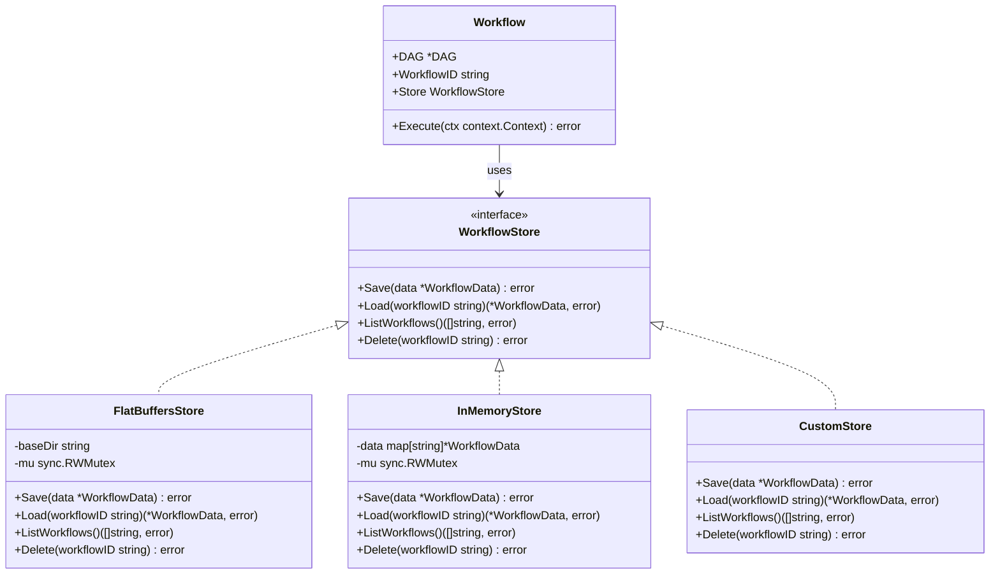
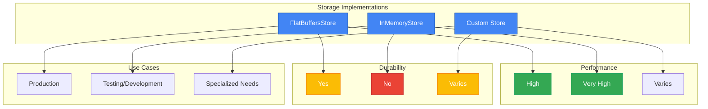
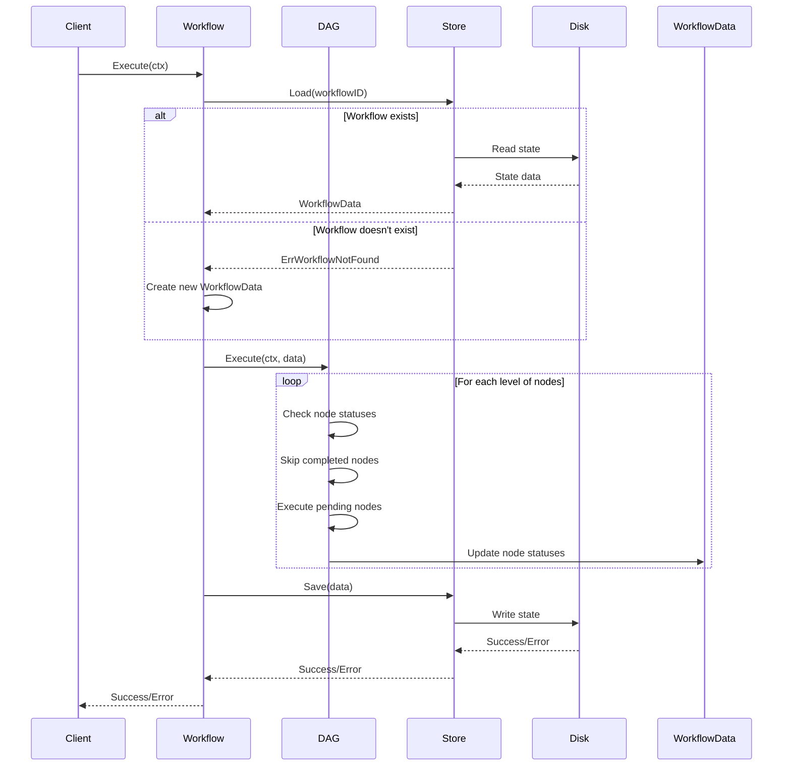
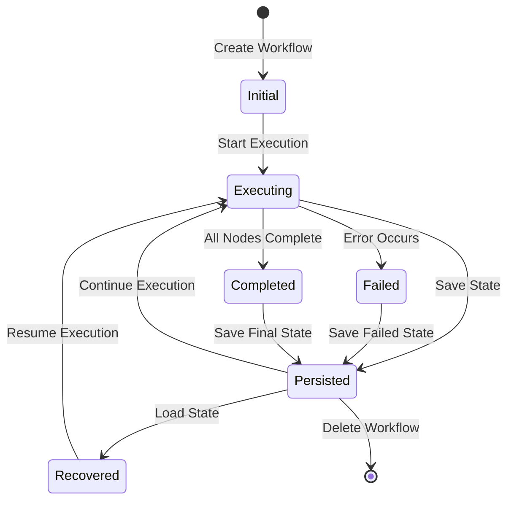

# Persistence Layer

## Package Organization

The Persistence Layer is part of the public API in the `pkg/workflow` package:

```go
import "github.com/yourusername/flow-orchestrator/pkg/workflow"
```

All storage interfaces and implementations are accessible through this package:

- `WorkflowStore` interface
- `JSONFileStore` implementation
- `FlatBuffersStore` implementation
- `InMemoryStore` implementation

The serialization details and internal storage mechanisms are implemented in the internal packages but are not exposed directly to users.

## Overview

The Persistence Layer in Flow Orchestrator provides the ability to save and restore workflow state, enabling workflows to survive application restarts, be distributed across multiple processes, or be resumed after failures. This document explains the persistence architecture, available storage implementations, and best practices for using persistence in your workflows.

**Important**: The persistence layer is specifically designed for workflow state management (node statuses, execution progress, etc.) and is not intended as a general-purpose data store for application data. For storing large volumes of application-specific data, you should implement your own storage solution.

## Persistence Architecture

### Core Components

The persistence layer consists of these key components:

1. **WorkflowStore Interface**: The contract that all storage implementations must fulfill
2. **Storage Implementations**: Concrete implementations for different storage backends
3. **Serialization/Deserialization**: Mechanisms for converting workflow data to/from persistent formats
4. **Workflow Integration**: How workflows interact with the persistence layer



### WorkflowStore Interface

The `WorkflowStore` interface defines the contract for storage implementations:

```go
type WorkflowStore interface {
    // Save stores the workflow data
    Save(data *WorkflowData) error

    // Load retrieves workflow data by ID
    Load(workflowID string) (*WorkflowData, error)

    // ListWorkflows returns all workflow IDs
    ListWorkflows() ([]string, error)

    // Delete removes a workflow
    Delete(workflowID string) error
}
```

This interface allows for different storage backends while maintaining a consistent API for workflow persistence.

## Storage Implementations

Flow Orchestrator provides two built-in storage implementations:

### 1. FlatBuffersStore (Recommended)

Stores workflow data using FlatBuffers for efficient binary serialization:

```go
type FlatBuffersStore struct {
    baseDir string
    mu      sync.RWMutex
}
```

**Key Features:**
- High-performance binary format
- Zero-copy deserialization
- Smaller storage footprint
- Recommended for all production use cases

**Usage:**
```go
store, err := workflow.NewFlatBuffersStore("/path/to/workflow/storage")
if err != nil {
    log.Fatalf("Failed to create store: %v", err)
}

// Use the store with a workflow
workflow := &workflow.Workflow{
    DAG:        dag,
    WorkflowID: "my-workflow",
    Store:      store,
}
```

### 2. InMemoryStore

Stores workflow data in memory:

```go
type InMemoryStore struct {
    data map[string]*WorkflowData
    mu   sync.RWMutex
}
```

**Key Features:**
- Fastest performance
- No persistence across application restarts
- Useful for testing and ephemeral workflows
- Suitable for scenarios where durability is not required

**Usage:**
```go
store := workflow.NewInMemoryStore()

// Use the store with a workflow
workflow := &workflow.Workflow{
    DAG:        dag,
    WorkflowID: "my-workflow",
    Store:      store,
}
```

### Storage Implementation Comparison



## Serialization and Deserialization

The persistence layer handles serialization and deserialization of workflow data:

### FlatBuffers Serialization

For the FlatBuffersStore, workflow data is serialized using FlatBuffers:

```go
func (s *FlatBuffersStore) Save(data *WorkflowData) error {
    // Lock for thread safety
    s.mu.Lock()
    defer s.mu.Unlock()

    // Create a FlatBuffers builder
    builder := flatbuffers.NewBuilder(1024)

    // Serialize workflow data
    // ... (FlatBuffers serialization code)

    // Write to file
    filePath := filepath.Join(s.baseDir, data.ID+".fb")
    err := os.WriteFile(filePath, builder.FinishedBytes(), 0644)
    if err != nil {
        return fmt.Errorf("failed to write file: %w", err)
    }

    return nil
}
```

## Workflow State Lifecycle

The workflow state follows a specific lifecycle through the persistence layer:



### State Transitions

Workflow state transitions through the following phases:

1. **Initial State**: When a workflow is first created, it has no persistent state.
2. **Execution State**: During execution, node statuses are updated in memory.
3. **Persistence Points**: State is saved at defined points (checkpoints, after each node, or at completion).
4. **Recovery State**: When a workflow is restarted, it loads the last saved state and resumes execution.
5. **Completion State**: Final state after successful execution.
6. **Error State**: State after a failure, which may be recovered from.



## Workflow Integration

Workflows interact with the persistence layer through the `Workflow` struct:

```go
type Workflow struct {
    DAG        *DAG
    WorkflowID string
    Store      WorkflowStore
}
```

During execution, the workflow uses the store to save and load state:

```go
func (w *Workflow) Execute(ctx context.Context) error {
    // Try to load existing state
    data, err := w.Store.Load(w.WorkflowID)
    if err != nil {
        if errors.Is(err, ErrWorkflowNotFound) {
            // Create new workflow data if not found
            data = NewWorkflowData()
            data.ID = w.WorkflowID
        } else {
            return fmt.Errorf("failed to load workflow state: %w", err)
        }
    }
    
    // Execute the DAG
    err = w.DAG.Execute(ctx, data)
    
    // Save the final state
    saveErr := w.Store.Save(data)
    if saveErr != nil {
        // If we already have an execution error, prioritize that
        if err != nil {
            return fmt.Errorf("execution failed: %w (and failed to save state: %v)", err, saveErr)
        }
        return fmt.Errorf("failed to save workflow state: %w", saveErr)
    }
    
    return err
}
```

## Persistence Strategies

Flow Orchestrator supports different persistence strategies:

### 1. Checkpoint Persistence

Save state at specific checkpoints:

```go
func (d *DAG) Execute(ctx context.Context, data *WorkflowData) error {
    // Get topologically sorted levels
    levels, err := d.TopologicalSort()
    if err != nil {
        return err
    }
    
    // Execute each level
    for i, level := range levels {
        // Execute nodes in this level
        err := executeNodesInLevel(ctx, level, data)
        if err != nil {
            return err
        }
        
        // Save checkpoint after each level
        if data.checkpointCallback != nil {
            if err := data.checkpointCallback(data); err != nil {
                return fmt.Errorf("checkpoint failed: %w", err)
            }
        }
    }
    
    return nil
}
```

### 2. Node-Level Persistence

Save state after each node execution:

```go
func (n *Node) Execute(ctx context.Context, data *WorkflowData) error {
    // Check if node is already completed
    if status, exists := data.GetNodeStatus(n.Name); exists && status == NodeStatusCompleted {
        return nil // Skip already completed nodes
    }
    
    // Execute the node's action
    err := n.Action.Execute(ctx, data)
    
    // Update node status
    if err != nil {
        data.SetNodeStatus(n.Name, NodeStatusFailed)
    } else {
        data.SetNodeStatus(n.Name, NodeStatusCompleted)
    }
    
    // Save state after node execution
    if data.persistCallback != nil {
        if persistErr := data.persistCallback(data); persistErr != nil {
            return fmt.Errorf("persistence failed: %w (original error: %v)", persistErr, err)
        }
    }
    
    return err
}
```

### 3. Transaction-Based Persistence

For storage backends that support transactions:

```go
type TransactionalStore interface {
    WorkflowStore
    BeginTransaction() (Transaction, error)
}

type Transaction interface {
    Save(data *WorkflowData) error
    Commit() error
    Rollback() error
}
```

## Recovery Mechanisms

Flow Orchestrator provides several mechanisms for workflow recovery:

### 1. Automatic Recovery

Workflows automatically recover from their last saved state:

```go
// This will resume from the last saved state if it exists
err := workflow.Execute(context.Background())
```

### 2. Manual Recovery

For more control, you can manually load and manipulate state:

```go
// Load the workflow state
data, err := store.Load("my-workflow")
if err != nil {
    log.Fatalf("Failed to load workflow: %v", err)
}

// Modify the state if needed
data.SetNodeStatus("problematic-node", workflow.NodeStatusPending)

// Save the modified state
err = store.Save(data)
if err != nil {
    log.Fatalf("Failed to save workflow: %v", err)
}

// Resume execution
err = workflow.Execute(context.Background())
```

### 3. Partial Recovery

You can also implement partial recovery strategies:

```go
func RecoverFailedNodes(workflowID string, store workflow.WorkflowStore) error {
    // Load the workflow state
    data, err := store.Load(workflowID)
    if err != nil {
        return err
    }
    
    // Reset failed nodes to pending
    for nodeName, status := range data.GetAllNodeStatuses() {
        if status == workflow.NodeStatusFailed {
            data.SetNodeStatus(nodeName, workflow.NodeStatusPending)
        }
    }
    
    // Save the modified state
    return store.Save(data)
}
```

## Performance Considerations

### 1. Serialization Overhead

Serialization and deserialization can be expensive operations:

- FlatBuffers provides efficient binary serialization with zero-copy deserialization
- Consider the frequency of persistence operations
- Balance persistence frequency against performance requirements

### 2. Storage Backend Performance

Different storage backends have different performance characteristics:

- InMemoryStore: Fastest but no durability
- FlatBuffersStore: Good balance of performance and durability
- Custom implementations: Performance depends on the underlying storage

### 3. Optimizing Persistence

Strategies to optimize persistence performance:

- Use checkpoints instead of persisting after every node
- Consider batching persistence operations
- Use arena-based memory management for large workflows
- Implement custom serialization for specific needs

## Custom Storage Implementations

You can implement custom storage backends by implementing the `WorkflowStore` interface:

### Example: Redis Storage

```go
type RedisStore struct {
    client *redis.Client
    prefix string
}

func NewRedisStore(client *redis.Client, prefix string) *RedisStore {
    return &RedisStore{
        client: client,
        prefix: prefix,
    }
}

func (s *RedisStore) Save(data *WorkflowData) error {
    // Serialize the workflow data
    bytes, err := json.Marshal(data)
    if err != nil {
        return fmt.Errorf("failed to serialize workflow data: %w", err)
    }
    
    // Save to Redis
    key := s.prefix + data.ID
    err = s.client.Set(context.Background(), key, bytes, 0).Err()
    if err != nil {
        return fmt.Errorf("failed to save to Redis: %w", err)
    }
    
    return nil
}

func (s *RedisStore) Load(workflowID string) (*WorkflowData, error) {
    // Load from Redis
    key := s.prefix + workflowID
    bytes, err := s.client.Get(context.Background(), key).Bytes()
    if err != nil {
        if err == redis.Nil {
            return nil, workflow.ErrWorkflowNotFound
        }
        return nil, fmt.Errorf("failed to load from Redis: %w", err)
    }
    
    // Deserialize the workflow data
    var data workflow.WorkflowData
    err = json.Unmarshal(bytes, &data)
    if err != nil {
        return nil, fmt.Errorf("failed to deserialize workflow data: %w", err)
    }
    
    return &data, nil
}

func (s *RedisStore) ListWorkflows() ([]string, error) {
    // List all workflows in Redis
    pattern := s.prefix + "*"
    keys, err := s.client.Keys(context.Background(), pattern).Result()
    if err != nil {
        return nil, fmt.Errorf("failed to list workflows: %w", err)
    }
    
    // Remove prefix from keys
    workflows := make([]string, len(keys))
    for i, key := range keys {
        workflows[i] = strings.TrimPrefix(key, s.prefix)
    }
    
    return workflows, nil
}

func (s *RedisStore) Delete(workflowID string) error {
    // Delete from Redis
    key := s.prefix + workflowID
    err := s.client.Del(context.Background(), key).Err()
    if err != nil {
        return fmt.Errorf("failed to delete workflow: %w", err)
    }
    
    return nil
}
```

## Best Practices

### 1. Choosing a Storage Implementation

- Use **FlatBuffersStore** for production workloads
- Use **InMemoryStore** for testing and development
- Implement custom storage for specific requirements

### 2. Persistence Frequency

- Balance persistence frequency against performance
- Consider the criticality of workflow state
- Use checkpoints for long-running workflows

### 3. Error Handling

- Handle persistence errors appropriately
- Consider retry strategies for transient errors
- Implement recovery mechanisms for critical workflows

### 4. Testing

- Test recovery scenarios
- Verify persistence behavior
- Test with different storage implementations

### 5. Monitoring

- Monitor storage performance
- Track persistence failures
- Implement alerting for critical workflows

## Conclusion

The persistence layer in Flow Orchestrator provides a robust mechanism for saving and restoring workflow state. By understanding the available storage implementations and best practices, you can implement reliable and performant workflow persistence for your applications.

Whether you need simple in-memory storage for testing or durable storage for production workloads, the persistence layer provides the flexibility to meet your requirements while maintaining a consistent API for workflow integration. 